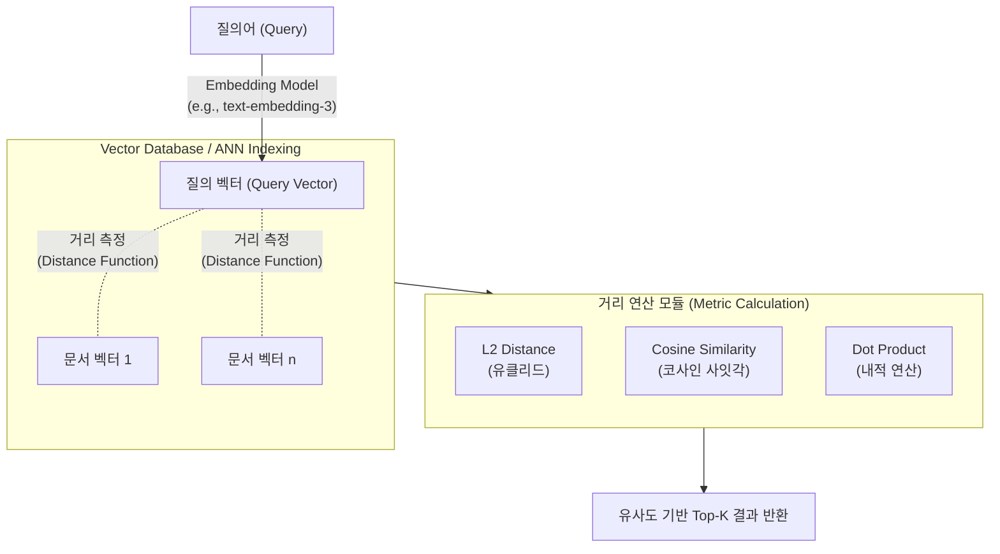

# 거리 함수 (Distance Function)
## I. 다차원 벡터 공간의 유사도 측정 척도, 거리 함수의 개요
- 정의: 다차원 벡터 공간(Vector Space) 상에 맵핑된 두 데이터 포인트(개체, 벡터) 간의 유사성(Similarity) 또는 상이성(Dissimilarity)을 정량적 수치로 산출하는 수학적 척도
- 필요성: 비정형 데이터(텍스트, 이미지)의 고차원 임베딩 활용 증가, 기계학습(KNN, K-Means 등)의 군집화/분류 정확도 향상, [[초거대 언어 모델|LLM]] RAG 환경의 의미론적 검색(Semantic Search) 품질 확보
- 특징: 거리 공간 4대 공리 준수(비음성, 동일성, 대칭성, 삼각 부등식), 데이터의 특성(연속형, 범주형) 및 모델 목적에 따른 이종 척도 선택 적용

## II. 거리 함수의 개념도 및 핵심 기술 요소
### 가. 벡터 검색 아키텍처 상의 거리 함수 동작 원리

- LLM 질의 임베딩과 Vector DB에 저장된 대상 벡터들 간의 공간적 거리 및 사잇각을 산출
- HNSW, IVF-PQ 등 ANN(Approximate Nearest Neighbor) 알고리즘과 결합하여 벡터 검색 고속화 수행
### 나. 거리 함수의 핵심 기술 요소
| 분류      | 요소기술(키워드)    | 세부 설명                                                                                                 |
| ----------- | ---------------- | --------------------------------------------------------------------------------------------------------- |
| 기하학적 거리 | 유클리드 거리 (L2)     | - 두 점 사이의 최단 직선 거리 산출 ($d = \sqrt{\sum (x_i - y_i)^2}$) - KNN, K-Means 등 군집화 및 LBS 좌표 기반 거리 측정에 활용     |
| 기하학적 거리 | 맨해튼 거리 (L1)      | - 격자 경로를 따라 이동한 절대값의 총합 ($d = \sum \Vert{}x_i - y_i\Vert{}$) - 고차원 공간에서 [[이상치]](Outlier)에 의한 데이터 왜곡 현상 완화  |
| 기하학적 거리 | 민코프스키 거리         | - L1, L2 거리 등을 Norm 차수(p값)에 따라 일반화하여 가변 적용하는 통합 척도                                                        |
| 기하학적 거리 | 체비셰프 거리          | - 다차원 공간에서 각 차원별 좌표 차이 중 가장 큰 최댓값 산출 (체스보드 거리)                                                            |
| 의미적 [[유사도]] | 코사인 유사도          | - 두 벡터 간의 사잇각($\theta$)을 기반으로 방향성 유사도 측정 ($sim = \cos(\theta)$) - 벡터 크기(문서 길이 등)에 무관하여 NLP 텍스트 임베딩에 특화 |
| 의미적 유사도 | 내적 (Dot Product) | - 두 벡터의 크기와 방향을 동시에 고려하는 곱셈 연산 합 산출 ($A \cdot B$) - 벡터 정규화 상태에서 코사인 거리와 순위가 동일하며 연산 속도 극대화             |
| 통계적 거리  | 마할라노비스 거리        | - 공분산 행렬을 활용하여 데이터의 확률 분포와 변수 간 상관관계를 반영한 거리 산출                                                           |
| 범주형 거리  | 해밍 거리 (Hamming)  | - 길이가 동일한 두 이진(Binary) 데이터에서 서로 다른 값을 가진 요소의 이격 개수                                                        |
## III. 거리 함수의 비교 및 LLM/RAG 환경의 최신 동향
### 가. 유클리드 거리(L2)와 코사인 유사도(Cosine) 비교
|비교 항목|유클리드 거리 (L2 Norm)|코사인 유사도 (Cosine Similarity)|
|---|---|---|
|측정 기준|데이터 포인트 간의 공간적 크기(Magnitude)|데이터 벡터 간의 의미적 방향(Angle)|
|민감도|벡터의 크기(문서의 길이, 단어 빈도)에 매우 민감함|벡터의 크기에 둔감함 (방향성 위주 판단)|
|차원의 저주|다차원으로 갈수록 거리가 기하급수적으로 증가(취약)|고차원 공간에서도 상대적인 뉘앙스와 의미 보존 유리|
|주요 활용 분야|이미지 픽셀 매칭, 연속형 센서 데이터 분류|RAG 기반 문서 검색, 사용자 기반 추천 시스템|
### 나. 임베딩 및 벡터 검색(Vector Search) 환경의 거리 함수 최신 동향
- 정규화 임베딩 및 내적(Dot Product) 최적화: OpenAI의 `text-embedding-3` 등 최신 모델은 기본적으로 L2 정규화(Normalization)된 벡터를 반환함. 이 경우 코사인 유사도와 내적의 결과가 수학적으로 동일해지므로, 복잡한 나눗셈 연산이 필요 없는 내적 연산을 채택하여 Vector DB의 쿼리 Latency를 극단적으로 최소화함.    
- 이진 양자화(Binary Quantization)와 해밍 거리의 결합: 수천 차원의 Float32 임베딩 벡터를 이진 비트(Bit)로 압축(BQ)하고, [[CPU]]의 XOR 연산을 활용하는 해밍 거리로 유사도를 측정하여 연산 속도를 최대 40배 이상 가속화 및 메모리 사용량 절감
- Matryoshka Representation Learning (MRL) 적용: 중요한 의미 정보를 벡터 앞단에 집중시키는 MRL 기술을 통해, 필요에 따라 벡터 차원을 잘라내고 거리 함수를 연산하여 검색 품질 유지와 컴퓨팅 리소스 효율성을 동시에 달성함.

---

### 🔗 연관 토픽

- **소속 도메인**: [[00_인공지능_MOC|🤖 인공지능]]
- **세부 분류**: `1. 수학 · 통계학 & 데이터 전처리`
- **핵심 연관 토픽**:
  - [[유사도|유사도(Similarity)]]
  - [[이상치]]
  - [[거리 공식|거리 공식(Distance Formula)]]
  - [[상관 관계 분석|상관 관계 분석 (Correlation Analysis)]]
  - [[초거대 언어 모델|초거대 언어 모델(Large Language Model)]]
