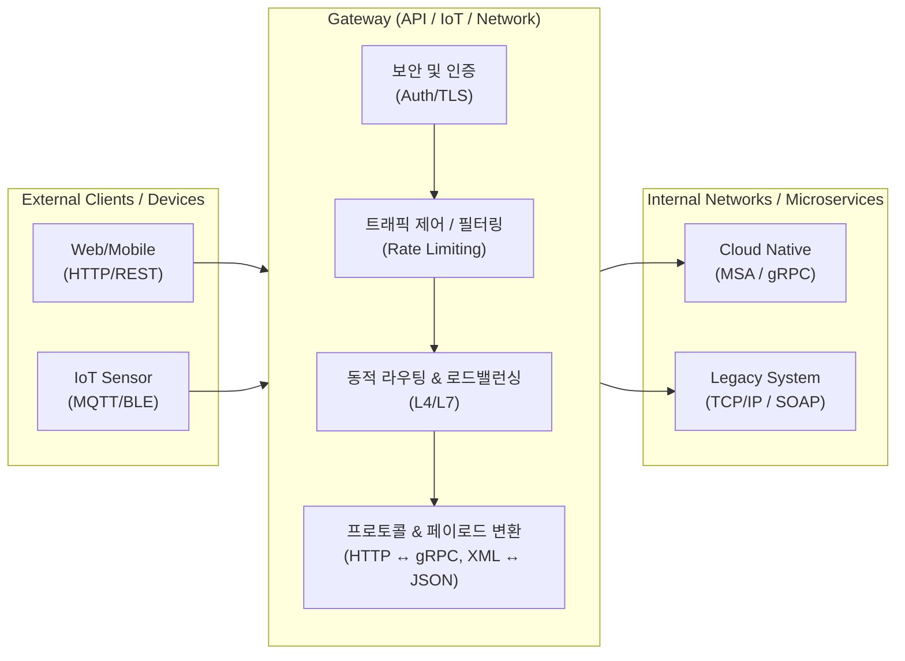

# 게이트웨이 (Gateway)
## I. 이기종 네트워크 및 프로토콜 연동의 진입점, 게이트웨이의 개요
- 정의: 서로 다른 통신망이나 이기종 프로토콜을 사용하는 네트워크 간의 통신을 가능하게 하는 하드웨어 또는 소프트웨어 기반의 네트워크 연결점(Node)
- 등장배경/필요성:
    - [[프로토콜]] 불일치 해소: [[TCP]]/IP, IPX, SNA 등 상이한 네트워크 아키텍처 간의 원활한 데이터 교환 요구
    - [[MSA (Micro Service Architecture)|MSA]] 환경 확산: [[클라우드 네이티브]] 환경에서 분산된 마이크로서비스를 통합 관리하는 API 진입점 필요
    - 엣지 컴퓨팅 대두: 저전력 IoT 통신([[MQTT (Message Queuing Telemetry Transport)|MQTT]], BLE 등)과 인터넷망(HTTP, TCP/IP) 간의 프로토콜 변환 필수
- 특징: 프로토콜 변환(Protocol Translation), 단일 진입점(Single Point of Entry), 트래픽 제어 및 보안 검문소 역할

## II. 게이트웨이의 아키텍처 및 핵심 기술 요소
### 가. 게이트웨이의 아키텍처 및 동작 원리

- 외부 클라이언트의 이기종 요청을 단일 진입점에서 수신하여 인증/인가, 트래픽 제어, 프로토콜 변환을 거쳐 적절한 내부 백엔드 시스템으로 라우팅 처리함
### 나. 게이트웨이의 핵심 기술 요소
|분류|요소기술(키워드)|세부 설명|
|---|---|---|
|변환/매핑|프로토콜 변환 (Protocol Translation)|- 이기종 프로토콜 간의 상호 변환 지원 (예: HTTP/1.1 ↔ HTTP/2, REST ↔ gRPC, MQTT ↔ TCP/IP)|
|변환/매핑|페이로드 변환 (Payload Transformation)|- 요청/응답 데이터의 포맷을 백엔드 요구사항에 맞게 변환 (예: [[XML]] ↔ [[JSON]] 변환)|
|연결/분배|메시지 라우팅 (Message Routing)|- 요청 URI, 헤더, 파라미터 기반의 동적 라우팅 및 엔드포인트 분배 기능|
|연결/분배|로드 밸런싱 (Load Balancing)|- 백엔드 서버의 부하를 분산시켜 [[HA(High Availability)|가용성]] 확보 (Round Robin, Least Connection 등)|
|보안/통제|인증/인가 (Authentication/Authorization)|- 단일 진입점에서의 중앙집중식 보안 통제 (OAuth 2.0, JWT, API Key 검증, TLS Termination)|
|보안/통제|트래픽 제어 (Rate Limiting/Throttling)|- 클라이언트별 API 호출 횟수 및 대역폭 제한을 통한 서버 과부하 방지 및 [[QoS]] 보장|
|[[신뢰성]]|서킷 브레이커 (Circuit Breaker)|- 타겟 서비스 장애 발생 시 호출을 차단(Open)하여 연쇄 장애 전파 방지 및 Fallback 처리|
|관찰성|로깅 및 모니터링 (Logging/Monitoring)|- 분산 트레이싱(Zipkin, Jaeger 연동) 및 메트릭 수집을 통한 트래픽 가시성 확보|
## III. 게이트웨이와 라우터의 비교 및 최신 동향
### 가. 게이트웨이와 라우터(Router)의 비교
|비교 항목|게이트웨이 (Gateway)|[[라우터]] (Router)|
|---|---|---|
|핵심 목적|이기종 네트워크 및 프로토콜 변환 연동|동종 네트워크(IP망) 내 패킷의 최적 경로 탐색|
|OSI 참조 모델|전 계층 (주로 L4 ~ L7 응용 계층)|L3 ([[네트워크 계층]])|
|데이터 처리 단위|메시지 (Message), 데이터 포맷|패킷 (Packet)|
|주요 기능|프로토콜 변환, API 라우팅, 보안/인증 처리|IP 라우팅, 패킷 포워딩, 서브넷 간 통신|
|구현 형태|[[API Gateway]] (Kong, Nginx), SWG, IoT Gateway|하드웨어 라우터, L3 [[스위치 (Layer 3 Switch)|스위치]]|
### 나. 게이트웨이 기술의 최신 동향 및 전망
- eBPF 기반 고성능 게이트웨이 대두: 기존 [[커널]]/유저스페이스 간의 컨텍스트 스위칭 오버헤드를 줄이기 위해, 커널 레벨에서 네트워킹을 처리하는 eBPF(extended Berkeley Packet Filter) 기반의 차세대 게이트웨이(예: Cilium) 도입 가속화
- Service Mesh와의 아키텍처 융합: 외부 트래픽을 처리하는 API Gateway(North-South)와 내부 서비스 간 통신을 제어하는 Service Mesh(East-West, Envoy 등)가 통합/연계되는 Ingress Gateway 형태로 발전 중
- [[제로 트러스트 보안모델|Zero Trust]] 관점의 SWG(Secure Web Gateway) 고도화: 원격 근무 확산에 따라 내부망 경계 중심의 보안에서 벗어나, 모든 트래픽을 검사하고 인가하는 [[SASE(Secure Access Service Edge)]] 기반의 클라우드 보안 게이트웨이로 진화

---

### 🔗 연관 토픽

- **소속 도메인**: [[00_네트워크_MOC|🌐 네트워크]]
- **세부 분류**: `1. OSI 7계층 & 데이터링크 계층 (L1/L2)`
- **핵심 연관 토픽**:
  - [[스위치 (Layer 3 Switch)]]
  - [[프로토콜]]
  - [[라우터]]
  - [[네트워크 계층|네트워크 계층 (Network Layer)]]
  - [[MQTT (Message Queuing Telemetry Transport)]]
