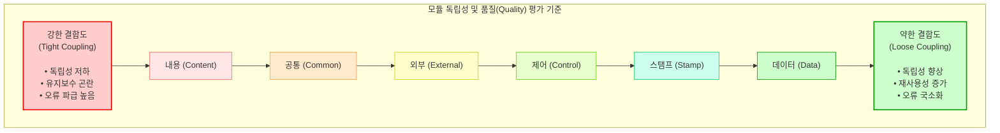

# 결합도 (Coupling)

## I. 성공적인 소프트웨어 설계를 위한 핵심 지표, 결합도의 개요

- 정의: 소프트웨어 구조에서 모듈 간의 상호 의존하는 정도 또는 연관 관계의 척도를 의미하는 설계 품질 평가 지표
- 목적: 모듈의 독립성 극대화, 시스템의 유지보수성 및 재사용성 향상, 파급 효과(Ripple Effect) 최소화
- 특징:
    - 설계 원칙: 낮을수록 품질이 우수함 (Low Coupling 지향)
    - 상호 배타성: [[응집도]](Cohesion)와 반비례적인 역학 관계 형성 (결합도 최소화, 응집도 최대화)

## II. 결합도의 유형별 개념도 및 핵심 구성 요소
### 가. 결합도의 개념도 및 판단 기준

- 강한 결합(내용)에서 약한 결합(데이터)으로 갈수록 소프트웨어 설계 품질이 우수함 (내-공-외-제-스-데)
- 최신 [[클라우드 네이티브]](Cloud Native) 환경에서는 결합도를 더욱 낮추기 위해 메시지/이벤트 기반 아키텍처 채택
### 나. 결합도의 세부 유형 및 핵심 기술 요소

|구분|요소기술(키워드)|세부 설명|
|---|---|---|
|강한 결합(품질 하)|내용 결합도(Content)|- 한 모듈이 다른 모듈의 내부 기능이나 데이터를 직접 참조 및 수정- GOTO 문 사용, [[캡슐화]] 위배|
|강한 결합(품질 하)|공통 결합도(Common)|- 여러 모듈이 동일한 전역 변수(Global Data)나 전역 메모리를 공유- 데이터 변경 시 모든 참조 모듈에 파급 효과 발생|
|중간 결합(품질 중)|외부 결합도(External)|- 외부 환경(OS, 특정 하드웨어, 통신 [[프로토콜]])과 모듈이 강하게 결합- 외부 포맷 변경 시 모듈도 함께 수정 필요|
|중간 결합(품질 중)|제어 결합도(Control)|- 모듈 간 제어 신호(Flag, Switch 등)를 전달하여 상대 모듈 내부 흐름 제어- [[블랙박스 테스트]] 곤란, [[정보은닉]] 위배|
|약한 결합(품질 상)|스탬프 결합도(Stamp)|- 모듈 간 인터페이스로 배열, 레코드, 객체 등 복합 자료구조 전달- 불필요한 데이터까지 함께 전달되는 오버헤드 존재|
|약한 결합(품질 상)|데이터 결합도(Data)|- 모듈 간 매개변수(Parameter)를 통해 필요한 단순 데이터만 전달- 가장 바람직한 결합도 수준 (독립성 최상)|
|현대적 관점(설계 원칙)|데메테르 법칙(Law of Demeter)|- 모듈 간 결합도를 낮추기 위해 직접적인 객체 통신을 제한하는 원칙- "최소 지식의 원칙(Principle of Least Knowledge)" 적용|
|현대적 관점(아키텍처)|느슨한 결합(Loose Coupling)|- [[MSA (Micro Service Architecture)|MSA]] 환경에서 [[API Gateway]], Message [[Queue]](Kafka) 기반 결합 최소화- 의존성 주입(DI), 비동기 이벤트 기반 통신([[EDA]]) 활용|

## III. 소프트웨어 모듈화 핵심 지표 비교 및 활용 전망
### 가. 결합도(Coupling)와 응집도(Cohesion) 비교

| 비교 항목     | 결합도 (Coupling)                       | 응집도 (Cohesion)               |
| ------------- | ---------------------------------------- | -------------------------------- |
| 평가 관점     | 모듈 간 (Inter-module) 연관성                  | 모듈 내 (Intra-module) 요소 연관성       |
| 지향점       | 최소화 (Low) 지향 / 약할수록 좋음                   | 최대화 (High) 지향 / 강할수록 좋음          |
| 평가 척도     | 내용 > 공통 > 외부 > 제어 > 스탬프 > 데이터            | 우연 < 논리 < 시간 < 절차 < 통신 < 순차 < 기능 |
| 주요 부작용    | (높을 시) 시스템 통합/테스트/[[유지보수]] 비용 증가             | (낮을 시) 단일 모듈의 복잡도 증가 및 이해도 저하    |
| 최신 트렌드 적용 | MSA, Event-Driven Architecture, REST API | 도메인 주도 설계([[DDD (Domain Driven Design)|DDD]]), Bounded Context  |

- [[객체지향]] 설계에서는 SOLID 원칙(DIP: 의존성 역전 원칙 등)을 통해 결합도를 낮추고 응집도를 높임
- 현대의 클라우드 분산 시스템 환경에서는 서비스 간 결합도를 낮추는 Circuit Breaker, Service Mesh 기술이 필수적으로 요구됨

---

### 🔗 연관 토픽

- **소속 도메인**: [[00_소프트웨어공학_MOC|🏗️ 소프트웨어공학]]
- **세부 분류**: `4. 아키텍처 스타일 & 객체지향 설계 원리`
- **핵심 연관 토픽**:
  - [[MSA (Micro Service Architecture)]]
  - [[DDD (Domain Driven Design)]]
  - [[응집도]]
  - [[정보은닉|정보은닉 (Information Hiding)]]
  - [[캡슐화|캡슐화 (encapsulation)]]
