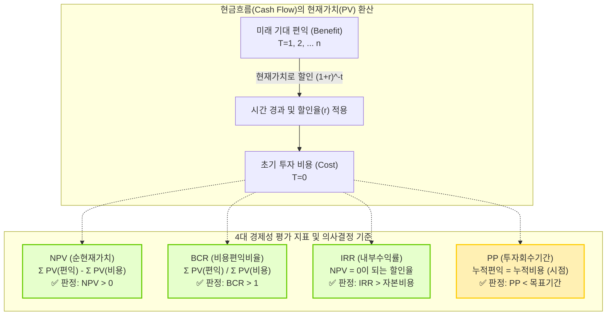

# 경제성 분석 기법 (BCR, PP, NPV, IRR)

## I. 성공적인 IT 투자를 위한 사전 검증 지표, 경제성 분석 기법의 개요

- 정의: 정보시스템 구축 및 IT 프로젝트 추진 시, 소요되는 예상 비용(Cost)과 기대되는 편익(Benefit)을 계량적으로 비교하여 투자 타당성을 검증하는 정량적 의사결정 기법
- 필요성: 한정된 자원의 최적 할당, 투자 프로젝트의 Go/No-Go 결정 기준 제공, 프로젝트 우선순위 선정 객관화
- 특징: 화폐의 시간가치(Time Value of Money) 고려 여부에 따라 정태적 분석(PP, ROI)과 동태적 분석(NPV, IRR, BCR)으로 구분됨

## II. 경제성 분석 기법의 개념도 및 핵심 평가 지표

### 가. 경제성 분석 기법의 개념도 및 판단 원리

- 미래에 발생하는 편익을 현재가치(Present Value)로 환산하여, 초기 투자 비용과 직접 비교함으로써 경제적 타당성을 수치화함.
### 나. 경제성 분석 기법의 핵심 기술 요소 비교표

|분류 (시간가치 고려)|분석 기법 (키워드)|세부 설명 및 채택 기준|
|---|---|---|
|동태적 분석(시간가치 O)|NPV(Net Present Value)|- 편익의 현재가치 합계에서 비용의 현재가치 합계를 차감한 절대 금액- 채택 기준: NPV > 0 (0보다 크면 투자 가치 있음)- 기업 가치 극대화에 가장 부합하는 지표|
|동태적 분석(시간가치 O)|BCR(Benefit-Cost Ratio)|- 편익의 현재가치 합계를 비용의 현재가치 합계로 나눈 비율 (수익성 지수)- 채택 기준: BCR > 1 (1보다 크면 투자 타당성 있음)- 투자 규모가 다른 여러 프로젝트의 우선순위 비교 시 유용함|
|동태적 분석(시간가치 O)|IRR(Internal Rate of Return)|- NPV를 '0'으로, BCR을 '1'로 만드는 프로젝트 자체의 내재적 할인율- 채택 기준: IRR > 자본비용(요구수익률)- 할인율 사전 결정 없이 수익률 자체를 직관적으로 파악 가능|
|정태적 분석(시간가치 X)|PP(Payback Period)|- 초기 투자 비용을 미래의 현금유입(편익)으로 모두 회수하는 데 걸리는 기간- 채택 기준: PP < 기업의 목표 회수 기간- 계산이 단순하나 화폐의 시간가치 및 회수기간 이후의 수익을 무시함|
|보완 기법|DPP(Discounted PP)|- 현금흐름을 현재가치로 할인한 후 투자회수기간을 산정하여 PP의 단점 보완|
## III. 경제성 분석 기법의 한계점 및 IT 투자 평가 패러다임 변화
### 가. 전통적 경제성 분석의 한계 및 보완 방안(최신 트렌드)

|한계점|한계점 상세 내용|보완 기법 및 해결 방안 (IT 트렌드)|
|---|---|---|
|무형 자산 평가 곤란|IT 투자는 브랜드 가치 증대, [[프로세스]] 혁신 등 재무적으로 환산하기 어려운 정성적 편익이 많음|IT-[[BSC]] (Balanced Scorecard)- 재무적 관점 외에 고객, 내부 프로세스, 학습/성장 등 균형 잡힌 다면 평가 도입|
|높은 불확실성/리스크|AI, 클라우드 등 최신 IT 기술은 기술 변화 속도가 빨라 미래 현금 흐름 추정이 매우 어려움|실물옵션 (Real Options Analysis)- 금융 옵션 이론을 적용하여 연기, 확대, 축소, 포기 등 경영자의 유연한 의사결정 가치를 평가에 반영|
|숨은 비용 누락|도입 시점의 비용만 고려하고 운영/[[유지보수]] 비용 누락|TCO (Total Cost of Ownership)- 도입부터 운영, 폐기까지 수명주기 전반의 직/간접 총소유비용 산정|
- 최근 [[클라우드 네이티브]] 및 AI 전환 프로젝트에서는 단순한 재무적 지표(NPV, ROI)를 넘어, 비즈니스 민첩성(Agility) 향상과 데이터 자산화 가치를 포함하는 종합적인 IT 투자 성과 측정 프레임워크가 필수적으로 요구됨.

---

### 🔗 연관 토픽

- **소속 도메인**: [[00_프로젝트관리_MOC|📋 프로젝트관리]]
- **세부 분류**: `3. 소프트웨어 원가 산정 & 성과 관리 (Cost & EVM)`
- **핵심 연관 토픽**:
  - [[프로세스]]
  - [[클라우드 네이티브]]
  - [[유지보수]]
  - [[BSC|BSC (Balanced Scorecard), IT-BSC (IT-Balanced Scorecard)]]
  - [[SW 품질비용]]
