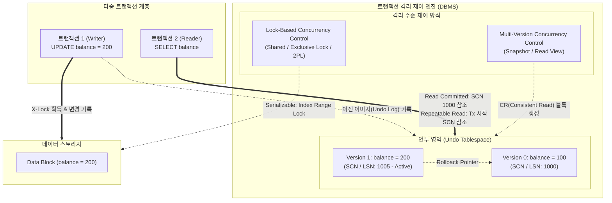
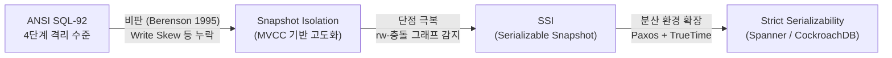

# 고립화 수준 (Transaction Isolation Level)
## I. 동시성과 데이터 일관성의 트레이드오프 제어, 고립화 수준의 개요
### 가. 고립화 수준(Transaction Isolation Level)의 정의
- 트랜잭션의 ACID 특성 중 고립성(Isolation)을 보장하기 위해 다중 [[트랜잭션]] 동시 실행 시 상호 간의 간섭 및 데이터 공유 범위를 단계별로 정의한 동시성 제어 기준
### 나. 고립화 수준의 필요성 및 핵심 특징
- **데이터 정합성 유지**: 비인가된 변경 데이터의 참조([[Dirty Read]] 등)를 방지하여 상호 종속적인 트랜잭션 간 일관성 훼손 차단
- **동시성(Throughput) 극대화**: 완벽한 직렬화(Serializability)로 인한 락 경합(Lock Contention) 및 대기시간을 업무 성격에 맞춰 최소화
- **성능-정합성 트레이드오프(Trade-off)**: 고립화 수준 상향 시 정합성은 증가하나 동시성 저하, 하향 시 동시성은 증가하나 이상현상([[Anomaly(이상현상)|Anomaly]]) 발생
## II. 고립화 수준의 아키텍처 및 핵심 기술 요소
### 가. 고립화 수준의 동시성 제어 메커니즘 및 동작 원리

- **동작 흐름**: 쓰기 작업(T1) 시 Undo Log에 이전 이미지 저장 $\rightarrow$ 읽기 작업(T2)은 격리 수준에 따라 커밋된 시점의 Snapshot(MVCC)을 참조하여 Read-Write 간 블로킹 제거
- **격리 수준 고도화**: Level이 올라갈수록 Lock 유지 시간 장기화([[2PL]]) 및 검증 대상 버전 범위 확대로 잠금 경합 발생률 증가
### 나. 고립화 수준의 핵심 기술 및 구성 요소

|**구분**|**핵심 기술(키워드)**|**세부 설명**|
|---|---|---|
|**락킹 메커니즘**|**2PL (Two-Phase [[Locking]])**|확장(Growing) 단계에서 락 획득만 수행하고, 수축(Shrinking) 단계에서 락 해제만 수행하여 직렬가능성 보장|
|**락킹 메커니즘**|**Strict 2PL**|트랜잭션 완료(Commit/Abort) 시점까지 모든 배타 락(X-Lock)을 유지하여 연쇄 복구(Cascading Abort) 방지|
|**다중 버전 제어**|**MVCC (Multi-Version)**|데이터 갱신 시 Undo Log에 다중 버전을 생성하여 읽기-쓰기 간 락 경합을 원천 해소하고 Consistent Read 지원|
|**스냅샷 제어**|**Snapshot Isolation**|트랜잭션 시작 시점의 스냅샷을 기반으로 쿼리를 실행하여 Non-Repeatable 및 [[Phantom Read]] 방지|
|**이상현상 방지**|**Gap Lock / Next-Key Lock**|레코드 간 공백(Gap) 및 레코드+공백을 동시에 락킹하여 팬텀 레코드 삽입을 방지 (MySQL InnoDB의 Repeatable Read 구현 방식)|
|**이상현상 방지**|**Predicate Lock**|검색 조건에 해당하는 술어(Predicate) 영역 전체를 락킹하여 Serializable 레벨의 완전한 Phantom Read 차단|
|**차세대 직렬화**|**SSI (Serializable SI)**|Snapshot Isolation 환경에서 $rw$-Antidependency 사이클을 동적으로 추적하여 이상 징후 발생 시 Abort 처리 (PostgreSQL 적용)|
|**분산 일관성**|**Strict Serializability**|외부 일관성(External Consistency) 보장 기법으로, 분산 환경에서 물리적 시간 순서와 직렬 순서를 일치화 (TrueTime/HLC 기반)|
## III. 고립화 수준별 이상현상 비교 및 최신 동향
### 가. ANSI SQL-92 고립화 수준 및 이상현상(Phenomena) 비교

|**격리 수준 ([[Isolation Level (격리 레벨고립성 수준)|Isolation Level]])**|**Dirty Read**|**Non-Repeatable Read**|**Phantom Read**|**주요 구현 방식 및 RDBMS 적용 현황**|
|---|---|---|---|---|
|**Level 0: Read Uncommitted**|**발생**|**발생**|**발생**|Commit되지 않은 데이터 읽기 허용 (배타 락 무시)|
|**Level 1: Read Committed**|**방지**|**발생**|**발생**|Commit 완료 데이터만 참조, [[SQL(Structured Query Language)|SQL]] 문장 단위 MVCC 스냅샷 갱신 (Oracle, PostgreSQL 기본값)|
|**Level 2: Repeatable Read**|**방지**|**방지**|**발생**|트랜잭션 단위 스냅샷 고정 참조 (MySQL InnoDB 기본값, Next-Key Lock 결합 시 팬텀리드 실질 방지)|
|**Level 3: Serializable**|**방지**|**방지**|**방지**|트랜잭션의 완전한 순차적 실행 보장, 락킹/SSI 기반 동시성 극소화|
### 나. 한계 극복을 위한 최신 기술 동향

코드 스니펫

- **ANSI SQL-92의 한계 및 확장**: Berenson 논문(1995)에서 제기된 Dirty Write, Lost Update, Write Skew(쓰기 왜곡) 등 비-ANSI 이상현상을 통제하기 위해 **Snapshot Isolation** 및 **SSI(Serializable Snapshot Isolation)** 상용화
- **분산 DB([[New SQL|NewSQL]]) 환경의 고립화**: Google Spanner, [[CockroachDB]], YugabyteDB 등 글로벌 분산 트랜잭션 환경에서는 원자 시계(Atomic Clock) 기반 TrueTime 또는 HLC(Hybrid Logical Clock)를 활용하여 지연시간 페널티를 최소화하면서 최고 수준인 **Strict Serializability**를 기본 채택하는 추세

---

### 🔗 연관 토픽

- **소속 도메인**: [[00_데이터베이스_MOC|🗄️ 데이터베이스]]
- **세부 분류**: `2. 트랜잭션 & 동시성 제어 (Concurrency)`
- **핵심 연관 토픽**:
  - [[트랜잭션]]
  - [[New SQL]]
  - [[CockroachDB|CockroachDB(코크로치DB)]]
  - [[2PL|2PL (Two-Phase Locking Protocol)]]
  - [[Dirty Read]]
