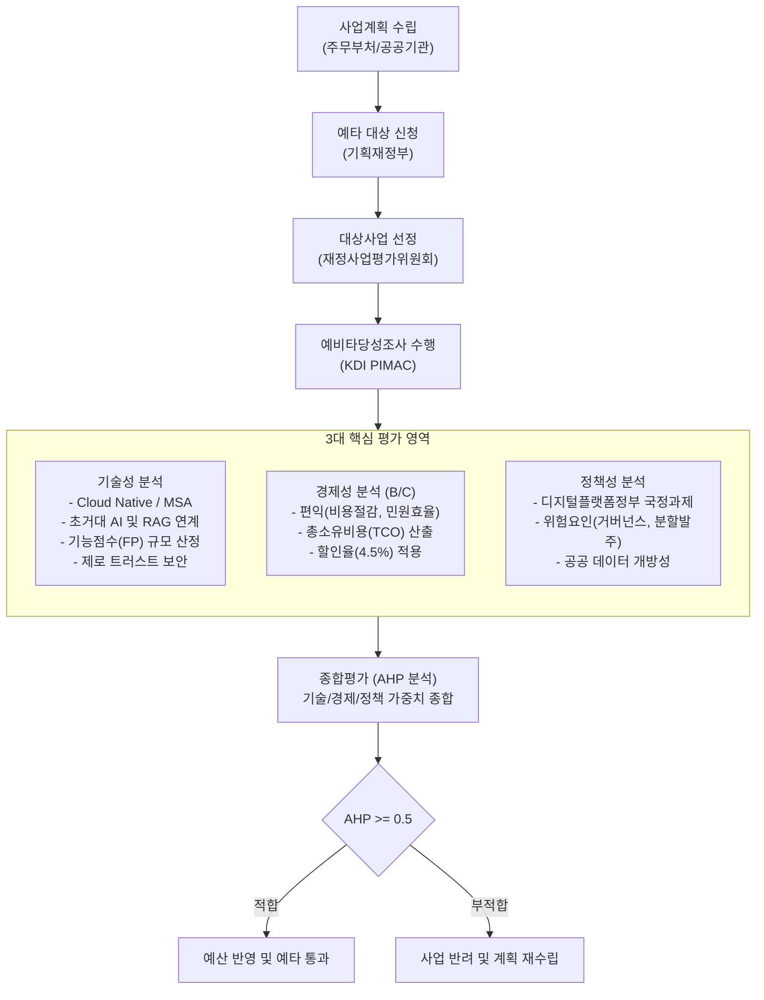

# 공공기관 정보화사업 예비타당성조사

---

## I. 대규모 IT 투자 효율성 및 기술 타당성 검증, 공공기관 정보화사업 예타의 개요

* **정의**: 공공기관이 추진하는 총사업비 1,000억원(기관 부담액 500억원) 이상의 대규모 정보화사업에 대해 기술적·경제적·정책적 타당성을 사전 검증하는 제도
* 대규모 차세대 시스템 구축 시 기술적 불확실성 해소, 예산 낭비 방지, 시스템 상호운용성 및 공공서비스 연속성 확보 목적
* **특징**: 기술성 분석 강화(클라우드·AI·[[MSA (Micro Service Architecture)|MSA]] 적합성), B/C(비용편익) 분석 병행, 다기준 의사결정(AHP 0.5 이상 시 사업 추진 타당성 인정)

---

## II. 공공기관 정보화사업 예비타당성조사 프레임워크 및 핵심 기술 요소

### 가. 정보화사업 예비타당성조사 절차 및 아키텍처 평가 체계

* KDI(PIMAC) 주관하에 기술성·경제성·정책성을 종합 평가하며, AHP 종합평점 0.5 이상을 획득해야 예산 수립 및 후속 절차 진행

### 나. 정보화부문 예타의 핵심 평가 영역 및 기술 요소

| 구분 | 핵심 기술/평가요소 | 세부 설명 |
| --- | --- | --- |
| 시스템 아키텍처 | Cloud-Native | 공공 민간 클라우드([[CSP]]) 우선 도입, [[컨테이너]] [[가상화]](K8s) 기반 [[PaaS]] 설계 타당성 |
| 시스템 아키텍처 | MSA | 모놀리식 지양, 도메인별 독립 배포/확장 가능한 마이크로서비스 아키텍처 분할 적정성 |
| [[인공지능]]/데이터 | GenAI & RAG | 행정 업무 자동화용 경량 [[초거대 언어 모델|LLM]]([[sLLM (Smaller Large Language Model)|sLLM]]) 도입, [[할루시네이션]] 방지용 검색증강생성 기술 검증 |
| 인공지능/데이터 | [[데이터 거버넌스|Data Governance]] | [[공공데이터]] 범정부 연계 체계, 데이터 카탈로그 및 메타데이터 표준화 준수 여부 |
| 비용 산정 | FP (기능점수) | ISO/IEC 14143 표준 기반 SW 규모 산정, 데이터/[[트랜잭션]] 기능 점수 단가 현실화 |
| 비용 산정 | TCO 분석 | H/W, S/W 라이선스 도입비뿐만 아니라 5~10년 운영유지보수비 및 클라우드 이용료 산출 |
| 보안 [[프레임워크]] | [[제로 트러스트 보안모델|Zero Trust]] | 단일 망분리 한계 극복, 다중 인증(MFA), 마이크로 [[세그멘테이션]], 지속적 검증 아키텍처 |
| 사업 관리 | 단계적 발주 | 차세대 대형 공공 SI 오픈 장애 방지용 분할 발주, PoC(개념검증) 선행 여부 |

---

## III. 정보화사업 예비타당성조사 vs 일반 SOC 예비타당성조사 비교

| 비교 항목 | 정보화사업 예비타당성조사 | 일반 SOC(토목/건축) 예비타당성조사 |
| --- | --- | --- |
| 대상 자산 | 무형의 소프트웨어, IT 인프라, 데이터 | 도로, 철도, 공항, 항만 등 물리적 구조물 |
| 감가상각/수명주기 | 3~5년(급격한 기술 진부화 및 갱신 주기) | 30~50년(장기 내구연수 및 [[유지보수]] 중심) |
| 편익(Benefit) 산정 | 처리시간 단축, 유지비 절감 등 계량화 난이도 높음 | 통행시간 절감, 교통사고 감소 등 정량화 용이 |
| 핵심 평가 중점 | 기술 적합성, 소프트웨어 규모(FP), 보안 안정성 | B/C 분석(경제성), 지역균형발전 분석 가중치 |
| 최신 트렌드 | 클라우드 전환 비용 표준화, AI 서비스 타당성 도입 | 친환경 탄소중립 평가, 공간정보 인프라 연계 |

* 급변하는 최신 IT 환경(생성형 AI, 클라우드)을 적기에 수용할 수 있도록 신속예타(패스트트랙) 제도 활성화 및 소프트웨어 사업 대가기준 고도화 지속 추진 필요

---

### 🔗 연관 토픽

- **소속 도메인**: [[00_소프트웨어공학_MOC|🏗️ 소프트웨어공학]]
- **세부 분류**: `4. 아키텍처 스타일 & 객체지향 설계 원리`
- **핵심 연관 토픽**:
  - [[MSA (Micro Service Architecture)]]
  - [[프레임워크]]
  - [[인공지능]]
  - [[제로 트러스트 보안모델|제로 트러스트 (Zero Trust) 보안모델]]
  - [[CSP|CSP (Cloud Service Provider)]]
