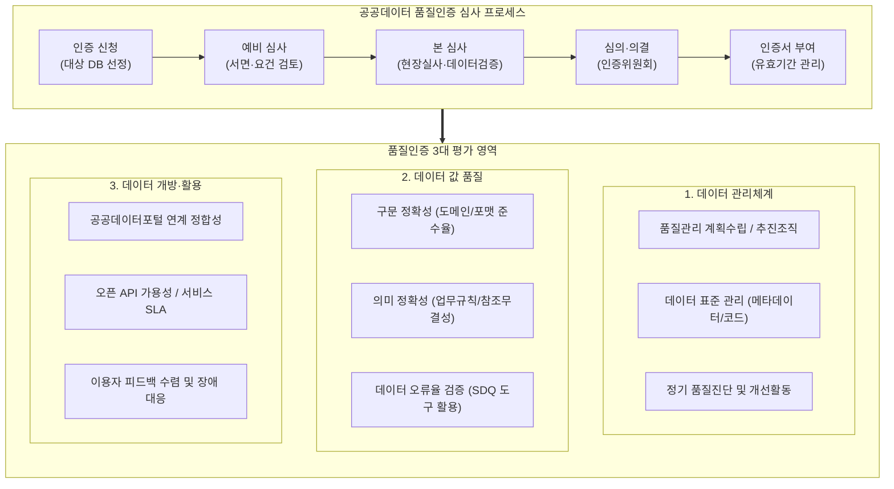

# 공공데이터 품질인증 매뉴얼

---

## I. 신뢰성 높은 데이터 생태계 구축을 위한 공공데이터 품질인증의 개요

* **정의**: 공공기관이 보유·관리하는 데이터의 정합성, 유효성 및 관리체계를 객관적으로 진단·심사하여 일정 수준 이상의 품질을 공식적으로 보증하는 행정안전부·한국지능정보사회진흥원(NIA)의 표준 가이드라인
* **추진 배경 및 특징**:
* **AI·데이터 경제 전환**: [[인공지능]] 학습 및 데이터 분석을 위한 고신뢰성 'AI-Ready Data' 원천 확보 필요
* **기관 자율 관리 내재화**: 수동적 일괄 평가에서 기관 주도의 능동적·상시적 자율 품질보증 체계로 전환
* **3대 핵심 영역 심사**: 데이터 관리체계, 데이터 값, 데이터 개방·활용의 전 주기 품질 요소 검증

---

## II. 공공데이터 품질인증 체계도 및 핵심 심사 영역

### 가. 공공데이터 품질인증 프레임워크 및 심사 절차

* 공공기관 신청 기반으로 [[PMBOK 프로세스 그룹 (5단계)|5단계]] 심사 프로세스를 거쳐 인증 등급(최우수, 우수 등) 부여 및 사후 사후모니터링 수행
* 정량적 오류율(값)뿐만 아니라 [[데이터 거버넌스]](관리체계)와 민간 활용성(개방·연계)을 종합 평가

### 나. 공공데이터 품질인증의 핵심 평가 영역 및 기술 요소

| 구분 | 핵심 기술 및 평가요소 | 세부 설명 |
| --- | --- | --- |
| **관리체계** | Q-Plan (품질관리계획서) | 기관 차원의 연간 [[데이터 품질관리(ISO 8000)|데이터 품질관리]] 목표 수립, 추진 일정, 전담 R&R 정의 |
| **관리체계** | 범정부 메타데이터 표준 | 표준단어, 표준용어, 도메인, 표준코드 정의 및 범정부 메타데이터 관리시스템 등록·준수 |
| **관리체계** | 형상 및 변경관리 | DB [[스키마]]([[DDL]]) 변경 이력 관리, 데이터 모델-물리 DB 간 일치성 확보 |
| **값 품질** | Syntax Accuracy (구문 정확성) | 날짜/숫자/전화번호 등 도메인 유효 범위 준수율, 패턴 적합성, 필수값 Null 체크 |
| **값 품질** | Semantic Consistency (의미 정확성) | 테이블 간 외래키(FK) 참조무결성, 비즈니스 룰(BR: Business Rule) 기반 정합성 |
| **값 품질** | DQI (오류율 측정 도구) | [[공공데이터]] 품질진단도구(SDQ) 활용 자동화 전수 검증, 오류율 기준(통상 0.01% 이하) 충족 |
| **개방·활용** | Data Synchronization (정합성) | 원천 운영계/정보계 DB와 공공데이터포털(data.go.kr) 개방 데이터 간 동기화 일치율 |
| **개방·활용** | Open API [[HA(High Availability)|가용성]] 및 표준화 | RESTful 규격 준수, [[JSON]]/[[XML]] 표준 포맷 제공, 응답 속도 및 가용성([[SLA]] 99.5% 이상) 보장 |

---

## III. 공공데이터 품질관리 수준평가와의 비교 및 발전 방향

### 가. 공공데이터 품질관리 수준평가 vs 공공데이터 품질인증 비교

| 비교 항목 | 공공데이터 [[품질관리]] 수준평가 | 공공데이터 품질인증 |
| --- | --- | --- |
| **제도 성격** | 법적 의무 기반 전수 실태 점검 | 기관 신청 기반의 자율적 품질 보증 제도 |
| **대상 범위** | 중앙행정기관, 지자체, 공공기관 전체 (기관 단위) | 기관 내 핵심 대민·대내 주요 [[데이터베이스]] (DB 단위) |
| **평가 방식** | 정량 지표(메타 등록률, 오류율) 중심 일괄 산출 | 관리체계 실사 + 데이터 값 전수 정밀진단 종합 심의 |
| **결과 활용** | 정부업무평가 반영, 부진기관 개선 권고 | 품질인증마크(인증서) 부여, 대국민 신뢰도 홍보 |
| **효과성** | 최소 품질 수준 유지를 위한 하한선 확보 | 고품질 데이터의 민간 개방 및 고부가가치 비즈니스 촉진 |

### 나. 향후 전망 및 기술 발전 방향

* **DataOps 기반 상시 품질 파이프라인 구축**: CI/CD 파이프라인 내 데이터 검증 자동화 도구를 결합하여 데이터 적재·배포 단계에서 실시간 품질 이상 탐지
* **AI 멀티모달 비정형 데이터 인증 체계 확장**: [[초거대 언어 모델|LLM]] 확산에 맞춰 텍스트 문서, 이미지, 음성 등 비정형 데이터의 개인정보 [[비식별화]] 수준 및 레이블링 정확도를 포괄하는 인증 지표 고도화 필요

---

### 🔗 연관 토픽

- **소속 도메인**: [[00_데이터베이스_MOC|🗄️ 데이터베이스]]
- **세부 분류**: `2. 트랜잭션 & 동시성 제어 (Concurrency)`
- **핵심 연관 토픽**:
  - [[공공데이터|공공데이터 (Open Data)]]
  - [[데이터 품질관리(ISO 8000)]]
  - [[데이터베이스]]
  - [[스키마]]
  - [[데이터 거버넌스|데이터 거버넌스 (Data Governance)]]
