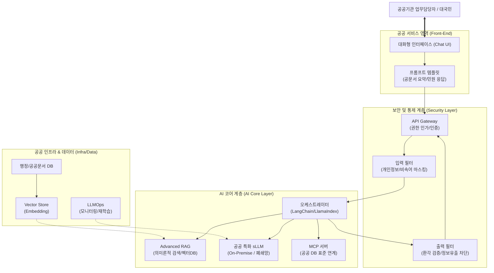

# 공공부문 초거대AI 도입·활용 가이드라인 2.0

---

## I. 안전하고 지능적인 행정 혁신, 공공부문 초거대AI 도입·활용 가이드라인 2.0의 개요

* **정의**: 국가 및 공공기관이 안전한 보안 환경 내에서 대국민 서비스 혁신과 행정 효율화를 달성하기 위해 초거대AI([[초거대 언어 모델|LLM]]/[[sLLM (Smaller Large Language Model)|sLLM]])를 기획, 구축, 운영하는 전 과정의 범정부 표준 지침(2025.04 개정)
* **추진 배경**: [[할루시네이션]](환각) 방지 및 정보 유출 위험성 통제 필요, 단순 API 연동을 넘어선 내부망 중심의 sLLM 및 RAG 기반 고도화, 디지털플랫폼정부(DPG) 실현을 위한 [[AI 거버넌스]] 확립
* **주요 특징**: 데이터 주권([[Sovereign AI (소버린 AI)|Sovereign AI]]) 확보, 온프레미스(On-Premise) 특화 폐쇄망 환경 지원, AI 레드팀(Red Teaming) 등 선제적 AI 보안 통제 체계화

---

## II. 가이드라인 2.0의 아키텍처 및 핵심 구성요소

### 가. 공공부문 초거대AI 아키텍처 및 동작 원리

* 업무 담당자의 질의(프롬프트)는 사전 필터링(PII 마스킹) 후, RAG를 통해 내부 벡터DB의 행정 문서를 검색하여 컨텍스트를 증강한 뒤 sLLM이 안전하게 답변을 생성하는 구조
* 외부 퍼블릭 클라우드 의존도를 낮추고 폐쇄망 내에서 데이터 유출 없이 작동하는 온프레미스 및 하이브리드 구성 권장

### 나. 공공부문 초거대AI 가이드라인 2.0의 핵심 기술 요소

| 구분 | 핵심 기술(키워드) | 세부 설명 |
| --- | --- | --- |
| **도입 모델** | **sLLM (Small LLM)** | 공공기관 내부망(On-Premise) 구축에 최적화된 경량화/파인튜닝된 언어 모델 |
| **환각 완화** | **Advanced RAG** | 내부 행정 문서, 규정집을 벡터 DB화하여 의미 기반 검색 및 [[신뢰성]] 있는 답변 증강 |
| **데이터 연계** | **[[MCP|MCP (Model Context Protocol)]]** | 다양한 공공 DB 및 내부 시스템과 AI 에이전트 간의 안전하고 표준화된 양방향 컨텍스트 연계 지원 |
| **보안/통제** | **데이터 [[비식별화]]** | 질의응답 시 포함될 수 있는 PII(개인정보), 민감 행정정보 사전 마스킹 및 실시간 필터링 |
| **보안/통제** | **AI Red Teaming** | 적대적 프롬프트 공격(Jailbreak, Prompt Injection)에 대비한 시스템 사전 모의 해킹 및 방어 훈련 |
| **운영 관리** | **[[LLMOps]] 파이프라인** | 모델의 응답 품질, 편향성, 시스템 부하 지속 모니터링 및 [[LoRA(Low-rank adaptation)|LoRA]] 등을 활용한 주기적 재학습 체계 |
| **활용 기법** | **Prompt Engineering** | 공문서 요약, 보도자료 초안 작성, 법령 질의응답 등 공공 업무 특화 프롬프트 템플릿 표준화 |
| **신뢰/윤리** | **[[XAI]] (설명가능한 AI)** | 생성된 답변의 정확성 검증을 위한 출처(Source) 의무 명시 및 논리적 추론 과정의 투명성 확보 |

---

## III. 가이드라인 기존(1.0)과의 비교 및 향후 전망

### 가. 가이드라인 1.0 vs 2.0 비교

| 비교 항목 | 가이드라인 1.0 (초기 도입기) | 가이드라인 2.0 (2025.04 고도화기) |
| --- | --- | --- |
| **활용 모델** | 퍼블릭 초거대AI (ChatGPT 등 외부 API) 중심 | 공공 특화 sLLM 구축 및 폐쇄망/하이브리드 중심 |
| **핵심 기술** | 기본 [[프롬프트 엔지니어링]] | Advanced RAG, MCP 기반 시스템 연동, Agentic AI |
| **보안 통제** | 민감정보 입력 금지(개인 수준 주의 요망) | 시스템적 필터링 체계 의무화, AI Red Teaming 도입 |
| **데이터 연계** | 단방향 질의응답 (정적 데이터) | 행정망 내부 시스템 API 양방향 연동 (동적 데이터) |
| **거버넌스** | [[AI 윤리]] 가이드라인 준수 권고 | AI 신뢰성 평가 지표 도입 및 LLMOps 기반 책임 추적성 강화 |

### 나. 향후 전망 및 동향

* **Agentic AI로의 진화**: 단순 질의응답을 넘어 민원 처리, 예산 분석, 결재 기안 등 일련의 행정 워크플로우를 자율적으로 수행하는 AI 에이전트 기반 업무 자동화 확산
* **소버린 AI(Sovereign AI) 확립**: 국가 안보와 직결된 데이터 보호를 위해 국산 AI 기초 모델(Foundation Model) 기반의 공공 전용 거대 모델 인프라 투자 지속 확대 예상

---

### 🔗 연관 토픽

- **소속 도메인**: [[00_인공지능_MOC|🤖 인공지능]]
- **세부 분류**: `4. 거대언어모델 (LLM) & 생성형 AI`
- **핵심 연관 토픽**:
  - [[LLMOps]]
  - [[sLLM (Smaller Large Language Model)]]
  - [[AI 윤리]]
  - [[프롬프트 엔지니어링|프롬프트 엔지니어링(Prompt Engineering)]]
  - [[할루시네이션|할루시네이션(Hallucination)]]
