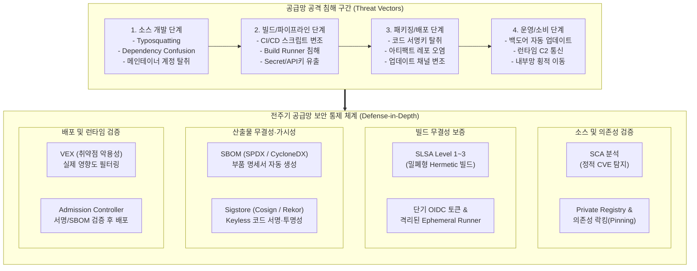

# 공급망 공격 (Supply Chain Attack)

---

## I. 신뢰 기반 생태계를 악용한 우회 침투, 공급망 공격의 개요

### 가. 공급망 공격(Supply Chain Attack)의 정의

* 소프트웨어 개발·빌드·배포 생태계 전반의 취약점(오픈소스, 서드파티 라이브러리, CI/CD 파이프라인, 협력업체)을 오염시켜, 이를 신뢰하는 최종 목표 조직과 다운스트림 사용자를 연쇄 침해하는 우회적 사이버 공격

### 나. 공급망 공격의 등장배경 및 핵심 특징

* 경계 보안(Perimeter) 한계 극복: 직접 침투가 어려운 표적 기업의 [[방화벽]]/망분리망을 협력사·정상 소프트웨어 공급망 우회를 통해 무력화
* 폭발적 피해 반경(Blast Radius): 단일 오픈소스 컴포넌트 또는 업데이트 서버 오염 시 수천~수만 개 다운스트림 고객사로 일괄 전파 (예: SolarWinds, Log4j, XZ Utils)
* 탐지 난이도 극대화: 정식 코드 서명(Code Signing) 및 공식 업데이트 채널을 경유하여 내부 보안 솔루션([[EDR(Endpoint Detection and Response)|EDR]], IPS)의 신뢰 기반 정책을 악용

---

## II. 공급망 공격의 위협 메커니즘 및 핵심 보안 대응 기술

### 가. 공급망 공격의 공격 벡터 및 방어 프레임워크 아키텍처

* 공격 흐름: 소스 오염(Typosquatting) $\rightarrow$ 빌드 오염(스크립트 주입) $\rightarrow$ 배포 오염(정상 서명 위장) $\rightarrow$ 다운스트림 조직 내부 침투
* 방어 흐름: 개발(SCA) $\rightarrow$ 빌드(SLSA, 격리 러너) $\rightarrow$ 산출물([[SBOM]], Sigstore 서명) $\rightarrow$ 런타임(VEX 기반 차단)의 [[End-to-End]] [[무결성]] 체인 수립

### 나. 공급망 공격 대응 핵심 기술 요소

| 구분 | 요소기술(키워드) | 세부 설명 |
| --- | --- | --- |
| 소스/의존성 | SCA (SW Composition Analysis) | 코드 내 포함된 오픈소스 라이브러리 식별, 버전 탐지 및 알려진 보안 취약점([[CVE]]) 자동 분석 |
| 소스/의존성 | Dependency Pinning & Hash | 의존성 패키지의 정확한 버전 및 체크섬 해시를 고정하여 타이포스쿼팅 및 의존성 혼란(Dependency Confusion) 공격 차단 |
| 빌드 무결성 | SLSA (Supply-chain Levels for Software Artifacts) | 빌드 플랫폼 무결성, 불변 빌드 환경, 외부 네트워크가 차단된 밀폐형(Hermetic) 빌드 보증 [[프레임워크]] (OpenSSF L1~L3) |
| 빌드 무결성 | CI/CD 파이프라인 하드닝 | 정적 시크릿 제거, OIDC(OpenID Connect) 기반 임시 토큰 발급, 일회성(Ephemeral) 빌드 러너 격리 운영 |
| 가시성 확보 | SBOM (Software Bill of Materials) | SW를 구성하는 패키지명, 버전, 라이선스, 의존 관계를 표준 구조화한 자재명세서 (SPDX, CycloneDX, SWID 규격) |
| 무결성 증명 | Sigstore (Cosign / Rekor / Fulcio) | OIDC ID 기반 단기 인증서(Fulcio) 발행, 불변 원장(Rekor) 투명성 로그 기록을 통한 무키(Keyless) 산출물 암호 서명 체계 |
| 위협 완화 | VEX (Vulnerability Exploitability eXchange) | SBOM에 나열된 수많은 CVE 중 실행 환경상 실제 악용 불가능(Not Affected)한 취약점을 분류하여 보안 피로도 해소 |
| 거버넌스 | NIST SP 800-218 ([[Secure Software Development Framework(SSDF)|SSDF]]) | SW 개발 전 단계(조직 준비, SW 보호, 안전한 SW 제작, 취약점 대응)의 미국 연방 표준 보안 개발 프레임워크 준수 |

---

## III. 전통적 애플리케이션 보안 vs SW 공급망 보안 비교 및 대응 동향

### 가. 전통적 보안과 공급망 보안 체계 비교

| 비교 항목 | 전통적 애플리케이션 보안 (AppSec) | 소프트웨어 공급망 보안 (SSCS) |
| --- | --- | --- |
| 보안 대상 | 자체 작성 소스코드 (1st-Party Code) | 소스, 오픈소스, 빌드 툴체인, 배포 파이프라인 전반 |
| 신뢰 모델 | 서명된 바이너리 및 내부망 신뢰 (Implicit Trust) | 공급망 구성요소 전반에 대한 지속적 검증 ([[제로 트러스트 보안모델|Zero Trust]]) |
| 핵심 도구 | [[SAST]], [[DAST]], WAF, IPS | SCA, SBOM, Attestation, SLSA, Sigstore |
| 무결성 기준 | 빌드 완료 후 단순 파일 해시 비교 | 소스 커밋부터 배포까지의 [[암호화]] 검증 체인(Provenance) |
| 규제 준수 | 전자금융감독규정, [[ISMS-P]] | NIST SSDF, 미 EO 14028, EU CRA(사이버복원력법), K-SBOM 가이드라인 |

### 나. 최신 기술 동향 및 향후 전망

* 글로벌 규제 강제화: 미국 행정명령(EO 14028)의 공공 조달 SBOM 제출 의무화 및 EU 사이버 복원력법(CRA) 발효에 따라 전 세계적인 SW 무결성 증적(Attestation) 표준화 가속
* K-SBOM 표준화 및 실증 확산: 과기정통부·KISA의 '소프트웨어 공급망 보안 가이드라인 1.0' 발표 이후 국내 공공·금융권을 중심으로 SBOM 기반 소프트웨어 자재명세서 체계 도입 본격화
* [[DevSecOps]]에서 SLSA/Zero Trust로 확장: 단순 CI/CD 파이프라인 정적 취약점 점검을 넘어 빌드 아티팩트 위·변조 방지 및 [[쿠버네티스]] Admission Controller와 결합된 서명 강제화 아키텍처 도입 필수화

---

### 🔗 연관 토픽

- **소속 도메인**: [[00_보안_MOC|🛡️ 보안]]
- **세부 분류**: `4. 웹 & 애플리케이션 보안 · 취약점 점검`
- **핵심 연관 토픽**:
  - [[Secure Software Development Framework(SSDF)]]
  - [[국가 망 보안체계|국가 망 보안체계(N2SF)]]
  - [[DAST]]
  - [[제로 트러스트 보안모델|제로 트러스트 (Zero Trust) 보안모델]]
  - [[DevSecOps]]
