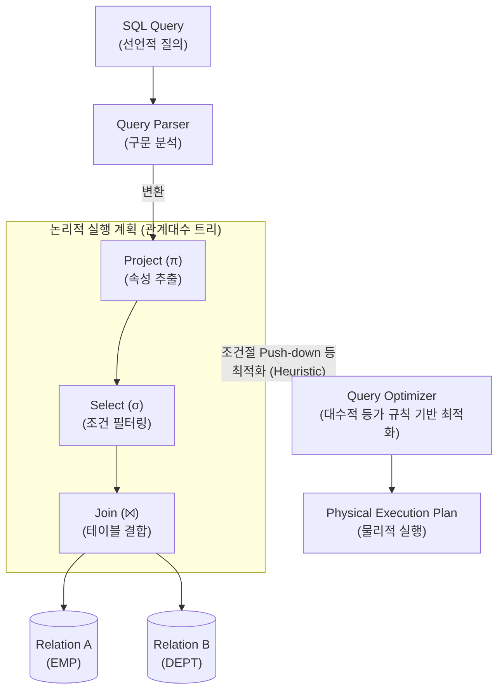

# 관계대수 (Relational Algebra)

---

## I. 관계형 데이터베이스의 이론적 기반, 관계대수의 개요

* **정의**: 원하는 데이터를 획득하기 위해 릴레이션에 수행할 연산의 순서와 처리 방법을 명시하는 절차적(Procedural) 데이터 언어
* 사용자가 원하는 정보(What)와 그 정보를 어떻게(How) 유도하는지에 대한 처리 과정을 수학적 연산 체계로 정의함
* **특징**:
* **폐쇄성(Closure)**: 연산의 피연산자(Input)와 연산의 결과(Output)가 모두 릴레이션(Relation) 구조를 유지함
* **질의 최적화 기반**: 현대 RDBMS 및 분산 쿼리 엔진(Spark [[SQL(Structured Query Language)|SQL]] 등)에서 실행 계획 트리 구성 및 최적화(CBO)의 이론적 근간으로 활용

---

## II. 관계대수의 동작 원리 및 핵심 연산자

### 가. 관계대수 기반의 질의(Query) 처리 동작 원리

* SQL 질의는 파싱 과정을 거쳐 관계대수 연산자로 구성된 논리적 실행 계획(트리)으로 변환됨
* [[DBMS]] 옵티마이저는 대수적 등가 규칙(Algebraic Equivalence)을 활용하여 최적의 경로(가장 비용이 적은 트리)를 도출함

### 나. 관계대수의 핵심 연산자 및 구성 요소

| 분류 | 요소기술(기호) | 세부 설명 |
| --- | --- | --- |
| 순수 관계 | **Select ($\sigma$)** | - 주어진 조건을 만족하는 튜플(행)의 부분집합을 추출 (수평적 연산) |
| 순수 관계 | **Project ($\pi$)** | - 릴레이션에서 지정된 속성(열)만을 추출하여 새로운 릴레이션 구성 (수직적 연산)- 중복 튜플 발생 시 자동 제거됨 |
| 순수 관계 | **Join ($\bowtie$)** | - 두 릴레이션의 공통 속성을 기반으로 조건에 맞는 튜플을 결합- 카티션 프로덕트 후 Select를 수행한 결과와 동일 (Theta, Equi, Natural Join 등) |
| 순수 관계 | **Division ($\div$)** | - 특정 릴레이션의 모든 속성값을 포함하는 튜플을 기준 릴레이션에서 추출 |
| 일반 집합 | **Union ($\cup$)** | - 두 릴레이션의 튜플 합집합 반환 (중복 튜플 제거)- 합병 가능(Union Compatible) 조건 충족 필수 |
| 일반 집합 | **Intersection ($\cap$)** | - 두 릴레이션에 공통으로 존재하는 튜플의 교집합 반환 |
| 일반 집합 | **Difference ($-$)** | - 첫 번째 릴레이션에는 존재하지만 두 번째 릴레이션에는 없는 튜플의 차집합 반환 |
| 일반 집합 | **Cartesian Product ($\times$)** | - 두 릴레이션 튜플들의 모든 가능한 조합 생성 (차수: 덧셈, 카디널리티: 곱셈) |

---

## III. 관계대수와 관계해석의 비교 및 향후 전망

### 가. 데이터베이스 질의 언어 간 비교 (관계대수 vs 관계해석)

| 비교 항목 | 관계대수 (Relational Algebra) | [[관계해석]] (Relational Calculus) |
| --- | --- | --- |
| **핵심 철학** | 절차적 (Procedural) 방식 | 선언적/비절차적 (Declarative) 방식 |
| **처리 초점** | **어떻게(How)** 데이터를 찾을 것인가 명시 | **무엇(What)**을 찾을 것인가 명시 |
| **이론적 기반** | 수학적 대수 집합 연산 | 술어 논리 (Predicate Calculus) |
| **주요 활용** | DBMS 내부의 논리적 질의 실행 계획 및 최적화 연산 | 상용 SQL, QBE(Query By Example) 설계의 이론적 사상 제공 |
| **표현 능력** | 관계해석과 동등한 표현력을 가짐 (Codd의 정리) | 관계대수와 동등한 표현력을 가짐 |

### 나. 관계대수의 최신 활용 동향 및 향후 전망

* **비용 기반 [[옵티마이저]](CBO) 고도화**: 대용량 [[트랜잭션]] 환경에서 관계대수 기반의 선택도(Selectivity) 및 카디널리티(Cardinality) 계산 정확도가 시스템 성능의 핵심으로 작용함
* **빅데이터 분산 처리 엔진 적용**: Apache Spark의 Catalyst [[OPTIMIZER|Optimizer]] 및 Presto/Trino 엔진 등에서 논리적 실행 계획(Logical Plan) 단계의 Rule-based 변환(예: Predicate Pushdown, Column Pruning)에 관계대수 원리가 적극 활용되고 있음

---

### 🔗 연관 토픽

- **소속 도메인**: [[00_데이터베이스_MOC|🗄️ 데이터베이스]]
- **세부 분류**: `6. SQL 표준 문법 & 쿼리 성능 튜닝`
- **핵심 연관 토픽**:
  - [[관계해석|관계해석(Relational Calculus)]]
  - [[OPTIMIZER]]
  - [[옵티마이저|옵티마이저 (Optimizer)]]
  - [[SQL(Structured Query Language)]]
  - [[DBMS]]
