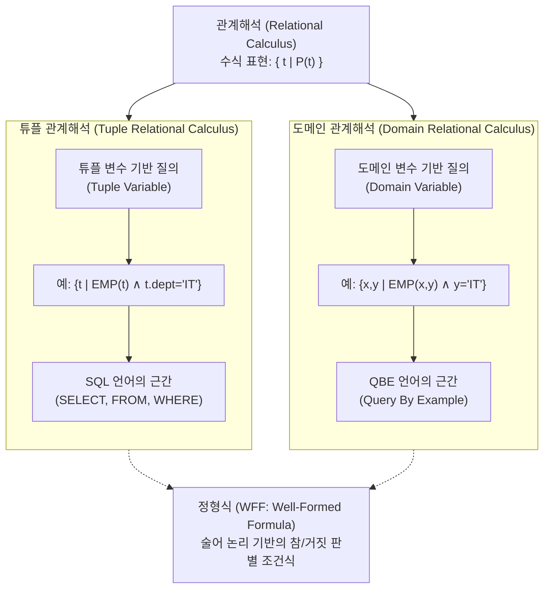

# 관계해석 (Relational Calculus)

---

## I. 관계형 데이터베이스의 선언적 질의 기반, 관계해석의 개요

* **정의**: 사용자가 원하는 데이터가 '무엇(What)'인지만 명시하고, 해당 데이터를 '어떻게(How)' 찾을 것인지는 명시하지 않는 비절차적(Declarative) 데이터 언어
* 술어 논리(Predicate Logic)에 기반하여 조건에 맞는 튜플이나 도메인을 구하는 수학적 체계임
* **특징**:
* **비절차성(Non-procedural)**: 실행 순서나 경로에 대한 명시 없이 논리적 조건(정형식)만 기술함
* **관계 완벽성(Relational Completeness)**: [[관계대수]](Relational Algebra)와 동등한 데이터 표현력 및 검색 능력을 가짐 (Codd의 정리)
* **언어 설계의 근간**: 현대 상용 RDBMS의 [[SQL(Structured Query Language)|SQL]] 및 시각적 질의어인 QBE(Query By Example)의 이론적 사상 제공

---

## II. 관계해석의 개념도 및 핵심 기술 요소

### 가. 관계해석의 개념도 및 유형 분류

* 구하고자 하는 결과 속성들의 대상 변수(Target)와 이를 만족시켜야 하는 술어 조건(Predicate)의 집합으로 질의를 구성함
* 무한 릴레이션(Infinite Relation)을 방지하기 위해 반드시 유한한 결과만을 반환하는 안전한 식(Safe Expression)으로만 설계되어야 함

### 나. 관계해석의 핵심 기술 및 구성 요소

| 분류 | 요소기술(키워드) | 세부 설명 |
| --- | --- | --- |
| **이론적 기반** | **술어 논리 (Predicate Logic)** | - 명제의 참과 거짓을 판별할 수 있는 논리적 문장 구조- 관계해석 조건식 평가의 수학적 기준 |
| **구성 요소** | **변수 (Variable)** | - 릴레이션의 튜플 전체(TRC) 또는 특정 속성의 도메인(DRC)에 바인딩되는 대상 객체 |
| **구성 요소** | **정형식 (WFF)** | - 원자식(Atom)들을 논리 연산자와 정량자로 연결하여 문법적으로 올바르게 구성된 수식 (Well-Formed Formula) |
| **논리 기호** | **전칭 정량자 ($\forall$)** | - Universal Quantifier ("For All")- 조건식에 대해 릴레이션의 **"모든"** 변수가 조건을 만족할 때 참(True) |
| **논리 기호** | **존재 정량자 ($\exists$)** | - Existential Quantifier ("There Exists")- 조건을 만족하는 변수가 **"적어도 하나 이상 존재"**할 때 참(True) |
| **논리 [[연산자]]** | **AND ($\land$), OR ($\lor$), NOT ($\lnot$)** | - 복합 술어 조건을 명시하기 위해 원자식들을 결합하는 논리 기호 |
| **유형** | **튜플 관계해석 (TRC)** | - E.F. Codd가 제안한 방식으로 변수가 튜플 단위로 할당됨- 현대 **SQL** 구문의 기본 사상 (SELECT = 대상 WFF, WHERE = 조건 WFF) |
| **유형** | **도메인 관계해석 (DRC)** | - M. Lacroix가 제안한 방식으로 변수가 속성(Domain) 단위로 할당됨- IBM의 **QBE(Query By Example)** 등 GUI 기반 질의 시스템의 뼈대 |

---

## III. 관계해석과 관계대수 비교 및 향후 동향

### 가. 관계형 데이터베이스 질의 언어 간 비교 (관계해석 vs 관계대수)

| 비교 항목 | 관계해석 (Relational Calculus) | 관계대수 (Relational Algebra) |
| --- | --- | --- |
| **질의 패러다임** | **선언적 / 비절차적 (Declarative)** | 절차적 (Procedural) |
| **처리 초점** | **무엇(What)** 데이터를 찾을 것인가 명시 | **어떻게(How)** 데이터를 찾을 것인가 명시 |
| **이론적 기반** | 1차 술어 논리 (First-Order Predicate Logic) | 수학적 집합론 및 대수 연산 |
| **[[DBMS]] 내 역할** | 사용자 친화적 쿼리 인터페이스 (SQL, QBE) | 질의 실행 계획(Plan) 생성 및 쿼리 최적화 (CBO) |
| **결과 도출 방식** | WFF(정형식)의 참/거짓을 평가하여 튜플 반환 | 릴레이션을 피연산자로 삼아 연산자를 순차적으로 적용 |

### 나. 선언적 쿼리의 확장 및 최신 활용 동향

* **무한성(Unsafe Query) 통제**: `NOT` 연산자 등의 잘못된 결합으로 발생하는 무한 결과 반환 오류를 막기 위해, 최신 DBMS 파서(Parser)는 WFF의 안전성(Safety)을 사전 검증(Semantic Check)함
* **차세대 DB 및 AI로의 확장**:
* 그래프 DB(Neo4j 등)의 Cypher 질의어 및 논리 프로그래밍(Datalog) 질의어 역시 관계해석의 '선언적 사상'을 계승하여 복잡한 패턴 매칭을 추상화함
* 최근 Text-to-SQL 등 [[초거대 언어 모델|LLM]](대형언어모델) 기반 Agent가 쿼리를 자동 생성할 때, 자연어를 관계해석 기반의 논리적 술어(Predicate) 구조로 매핑(Reasoning)하는 데 핵심 지식으로 활용됨

---

### 🔗 연관 토픽

- **소속 도메인**: [[00_데이터베이스_MOC|🗄️ 데이터베이스]]
- **세부 분류**: `6. SQL 표준 문법 & 쿼리 성능 튜닝`
- **핵심 연관 토픽**:
  - [[관계대수|관계대수(Relational Algebra)]]
  - [[SQL(Structured Query Language)]]
  - [[DBMS]]
  - [[옵티마이저|옵티마이저 (Optimizer)]]
  - [[OPTIMIZER]]
