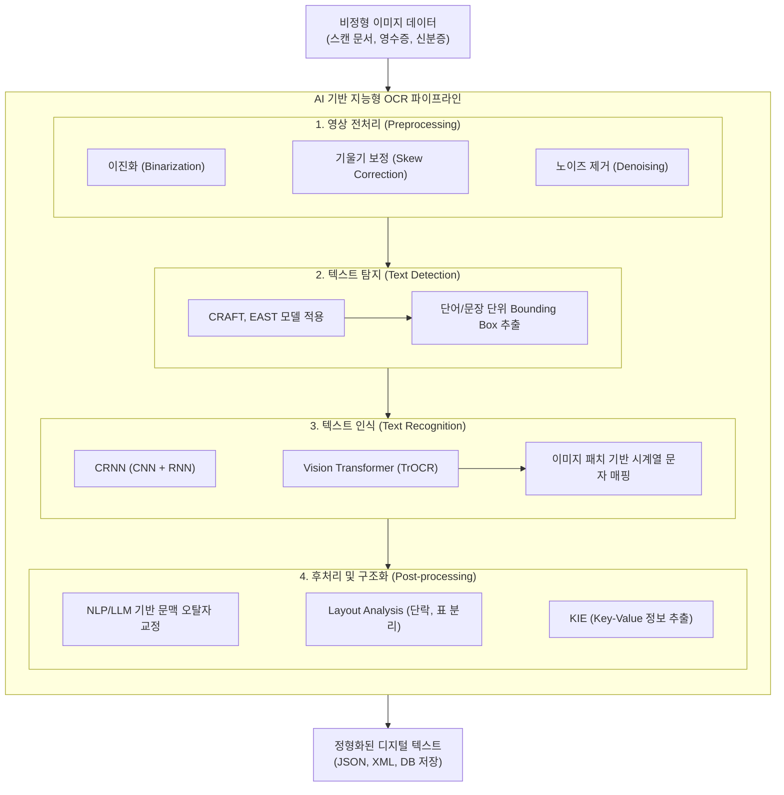

# 광학문자인식(OCR)

---

## I. 비정형 문서의 디지털 자산화, 광학문자인식(OCR)의 개요

* **정의**: 스캔된 이미지, 사진, 문서 내의 아날로그 텍스트 기호를 식별하여 기계가 판독 가능한 디지털 데이터(문자열)로 변환하는 지능형 인식 기술
* **전통적 한계 극복**: 과거 패턴 매칭 기반의 폰트 의존적 한계를 벗어나, [[딥러닝]]([[CNN]]+[[RNN (Recurrent Neural Network)|RNN]]) 및 Vision Transformer 기반으로 필기체, 다국어, 노이즈 환경에서의 인식률 극대화
* **최신 특징**: 텍스트 단순 추출을 넘어 문서의 레이아웃을 파악하는 Document AI로 진화, 멀티모달 [[초거대 언어 모델|LLM]] 및 RAG(검색 증강 생성) 파이프라인의 핵심 전처리 요소로 부상

---

## II. OCR의 아키텍처 및 핵심 구성요소

### 가. OCR의 개념도 및 동작 원리

* 이미지 입력 후 전처리를 거쳐 텍스트 영역을 찾고(Detection), 해당 영역의 글자를 해독(Recognition)한 뒤, NLP 모델을 통해 맥락 기반 정제를 수행하는 4단계 파이프라인 구조

### 나. OCR의 핵심 기술 요소

| 구분 | 핵심 기술 | 세부 설명 |
| --- | --- | --- |
| **영상 전처리** | Binarization (이진화) | 이미지의 픽셀 값을 0(흑)과 1(백)로 변환하여 글자와 배경의 대비를 극대화 |
| **영상 전처리** | Skew Correction | Hough 변환 등을 활용하여 틀어진 문서 이미지의 수평/수직 정렬 수행 |
| **문자 탐지** | CRAFT / EAST | 딥러닝 기반으로 문자의 중심점과 영역을 유연한 형태의 Bounding Box로 탐지 |
| **문자 인식** | CRNN [[알고리즘]] | CNN(특징 추출)과 RNN(시계열 패턴 인식)을 결합하여 가변 길이 문자열 인식 |
| **문자 인식** | TrOCR / ViT | Vision Transformer를 활용해 이미지 패치 간의 Attention 메커니즘으로 인식 고도화 |
| **구조 분석** | Layout Analysis | 문서 내 텍스트, 표(Table), 그림, 다단 구조 등을 논리적인 블록으로 분할 인식 |
| **의미 추출** | KIE (Key Info. Ext.) | 영수증, 신분증 등에서 이름, 금액 등 필요 항목(Key-Value Pair)을 자동 추출 |
| **후처리 보정** | LLM 기반 정제 | 단순 사전(Dictionary) 매칭을 넘어 앞뒤 문맥(Context)을 파악하여 오탈자 자동 교정 |

---

## III. OCR 기술의 발전 양상 (Rule-based vs AI-based) 및 향후 전망

### 가. 전통적 OCR과 AI 기반 지능형 OCR 비교

| 비교 항목 | 전통적 OCR (Rule-based) | AI 기반 지능형 OCR (Document AI) |
| --- | --- | --- |
| **핵심 기술** | 패턴 매칭, 템플릿 매칭, 외곽선 추적 | Deep Learning (CNN, RNN, Transformer) |
| **인식 대상** | 폰트가 명확한 정형 문서, 고품질 스캔본 | 비정형 문서, 악필 필기체, 노이즈/훼손 이미지 |
| **구조 이해** | 텍스트의 단순 평면적(Flat) 추출 | 문서 레이아웃 구조 인식 및 Key-Value 매핑 |
| **후처리 방식** | 정적 사전(Dictionary) 기반 단순 교정 | NLP, LLM 활용 맥락(Context) 기반 추론 보정 |
| **주요 엔진** | Tesseract (초기 버전), ABBYY FineReader | Naver CLOVA OCR, Google Document AI |

### 나. 최근 동향 및 향후 전망

* **[[End-to-End]] 멀티모달 통합**: Detection과 Recognition 파이프라인을 분리하지 않고, GPT-4o나 Gemini 1.5 Pro와 같은 대형 멀티모달 모델(LMM)이 이미지를 즉시 텍스트 및 마크다운으로 변환하는 형태로 진화 중
* **RAG(검색 증강 생성) 결합**: 기업 내부의 방대한 비정형 문서(PDF, 스캔 도면 등)를 LLM이 이해할 수 있도록 벡터 DB화하기 위한 필수 전처리 기술로 역할이 확대됨
* **보안 및 프라이버시**: 온디바이스(On-Device) [[NPU]]를 활용하여 서버로 데이터를 전송하지 않고 단말 내에서 민감 정보(주민등록증, 카드번호)를 처리하는 엣지 OCR 수요 증가

---

### 🔗 연관 토픽

- **소속 도메인**: [[00_인공지능_MOC|🤖 인공지능]]
- **세부 분류**: `3. 딥러닝 핵심 아키텍처 & 신경망`
- **핵심 연관 토픽**:
  - [[초거대 언어 모델|초거대 언어 모델(Large Language Model)]]
  - [[딥러닝]]
  - [[RNN (Recurrent Neural Network)]]
  - [[인공지능]]
  - [[CNN|CNN (Convolutional Neural Network)]]
