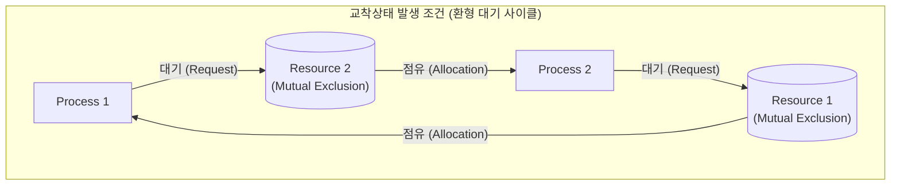

# 교착상태 (Deadlock)

---

## I. 멀티프로그래밍 환경의 영구적 자원 대기, 교착상태의 개요

* **정의**: 둘 이상의 [[프로세스]] 또는 스레드가 서로 점유한 자원을 무한정 대기하여 프로세스 수행이 영구적으로 중단되는 상태
* 다중 작업 환경의 자원 공유 및 비동기 동시성 제어 과정에서 시스템 [[HA(High Availability)|가용성]](Availability)을 치명적으로 저해하는 핵심 병목
* **특징**: 4대 필요조건(상호배제, 점유대기, 비선점, 환형대기) 동시 만족 시 발생, 발생 예측이 어려운 비결정적(Nondeterministic) 한계

---

## II. 교착상태의 발생 메커니즘 및 4대 해결 기법

### 가. 교착상태의 자원 할당 그래프(RAG) 및 동작 원리

* P1이 R1을 배타적으로 점유한 채 R2를 요청하고, P2가 R2를 점유한 채 R1을 요청하여 상호 자원 해제를 무한정 대기하는 순환 루프(Cycle) 형성

### 나. 교착상태의 핵심 해결 기술 및 구성 요소

| 구분 | 요소기술(키워드) | 세부 설명 |
| --- | --- | --- |
| **예방 (Prevention)** | 상호 배제 부정 | [[가상화]] 기술 및 Spooling 적용, Read-Only 자원 공유 확대를 통한 독점 제거 |
| **예방 (Prevention)** | 점유 및 대기 부정 | 자원 요청 시 일괄 할당(All-or-Nothing) 방식 적용, 미보유 상태에서만 요청 허용 |
| **예방 (Prevention)** | 비선점 부정 | 추가 자원 대기 발생 시 기보유 자원을 즉시 강제 반납(Preemption) 후 재요청 |
| **예방 (Prevention)** | 환형 대기 부정 | 모든 자원에 선형 고유 번호를 부여하고 오름차순 순차 요청(Hierarchical Ordering) 강제 |
| **회피 (Avoidance)** | 은행원 [[알고리즘]] | [[다익스트라 알고리즘|Dijkstra]] 제안, 프로세스의 최대 자원 요구량을 사전 파악하여 안전 상태(Safe State) 시만 할당 |
| **탐지 (Detection)** | 대기 그래프 (WFG) | 자원 할당 그래프에서 자원 노드를 생략하고 프로세스 간 간선 축약 후 DFS/Tarjan 사이클 탐지 |
| **탐지 (Detection)** | 타임아웃 감지 | [[트랜잭션]] 락 대기 시간 임계치(Lock [[Timeout]]) 초과 시 교착으로 간주하여 자동 중단 |
| **복구 (Recovery)** | 희생자 선정 및 롤백 | 우선순위 및 자원 소모 비용 기반 희생자(Victim) 선정, 체크포인트 기반 롤백 및 재수행 |
| **무시 (Ignorance)** | 타조 알고리즘 | 발생 빈도가 극히 낮고 해결 비용이 큰 시스템에서 교착을 무시하고 재부팅 처리 (UNIX/OS) |

---

## III. 교착상태 해결 기법 비교 및 분산 아키텍처 환경의 최신 동향

### 가. 교착상태 해결 기법 간 비교

| 비교 항목 | 예방 (Prevention) | 회피 (Avoidance) | 탐지 및 복구 (Detection & Recovery) |
| --- | --- | --- | --- |
| **자원 이용률** | 매우 낮음 (강한 사전 제약) | 보통 (동적 안전 상태 평가) | 높음 (자원 할당 제한 없음) |
| **시스템 오버헤드** | 컴파일/설계 시점 적용 | 런타임 안전 상태 검사 부하 | 주기적 사이클 탐지 및 롤백 부하 |
| **사전 정보 요구** | 불필요 (동작 규칙 준수) | 최대 자원 요구량 사전 선언 | 불필요 (현재 할당 상태만 추적) |
| **발생 가능성** | 완전 배제 (0%) | 완전 배제 (0%) | 발생 허용 후 사후 해결 |
| **주요 한계점** | 심각한 자원 낭비 및 처리율 저하 | 최대 자원량 사전 예측 불가 | 희생자 롤백에 따른 [[기아|기아(Starvation)]] |

### 나. 분산 시스템 및 최신 컴퓨팅 환경에서의 동향

* **[[MSA (Micro Service Architecture)|MSA]] 분산 트랜잭션 대응**: 2PC(Two-Phase Commit)의 블로킹 데드락 취약점을 극복하기 위해 비동기 메시징 기반 보상 트랜잭션을 사용하는 Saga 패턴(Choreography/Orchestration) 및 타임아웃 분산 락(Redis Redlock) 활용
* **[[DBMS]] 동시성 제어 고도화**: 비차단 읽기를 보장하는 MVCC(Multi-Version Concurrency Control) 적용 및 트랜잭션 타임스탬프 순서 기반 Wait-Die / Wound-Wait 비선점 알고리즘으로 분산 데드락 방지
* **[[커널]] 및 런타임 관측성(Observability)**: eBPF 기반 도구(Lockdep, BCC)를 활용하여 시스템 런타임 성능 저하 없이 커널 뮤텍스/[[스핀락]] 경합 패턴 및 잠재적 데드락 상태를 실시간 프로파일링

---

### 🔗 연관 토픽

- **소속 도메인**: [[00_운영체제_MOC|⚙️ 운영체제]]
- **세부 분류**: `1. 프로세스 & 스레드 관리`
- **핵심 연관 토픽**:
  - [[기아|기아(Starvation)]]
  - [[프로세스]]
  - [[멀티 쓰레드|멀티 쓰레드(Multi-Thread)]]
  - [[커널|커널(Kernel)]]
  - [[스핀락|스핀락 (Spin Lock)]]
