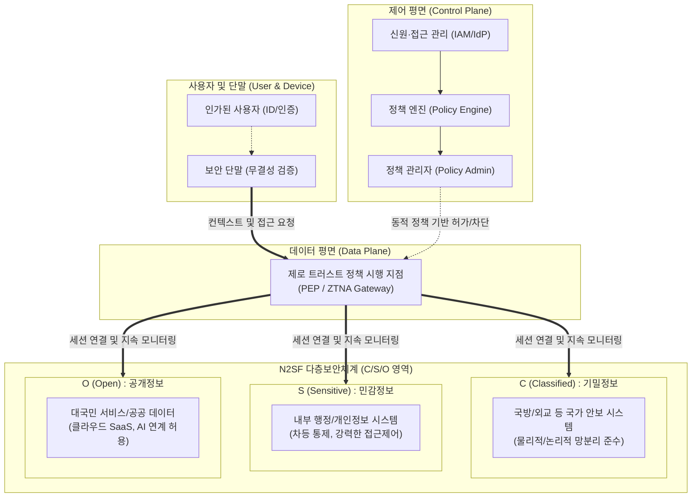

# 국가 망 보안체계(N2SF)

---

## I. 데이터 중심의 다층보안체계, 국가 망 보안체계(N2SF)의 개요

* **정의**: 기존의 획일적인 물리적 망분리 정책을 개선하여, 국가·공공기관 업무정보의 중요도(C/S/O)에 따라 보안 통제를 차등 적용하는 데이터 중심의 유연한 다층보안 [[프레임워크]](National Network Security Framework)
* **도입 배경**: 획일적 망분리로 인한 클라우드 및 초거대 AI 등 신기술 도입의 한계 극복, [[공급망 공격]] 등 지능화된 사이버 위협에 대응하기 위한 보안 패러다임 전환([[제로 트러스트 보안모델|Zero Trust]])의 필요성 대두
* **특징**: 다층보안체계(MLS; Multi-Level Security) 기반 등급 분류, 제로 트러스트 기반 지속 검증, 인가된 사용자에 대한 최소 권한(Least Privilege) 원칙 적용

---

## II. N2SF의 개념도 및 핵심 기술 요소

### 가. N2SF의 개념도 및 동작 원리

* 업무 데이터의 중요도에 따라 3등급(C/S/O)으로 분류하고, 사용자 신원 및 단말 상태를 지속적으로 검증(Zero Trust)하여 각 보안 영역에 대한 접근을 차등적이고 동적으로 통제함

### 나. N2SF의 핵심 기술 및 구성 요소

| 구분 | 요소기술(키워드) | 세부 설명 |
| --- | --- | --- |
| **자산 분류** | **C/S/O 등급화 (MLS)** | 자산 중요도에 따라 기밀(Classified), 민감(Sensitive), 공개(Open) 시스템으로 분리 및 식별 |
| **식별/인증** | **다중요소 인증 (MFA)** | 시스템 접근 시 2개 이상의 인증 요소(생체, OTP 등)를 요구하여 비인가자의 접근 원천 차단 |
| **접근 통제** | **최소 권한 (Least Privilege)** | 사용자 및 프로세스가 특정 업무를 수행하는 데 필요한 최소한의 접근 권한([[RBAC]]/ABAC)만 부여 |
| **접근 통제** | **ZTNA (Zero Trust)** | 위치에 관계없이 '항상 검증' 원칙을 적용하여 사용자와 단말의 상태 기반으로 애플리케이션 접근 제어 |
| **분리/격리** | **물리/논리적 격리 (Isolation)** | C등급(기밀) 정보는 하드웨어 및 소프트웨어 수준의 분리를 통해 외부 간섭 차단 및 망분리 환경 유지 |
| **정보 보호** | **데이터 흐름 통제 (Info Flow)** | 외부 경계 및 원격 접속 구간의 통신을 암호화하고, 승인되지 않은 정보 전송 방식을 제한하여 유출 방지 |
| **탐지/대응** | **위협 탐지 및 [[EDR(Endpoint Detection and Response)|EDR]]** | 이상 행위나 침해 시도를 실시간으로 탐지하고 확산을 차단할 수 있는 엔드포인트 및 네트워크 운영 체계 확보 |
| **감사/운영** | **증적 관리 및 책임성** | 보안 이상 행위 발생 시 접근 주체, 대응 기준 및 조치 내역을 로그로 기록하여 포렌식 분석 및 감사 대응 |

---

## III. N2SF와 기존 망분리 정책 비교 및 향후 전망

### 가. 기존 획일적 망분리와 N2SF(다층보안체계) 비교

| 비교 항목 | 기존 망분리 정책 | N2SF (국가 망 보안체계) |
| --- | --- | --- |
| **정책 기조** | 획일적 보안 (경계 방어 중심) | 위험 기반 차등 보안 (데이터 중심) |
| **보안 경계** | 내부망과 외부망의 물리적/논리적 분리 | 신원, 단말, 데이터 중요도 중심 (Zero Trust) |
| **데이터 활용** | 내/외부망 간 자료전송 극히 제한적 | C/S/O 등급별 허용 기준에 따른 원활한 데이터 공유 |
| **신기술(AI) 도입** | 퍼블릭 클라우드, 상용 SaaS 도입 불가 | O/S 등급에 대해 민간 클라우드 및 초거대 AI 적극 활용 허용 |
| **적용 대상** | 모든 시스템에 동일한 통제 적용 | 실제 보안 위협과 업무 특성에 따른 맞춤형 통제 적용 |

### 나. N2SF의 향후 전망 및 동향

* **공공부문 AI 및 [[클라우드 네이티브]] 전환 가속화**: O(Open) 등급 시스템을 중심으로 민간의 혁신적인 SaaS 솔루션과 [[sLLM (Smaller Large Language Model)|sLLM]]/초거대 AI API 연동이 본격화되어 행정 서비스 질적 향상 기대
* **보안 거버넌스 및 평가 체계 고도화**: 단일 보안 솔루션 도입을 넘어, 지속적인 보안 상태 모니터링(Continuous Monitoring)과 AI 레드팀(Red Teaming) 등 선제적 위험 평가 체계 구축 필수
* **레거시 마이그레이션 과제**: 수많은 기존 공공 정보시스템을 C/S/O 기준으로 명확히 재분류(Data Classification)하기 위한 가이드라인 구체화 및 자동화된 데이터 식별 도구 도입 수요 증대 전망

---

### 🔗 연관 토픽

- **소속 도메인**: [[00_보안_MOC|🛡️ 보안]]
- **세부 분류**: `4. 웹 & 애플리케이션 보안 · 취약점 점검`
- **핵심 연관 토픽**:
  - [[공급망 공격|공급망 공격(Supply Chain Attack)]]
  - [[제로 트러스트 보안모델|제로 트러스트 (Zero Trust) 보안모델]]
  - [[RBAC]]
  - [[프레임워크]]
  - [[클라우드 네이티브]]
