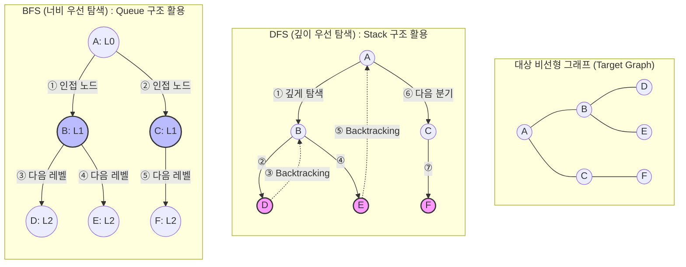

# 그래프 순회 (Graph Traversal)

---

## I. 복잡한 네트워크 구조의 체계적 탐색, 그래프 순회(Graph Traversal)의 개요

* **정의**: 그래프 자료구조를 구성하는 모든 정점(Vertex)과 간선([[EDGE|Edge]])을 체계적이고 중복 없이 방문하여 특정 노드를 찾거나 연산을 수행하는 핵심 탐색 [[알고리즘]]
* **등장배경**: 선형 구조(배열, 연결 리스트)와 달리 다대다(N:M) 연결망인 비선형 구조에서의 무한 루프(사이클) 방지 및 효율적 경로 탐색 필요성 증대
* **특징**: 방문 여부(Visited) 관리 필수, 자료구조([[Stack]]/[[Queue]]) 결합, 완전 탐색(Exhaustive Search) 보장, 네트워크 라우팅 및 소셜 네트워크 분석의 기반 기술

---

## II. 그래프 순회의 개념도 및 핵심 기술 요소

### 가. 그래프 순회의 개념도 및 동작 원리

* 노드 방문 시 방문 배열(Visited Array)에 기록하여 사이클(Cycle)에 의한 무한 루프를 방지함
* DFS는 한 분기(Branch)를 끝까지 파고든 후 백트래킹(LIFO)하며, BFS는 시작점 기준 레벨 단위로 확장([[FIFO]])하여 탐색함

### 나. 그래프 순회의 핵심 기술 요소

| 구분 | 요소기술(키워드) | 세부 설명 |
| --- | --- | --- |
| **자료 구조** | **인접 리스트 (Adjacency List)** | 정점 연결 정보를 리스트로 구현하여 희소 그래프 탐색 시 $O(V+E)$ 시간복잡도 보장 및 메모리 최적화 |
| **자료 구조** | **방문 배열 (Visited Array)** | 각 정점의 방문 상태(True/False)를 저장하여 중복 탐색 및 사이클 발생 방지 |
| **구현 기법** | **Stack / 재귀 (Recursion)** | DFS 구현을 위한 후입선출(LIFO) 구조, 재귀 함수 호출 스택을 통한 깊이 탐색 수행 |
| **구현 기법** | **Queue** | BFS 구현을 위한 선입선출(FIFO) 구조, 현재 레벨의 인접 정점을 큐에 삽입/추출하여 너비 탐색 |
| **탐색 제어** | **백트래킹 (Backtracking)** | DFS 수행 중 더 이상 방문할 인접 정점이 없는 막다른 길에서 이전 정점으로 회귀하는 기법 |
| **탐색 제어** | **레벨 횡단 (Level Traversal)** | BFS 수행 시 시작점으로부터 간선 수가 같은(동일 레벨) 정점들을 우선적으로 횡단하는 기법 |
| **응용 기술** | **A* Search (휴리스틱)** | 최단 경로 탐색 시 가중치와 휴리스틱(예측) 함수를 결합하여 탐색 공간을 최적화하는 기법 |
| **확장 기술** | **분산 그래프 처리 (BSP)** | 대규모 그래프 처리를 위해 Pregel, Apache Giraph 등 Bulk Synchronous Parallel 기반 병렬 순회 |

---

## III. 그래프 순회 핵심 알고리즘 비교 및 최신 동향

### 가. 깊이 우선 탐색(DFS)과 너비 우선 탐색(BFS) 비교

| 비교 항목 | 깊이 우선 탐색 (DFS, Depth-First Search) | 너비 우선 탐색 (BFS, Breadth-First Search) |
| --- | --- | --- |
| **탐색 철학** | 한 우물을 끝까지 깊게 탐색 (수직적) | 인접한 노드부터 얕고 넓게 탐색 (수평적) |
| **기반 자료구조** | Stack (또는 재귀 함수) | Queue |
| **경로 특징** | 해가 여러 개일 경우 **최단 경로 미보장** | 가중치가 없는 그래프에서 **최단 경로 보장** |
| **메모리 사용량** | 상대적으로 적음 (트리의 최대 깊이에 비례) | 상대적으로 많음 (동일 레벨의 최대 정점 수에 비례) |
| **시간 복잡도** | 인접리스트: $O(V+E)$, 인접행렬: $O(V^2)$ | 인접리스트: $O(V+E)$, 인접행렬: $O(V^2)$ |
| **주요 활용 분야** | 위상 정렬(Topological Sort), 사이클 탐지, 미로 찾기 | 최단 거리 산출, 웹 크롤러, 소셜 네트워크 친구 추천 |

### 나. 그래프 순회 알고리즘의 최신 동향 및 전망

* **Graph Neural Network(GNN) 연계**: 단순 정점 탐색을 넘어, 순회 과정에서 노드 간의 관계와 속성을 학습하여 추천 시스템 및 신약 탐색(단백질 구조 분석) 모델링의 핵심 전처리 과정으로 진화
* **[[벡터 데이터베이스]](Vector DB) 인덱싱**: 대용량 초거대 AI([[초거대 언어 모델|LLM]])의 RAG 구현 시 사용되는 HNSW(Hierarchical Navigable Small World) 알고리즘 내부에서 근사 최근접 이웃(ANN)을 찾기 위해 다층 그래프 순회 기법 응용
* **대규모 분산 처리 [[프레임워크]] 최적화**: 수십억 개의 노드/간선을 가진 소셜 데이터(빅데이터)의 순회 처리 병목을 해결하기 위해 [[GPU]] 기반 그래프 가속기 및 분산 메모리 아키텍처(Neo4j, AWS Neptune) 활용 확산

---

### 🔗 연관 토픽

- **소속 도메인**: [[00_컴퓨터구조_MOC|💻 컴퓨터구조]]
- **세부 분류**: `3. 고성능 AI 가속기 & 입출력 시스템`
- **핵심 연관 토픽**:
  - [[Stack]]
  - [[EDGE|edge]]
  - [[GPU]]
  - [[Queue]]
  - [[FIFO]]
