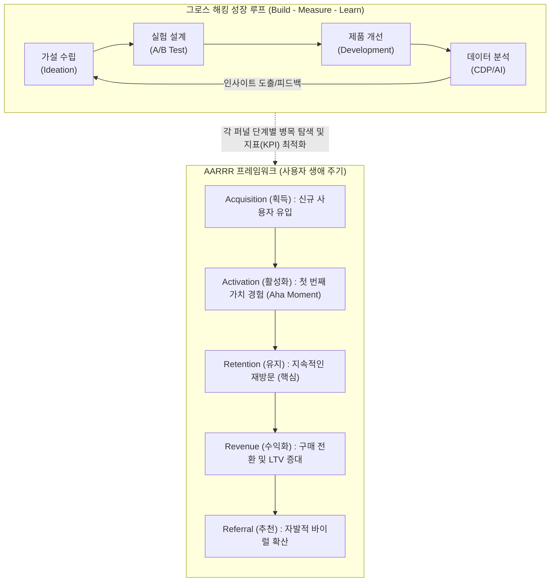

# 그로스 해킹 (Growth Hacking)

---

## I. 데이터 기반의 지속 가능한 성장 전략, 그로스 해킹의 개요

* **정의**: 제품 개발, 마케팅, 데이터 분석을 융합하여 고객의 생애 주기(AARRR) 전반에 걸쳐 가설 수립 및 실험(A/B 테스트)을 반복함으로써 비즈니스의 빠른 성장을 견인하는 데이터 주도형 마케팅 방법론
* **필요성 및 특징**:
* 고객 획득 비용(CAC) 상승 및 전통적 매스 마케팅의 ROI 한계 극복 필요
* 직관이 아닌 데이터 기반(Data-Driven) 의사결정 및 제품 주도 성장(PLG) 체계 실현
* 최근 AI/[[초거대 언어 모델|LLM]] 및 실시간 CDP와 결합하여 초개인화 및 자동화된 지속 가능한 성장 시스템으로 진화 중

---

## II. 그로스 해킹의 개념도 및 핵심 기술 요소

### 가. 그로스 해킹의 개념도 및 동작 원리

* 린 스타트업([[린 방법론|Lean]] Startup) 기반의 가설-실험-측정 사이클을 반복하여, AARRR 퍼널의 단계별 이탈률을 최소화하고 고객 생애 가치(LTV)를 극대화함

### 나. 그로스 해킹의 핵심 기술 요소

| 구분 | 요소기술(키워드) | 세부 설명 |
| --- | --- | --- |
| **성장 지표** | AARRR [[프레임워크]] | 획득, 활성화, 유지, 수익화, 추천의 [[PMBOK 프로세스 그룹 (5단계)|5단계]] 고객 여정 분석 모델 |
| **성장 지표** | 북극성 지표 (NSM) | 제품이 고객에게 주는 핵심 가치를 대변하는 전사적 단일 성공 지표 (North Star Metric) |
| **분석 기법** | 코호트 분석 (Cohort) | 가입 시점 등 동질적인 특성을 가진 그룹 단위로 유지율(Retention) 패턴 분석 |
| **실험 기법** | A/B 테스트 / 다변량 | UI/UX, 메시지 등을 대조군과 실험군으로 나누어 정량적 성과 검증 |
| **경험 설계** | 아하 모먼트 (Aha Moment) | 사용자가 제품의 가치를 처음으로 깊게 체감하여 이탈률이 급감하는 결정적 순간 |
| **인프라/데이터** | 실시간 CDP | 파편화된 고객 행동 데이터를 통합 및 식별하여 단일 뷰(SSOT) 기반 행동 활성화 지원 |
| **최신 기술** | AI/Bandit [[알고리즘]] | 수동 A/B 테스트의 한계를 넘어, 성과가 좋은 변수로 트래픽을 AI가 능동적으로 자동 할당 |
| **비즈니스 전략** | 제품 주도 성장 (PLG) | 영업/마케팅이 아닌, 제품 자체의 우수한 온보딩과 바이럴 루프를 통해 성장을 견인 |

---

## III. 전통적 마케팅과 그로스 해킹 비교 및 최신 동향

### 가. 전통적 마케팅과 그로스 해킹의 비교

| 비교 항목 | 전통적 마케팅 | 그로스 해킹 (Growth Hacking) |
| --- | --- | --- |
| **핵심 타깃** | 불특정 다수 대중 (Mass Audience) | 세분화된 타깃 및 코호트 그룹 (Micro-target) |
| **집중 퍼널** | 인지(Awareness), 획득(Acquisition) | AARRR 전체 (특히 Activation과 Retention 영역을 중시) |
| **의사결정 기준** | 마케터의 직관, 정성적 브랜드 경험 | 데이터 분석 결과, 정량적 가설 수립 및 실험(Test) 검증 |
| **예산 집행** | 대규모 미디어/광고 예산 선집행 (Top-Down) | 저비용 고효율 실험 중심, 기술 및 자동화 도구 적극 활용 |
| **주도 조직** | 마케팅 부서 중심 (Silo 현상) | 크로스펑셔널 팀 (기획자, 마케터, 개발자, 데이터 분석가) |

### 나. 최신 동향 및 향후 전망

* **AI 기반 지능형 그로스 시스템으로의 진화**: 단기적인 트릭이나 꼼수(Hack) 수준의 단편적 실험을 넘어, 인공지능과 머신러닝이 수천 개의 변수를 동시에 분석하여 고객 여정을 실시간으로 최적화하는 능동적이고 장기적인 성장 시스템으로 진화하고 있음.
* **퍼스트 파티 데이터(1st Party Data) 중심의 인프라 구축 강화**: 쿠키리스(Cookieless) 및 개인정보보호 규제 강화 시대에 대응하기 위해 실시간 고객 데이터 플랫폼(CDP)과 리버스 ETL(Reverse ETL) 등 현대적 데이터 스택(Modern Data [[Stack]])을 결합하여, 실무 조직(GTM)이 고객 데이터를 즉시 활성화할 수 있는 기반 아키텍처 도입이 필수로 대두됨.

---

### 🔗 연관 토픽

- **소속 도메인**: [[00_경영전략_MOC|📈 경영전략]]
- **세부 분류**: `1. 경영 환경 분석 & 전략 수립 프레임워크`
- **핵심 연관 토픽**:
  - [[의도 경제|의도 경제(Intention Economy)]]
  - [[Stack]]
  - [[PMBOK 프로세스 그룹 (5단계)]]
  - [[린 방법론|린 (Lean) 방법론]]
  - [[IT 거버넌스]]
