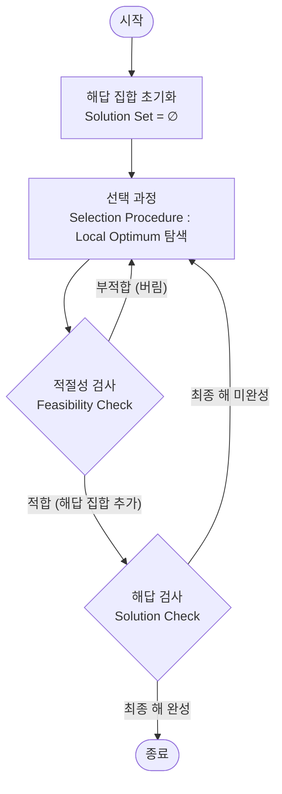

# 그리디 알고리즘 (Greedy Algorithm)

---

## I. 대규모 최적화 문제의 휴리스틱 접근, 그리디 알고리즘의 개요

* **정의**: 매 선택의 순간마다 지역적으로 최적인 해(Local Optimum)를 선택하는 과정을 반복하여, 최종적인 전역 최적해(Global Optimum)를 도출하는 직관적·휴리스틱 기반 [[알고리즘]] 기법
* **등장배경 및 특징**:
* 완전 탐색(Exhaustive Search)의 지수적 시간 복잡도(Exponential Time) 한계 극복을 위한 다항 시간(Polynomial Time) 내 근사해 도출 요구 증대
* **특징**: 빠른 수행 속도, 낮은 자원 소모, 부분 최적해 기반, 특정 조건(매트로이드) 하에서만 전역 최적해 보장

---

## II. 그리디 알고리즘의 핵심 원리 및 구성요소

### 가. 그리디 알고리즘의 동작 원리

* 매 단계별 최적 조건 탐색(선택) 후, 제약조건 부합 여부(적절성)를 판단하여 해답 집합에 추가하는 반복 구조

### 나. 그리디 알고리즘의 핵심 기술 및 구성 요소

| 분류 | 요소기술(키워드) | 세부 설명 |
| --- | --- | --- |
| **성립 조건** | 탐욕적 선택 속성(Greedy Choice Property) | 앞 단계의 선택이 이후 단계의 선택에 영향을 주지 않는 독립적 구조 |
| **성립 조건** | 최적 부분 구조(Optimal Substructure) | 전체 문제의 최적해가 각 부분 문제들의 최적해의 조합으로 구성됨 |
| **수학적 모델** | 매트로이드(Matroid) | 그리디 알고리즘이 항상 전역 최적해를 도출함을 보장하는 부분집합의 수학적 공리 |
| **동작 단계** | 선택 과정(Selection Procedure) | 현재 상태 기준, 가장 최선의 결과를 가져오는 후보 해답을 선택 |
| **동작 단계** | 적절성 검사(Feasibility Check) | 선택된 후보 해답이 문제의 제약 조건을 위배하지 않는지 검사 |
| **동작 단계** | 해답 검사(Solution Check) | 선택된 후보 해답들의 집합이 전체 문제의 최종 해답을 구성하는지 검사 |
| **주요 알고리즘** | 최소 비용 신장 트리([[최소 신장 트리|MST]]) | 네트워크 라우팅 비용 최소화를 위한 **Kruskal**, **Prim** 알고리즘 적용 |
| **주요 알고리즘** | 최단 경로 탐색(Shortest Path) | 단일 출발점 최단 경로 탐색을 위한 **[[다익스트라 알고리즘|Dijkstra]]** 알고리즘, [[허프만 코딩]](압축) |

---

## III. 그리디 알고리즘 비교 및 최근 활용 동향

### 가. 그리디 알고리즘과 동적 계획법(DP) 비교

| 비교 항목 | 그리디 알고리즘 (Greedy) | [[동적 계획법|동적 계획법 (Dynamic Programming)]] |
| --- | --- | --- |
| **의사결정 방식** | 현재 상태에서 최적해 선택 (**Local**) | 모든 가능성 고려 후 최적해 선택 (**Global**) |
| **문제 접근법** | **Top-Down** (선택 후 하위문제 해결) | **Bottom-Up** (하위문제 해결 후 상위로 병합) |
| **최적해 보장** | 부분적 보장 (매트로이드 구조 한정) | 항상 보장 (최적 부분 구조 만족 시) |
| **성능 및 자원** | 연산 속도 빠름 / 메모리 사용량 적음 | 연산 속도 느림 / 메모리 사용 많음 (Memoization) |
| **대표 사례** | Dijkstra, Kruskal, Fractional Knapsack | 0-1 Knapsack, 피보나치 수열, Floyd-Warshall |

### 나. 전망 및 최신 동향

* **NP-Hard 문제의 근사해(Approximation)**: 외판원 문제(TSP), 셋 커버(Set Cover) 등 다항 시간에 풀 수 없는 난제에 대해 최적해에 근접한 결과를 도출하는 휴리스틱 기법으로 활용
* **클라우드/AI [[자원 최적화]] 적용**: 최근 엣지 컴퓨팅 환경에서의 실시간 태스크 [[스케줄링]](Task Scheduling), [[초거대 언어 모델|LLM]] 및 [[딥러닝]] 모델의 네트워크 가중치 가지치기(Pruning) 과정에서 효율적 자원 할당 도구로 활발히 적용됨

---

### 🔗 연관 토픽

- **소속 도메인**: [[00_컴퓨터구조_MOC|💻 컴퓨터구조]]
- **세부 분류**: `3. 고성능 AI 가속기 & 입출력 시스템`
- **핵심 연관 토픽**:
  - [[허프만 코딩|허프만 (Huffman) 코딩]]
  - [[알고리즘]]
  - [[다익스트라 알고리즘|다익스트라 (Dijkstra) 알고리즘]]
  - [[동적 계획법|동적 계획법 (Dynamic Programming)]]
  - [[딥러닝]]
