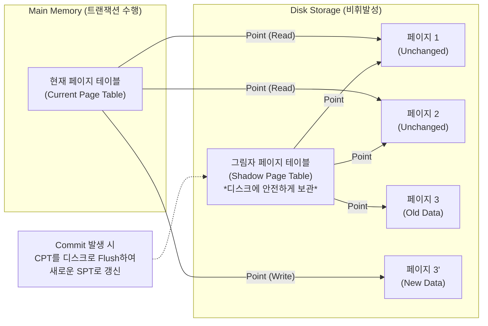

# 그림자페이지 (Shadow Paging) 기법

---

## I. 로그 없는 고속 데이터베이스 회복 기법, 그림자페이지의 개요

* **정의**: [[트랜잭션]] 수행 시 데이터를 제자리 갱신(In-place Update)하지 않고 새로운 위치에 복제본을 만들어 변경한 후, 커밋 시 페이지 테이블의 포인터를 원자적으로 변경하여 회복을 수행하는 [[데이터베이스]] 장애 복구 기법
* **배경 및 특징**:
* **등장배경**: 기존 로그 기반(Undo/Redo) 회복 기법의 로깅 오버헤드 증가 및 복구 시간 지연 문제 해결 필요
* **특징**: Out-of-place Update(비제자리 갱신), 로그 기록 불필요(No-Undo/No-Redo), 빠른 장애 복구 속도, 원자적 스위칭(Atomic Switching)을 통한 트랜잭션 영속성 보장

---

## II. 그림자페이지 기법의 개념도 및 핵심 기술 요소

### 가. 그림자페이지 기법의 아키텍처 및 동작 원리

* **동작 흐름**: 트랜잭션 시작 시 디스크의 그림자 페이지 테이블을 메모리로 복사하여 현재 페이지 테이블(CPT) 생성 -> 데이터 갱신 시 새로운 디스크 블록 할당(Page 3') 후 CPT 갱신 -> 커밋 시 CPT를 디스크에 기록하고 기존 SPT와 스위칭(원자적 반영)

### 나. 그림자페이지 기법의 핵심 기술 요소

| 구분 | 요소기술(키워드) | 세부 설명 |
| --- | --- | --- |
| **자료구조** | 그림자 페이지 테이블(Shadow Page Table) | 트랜잭션 시작 시점의 일관된 데이터베이스 상태를 가리키는 디스크 상의 원본 디렉토리 |
| **자료구조** | 현재 페이지 테이블(Current Page Table) | 현재 실행 중인 트랜잭션의 변경 사항(포인터)을 추적하는 주 기억장치 상의 디렉토리 |
| **갱신 방식** | 비제자리 갱신(Out-of-place Update) | 기존 디스크 블록을 덮어쓰지 않고, 새로운 디스크 빈 블록을 할당받아 갱신된 데이터를 기록 |
| **반영 메커니즘** | 원자적 스위칭(Atomic Switching) | 커밋 완료 시 디스크의 마스터 레코드가 가리키는 포인터를 CPT로 단번에 변경하여 영속성 확보 |
| **복구(장애)** | No-Undo / No-Redo | 장애 발생(Abort) 시 메모리의 CPT만 폐기하고 디스크의 SPT를 유지하여 별도 로그 없이 즉시 복구 |
| **사후 처리** | 가비지 컬렉션(Garbage Collection) | 커밋 후 참조되지 않는 과거의 원본 블록(고아 페이지)들을 탐색하여 가용 공간(Free List)으로 회수 |
| **최적화** | 체크포인트(Checkpointing) | 갱신된 다수의 페이지와 페이지 테이블을 주기적으로 디스크에 동기화하여 일관성 보장 |

---

## III. 로그 기반 회복 기법과의 비교 및 향후 활용 전망

### 가. 그림자페이지 기법과 로그 기반(WAL) 회복 기법 비교

| 비교 항목 | 그림자페이지 (Shadow Paging) | 로그 기반 회복 (WAL: Write-Ahead Logging) |
| --- | --- | --- |
| **데이터 갱신 방식** | Out-of-place Update (새 블록에 기록) | In-place Update (원본 블록에 덮어쓰기) |
| **회복 메커니즘** | 포인터 스위칭 (페이지 테이블 교체) | Undo (취소) / Redo (재실행) 로그 활용 |
| **복구 소요 시간** | 매우 빠름 (테이블 참조만 원복) | 상대적으로 느림 (로그 분석 및 재연산 필요) |
| **데이터 군집화** | 군집화 파괴 ([[단편화]] 발생, 순차 읽기 불리) | 군집화 유지 (Clustering 유지, 순차 읽기 유리) |
| **자원 소모** | 디스크 공간 소모 큼, 가비지 컬렉션 부하 | 로그 기록 오버헤드 발생 (I/O 부하) |

### 나. 그림자페이지 기술의 발전 및 최신 동향

* **차세대 파일시스템의 기반 기술로 진화**: 데이터베이스 수준의 기술적 한계(단편화 문제)를 넘어, ZFS, Btrfs 등 현대적인 스토리지 시스템에서 무결성을 보장하는 **CoW (Copy-on-Write)** 메커니즘으로 핵심 사상 계승
* **플래시 메모리(SSD) 및 인메모리 DB 적용**: 덮어쓰기가 불가능한 낸드 플래시 특성에 맞춰 SSD의 FTL(Flash Translation Layer) 매핑 기술에 광범위하게 적용되며, LMDB(Lightning Memory-Mapped Database)와 같이 초고속 읽기를 지원하는 최신 임베디드 데이터베이스의 근간 아키텍처로 활용 중

---

### 🔗 연관 토픽

- **소속 도메인**: [[00_데이터베이스_MOC|🗄️ 데이터베이스]]
- **세부 분류**: `2. 트랜잭션 & 동시성 제어 (Concurrency)`
- **핵심 연관 토픽**:
  - [[트랜잭션]]
  - [[ARIES|ARIES (Algorithms for Recovery and Isolation Exploiting Semantics)]]
  - [[데이터베이스]]
  - [[MVCC(다중 버전 동시성 제어) 2가지 유형]]
  - [[무결성]]
