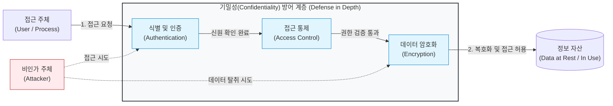

# 기밀성 (Confidentiality)

---

## I. 안전한 정보 자산 보호의 기반, 기밀성의 개요

* **정의**: 인가되지 않은 사용자, [[프로세스]], 시스템이 정보에 접근하거나 노출되는 것을 원천적으로 차단하여 정보의 비밀을 유지하는 정보보안의 핵심 특성
* **등장배경 및 특징**:
* 클라우드 전환, 원격 근무 확산 및 지능형 사이버 공격(APT, [[랜섬웨어]]) 증가로 인한 데이터 유출 방지 필요성 대두
* **특징**: 최소 권한의 원칙(Least Privilege), 알 권리 원칙(Need-to-Know), 인가(Authorization) 및 [[암호화]](Encryption) 기반의 방어

---

## II. 기밀성 보장 개념도 및 핵심 기술 요소

### 가. 기밀성 보장 통제 아키텍처 및 동작 원리

* 인가되지 않은 주체(Attacker)의 접근을 다층적 방어 체계(인증 -> 접근통제 -> 암호화)를 통해 차단하여 정보 자산의 유출을 방지

### 나. 기밀성의 핵심 기술 요소

| 구분 | 요소기술(키워드) | 세부 설명 |
| --- | --- | --- |
| **권한 관리** | 접근 통제 (Access Control) | [[MAC]](강제적), [[DAC]](임의적), [[RBAC]](역할 기반) 등 주체와 객체 간 접근 권한 제어 |
| **권한 관리** | [[IAM]] (Identity & Access Mgmt) | 기업 내 모든 IT 자원에 대한 통합적인 디지털 신원 식별, 인증 및 권한 관리 체계 |
| **데이터 보호** | 대칭키 / [[비대칭키 암호화]] | [[AES]], [[RSA (Rivest Shamir Adleman)|RSA]] 등을 활용하여 저장(At-Rest) 및 전송(In-Transit) 중인 데이터 보호 |
| **데이터 보호** | 데이터 마스킹 / [[비식별화]] | 민감 정보(개인정보 등)를 마스킹, 가명처리, 익명화하여 비인가자 대상 식별 불가 처리 |
| **인증 통제** | 다중 인증 (MFA) | 비밀번호 외 생체정보([[FIDO]]), OTP 등을 결합하여 계정 탈취로 인한 기밀성 훼손 방지 |
| **환경 통제** | 물리적 / 논리적 망분리 | 내부망과 외부망을 분리하여 외부 침입자로부터 내부의 기밀 데이터를 원천 격리 |
| **최신 기술** | 기밀 컴퓨팅 (TEE) | [[CPU]] 내 신뢰 실행 환경(TrustZone, SGX)을 통해 사용 중(In-Use)인 메모리 데이터 보호 |
| **최신 기술** | [[동형 암호]] (Homomorphic) | 암호화된 상태 그대로 연산을 수행하여 클라우드 등에서의 데이터 노출 위험 원천 제거 |

---

## III. 정보보안 3대 요소(CIA) 비교 및 최신 동향

### 가. 기밀성 및 보안 3대 요소(CIA Triad) 비교

| 비교 항목 | 기밀성 (Confidentiality) | [[무결성]] (Integrity) | [[HA(High Availability)|가용성]] (Availability) |
| --- | --- | --- | --- |
| **핵심 목적** | 인가되지 않은 **정보 유출 방지** | 인가되지 않은 **정보 위·변조 방지** | 필요 시 **서비스의 지속적 사용 보장** |
| **보안 위협** | 스니핑(Sniffing), 소셜 엔지니어링 | 스푸핑(Spoofing), 백도어 변조 | [[DoS (Denial of Service)|DoS]] / [[DDOS|DDoS]], 랜섬웨어(파괴) |
| **주요 대응 기술** | 암호화, 접근 통제, [[방화벽]], [[VPN]] | 해시 함수(SHA-256), 전자서명 | 이중화/[[다중화]], 백업, DR 센터, [[CDN]] |

### 나. 기밀성 보장 관련 향후 전망 및 트렌드

* **경계 상실 대응 ([[제로 트러스트 보안모델|Zero Trust]] 도입)**: '결코 신뢰하지 않고 항상 검증한다'는 제로 트러스트 아키텍처(ZTA)를 통한 지속적 인증 및 마이크로 [[세그멘테이션]](Micro-Segmentation) 적용 확대
* **양자 컴퓨터 위협 대비 (PQC 전환)**: 양자 컴퓨팅에 의한 기존 공개키 암호(RSA, [[ECC]]) 체계 붕괴 위험에 대응하기 위해 격자(Lattice) 기반 등의 [[양자내성암호]](Post-Quantum Cryptography) 조기 도입 필수화 추세

---

### 🔗 연관 토픽

- **소속 도메인**: [[00_보안_MOC|🛡️ 보안]]
- **세부 분류**: `1. 정보보안 원칙 & 거버넌스 · 인증`
- **핵심 연관 토픽**:
  - [[암호화|암호화 (Encryption)]]
  - [[RBAC]]
  - [[DoS (Denial of Service)]]
  - [[비대칭키 암호화]]
  - [[RSA (Rivest Shamir Adleman)]]
