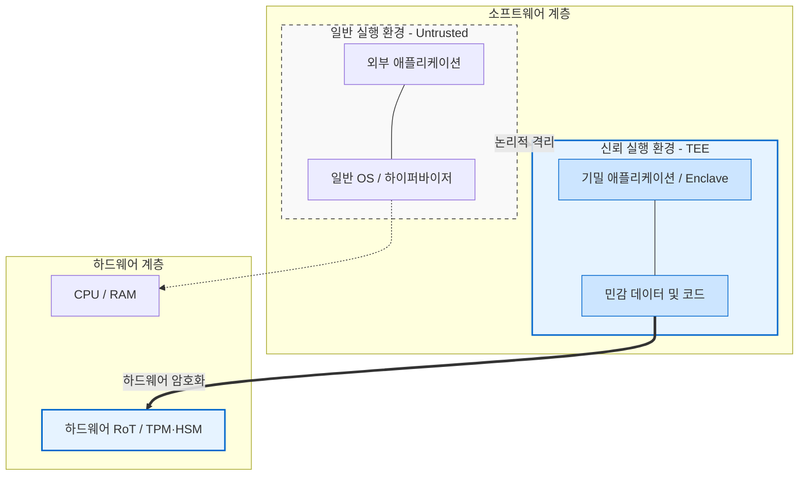

# 기밀컴퓨팅(Confidential Computing)

## I. '사용 중인 데이터(Data in Use)' 보호의 핵심, 기밀 컴퓨팅의 개요

**정의:** 클라우드 및 엣지 컴퓨팅 환경에서 하드웨어 기반의 안전한 **신뢰 실행 환경(TEE, Trusted Execution Environment)**을 구축하여, 메모리에서 처리 연산 중인 데이터(Data in Use)의 유출 및 변조를 원천 차단하는 하드웨어 기반 보안 기술.

**등장 배경:** 기존 보안 체계는 '저장 중(Data at Rest)' 및 '전송 중(Data in Transit)'인 데이터 암호화에 집중했으나, 하이퍼바이저 권한 탈취나 내부자 위협 등으로 인해 메모리에 적재되어 **'연산 중'인 평문 데이터**를 탈취하는 위협이 증가함에 따라 이를 방어할 하드웨어 기반 격리 기술이 요구됨.

## II. 기밀 컴퓨팅의 핵심 메커니즘 및 요소 기술

| **구분** | **핵심 기술** | **설명** |
| --- | --- | --- |
| 격리 환경 | **TEE (신뢰 실행 환경)** | 메인 OS나 클라우드 제공자([[CSP]])조차 접근할 수 없는 [[CPU]] 내부의 격리된 보안 영역(Enclave)을 생성하여 연산 수행. |
|  | **메모리 [[암호화]]** | CPU 내장 암호화 엔진을 사용하여 TEE 내의 메모리 데이터를 암호화 (예: AMD SEV, Intel TDX). |
| 신뢰 검증 | **하드웨어 RoT 및 [[TPM]]** | 기밀 컴퓨팅은 플랫폼의 무결성을 증명하기 위해 TPM(Trusted Platform Module)과 TEE를 연동하여 하드웨어 기반 신뢰 근원(Root of Trust)을 확보함. |
|  | **원격 증명 (Remote Attestation)** | 워크로드가 실행 중인 플랫폼의 무결성을 지속 검증하기 위해, TPM의 AK(Attestation Key)로 서명된 부팅 및 상태 증거를 외부 검증자에게 전송하여 확인받음. |

---

## III. 기밀 컴퓨팅의 주요 적용 사례 및 활용 분야

### 1. 클라우드 워크로드 무결성 보장

- 퍼블릭 클라우드의 IaaS 인스턴스에 vTPM(가상 TPM)을 제공하여, 가상 머신(VM) 부팅 단계부터 운영 환경까지의 무결성을 보장함 (AWS Nitro, Azure vTPM, GCP Shielded VM 등).

### 2. 다자간 민감 데이터 연합 학습 (Federated Learning)

- 의료 정보, 금융 데이터 등 서로 다른 기관의 민감한 데이터를 외부로 노출하지 않고, TEE 내부에서만 복호화하여 AI 모델을 공동 학습시키는 프라이버시 보존형 AI 기술에 핵심적으로 활용.

### 3. 차세대 인증 및 디바이스 보호

- **FIDO2 기반 무비밀번호 인증:** 사용자 생체 정보 및 개인키를 TPM 기반의 [[가상화]] 격리 환경에 저장하여 피싱 및 자격 증명 탈취 공격을 방어함.

---

## IV. 향후 발전 방향 및 시사점

- **하드웨어 보안 칩의 진화:** 향후 양자 컴퓨터 위협에 대비하여 PQC(양자 내성 암호) 알고리즘인 ML-KEM, ML-[[DSA]] 등을 지원하는 TPM 규격 업데이트가 추진되며 기밀 컴퓨팅의 암호화 수준이 한층 고도화될 전망임.
- **제로 트러스트 아키텍처(ZTA)의 핵심 인프라:** '절대 신뢰하지 않고 항상 검증한다'는 제로 트러스트 실현을 위해, 사용자 신원뿐만 아니라 디바이스의 물리적 [[무결성]] 상태를 판단하는 TPM 원격 증명과 기밀 컴퓨팅의 융합이 필수 구현 수단으로 자리매김할 것임.
끝.

---

### 🔗 연관 토픽

- **소속 도메인**: [[00_보안_MOC|🛡️ 보안]]
- **세부 분류**: `3. 네트워크 & 엔드포인트 · 인프라 보안`
- **핵심 연관 토픽**:
  - [[암호화|암호화 (Encryption)]]
  - [[TPM|TPM (Trusted Platform Module)]]
  - [[DSA]]
  - [[CSP|CSP (Cloud Service Provider)]]
  - [[CPU Ring Level]]
