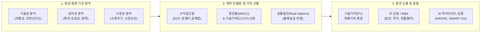

# 기술 가치 평가 (Technology Valuation)

---

## I. 지식재산(IP)의 미래 경제적 가치 화폐화, 기술 가치 평가의 개요

* **정의**: 사업화하려는 기술이나 사업화된 기술이 미래에 창출할 경제적 편익을 공인된 평가 모델을 적용하여 현재 시점의 화폐가치로 산정하는 정량화 기법
* **배경**: 무형자산 중심의 지식경제 전환, R&D 투자 타당성 검증, IP 기반 금융(담보대출·투자유치·보증) 활성화 요구 증대
* **핵심 특징**: 미래 현금흐름 예측성, 기술수명주기(TLC) 종속성, 불확실성/위험 프리미엄 반영, 시장 거래 사례의 비대칭성 극복

---

## II. 기술 가치 평가의 프로세스 및 핵심 구성요소

### 가. 기술 가치 평가의 프로세스 및 가치 산출 메커니즘

* 정성적 권리·기술성 분석을 선행한 후, 사업화 주체의 미래 잉여현금흐름(FCF)에 기술기여도와 할인율을 반영하여 최종 현재가치(PV) 도출

### 나. 기술 가치 평가의 핵심 기술 및 구성요소

| 구분 | 요소기술 (키워드) | 세부 설명 |
| --- | --- | --- |
| **권리/기술 분석** | 권리 안정성 분석 | 특허 존속기간, 청구항 권리범위(Claim), 무효화 위험 및 침해 회피 가능성 평가 |
| **수명주기 추정** | 기술수명주기(TLC) | 기술의 도입-성장-성숙-쇠퇴 단계를 도출하여 경제적 수명 및 매출 발생 가능 기간 산정 |
| **재무 예측** | 잉여현금흐름 (FCF) | 매출액 추정 후 매출원가, 판관비, 법인세, 운전자본증감, CAPEX를 차감한 현금 창출액 도출 |
| **위험률 조정** | 할인율 산정 (WACC) | 타인자본비용과 자기자본비용(CAPM)의 가중평균에 기술사업화 고유 위험프리미엄을 가산 |
| **기여분 분리** | 기술기여도 (TCF) | 전체 사업가치 중 마케팅·설비·인력 제외 순수 기술 몫 산정 (개별기술강도평가 활용) |
| **평가 방법론** | 로열티 공제법 | 가상 라이선싱 계약 가정 시 절감 가능한 로열티 지급액을 현재가치로 할인하는 기법 |
| **불확실성 제어** | 실물옵션 (Real Options) | 단계별 투자(Stage-gate), 연구 포기/확장 옵션 등 불확실성을 블랙-숄즈 모형으로 반영 |
| **AI·자동화** | AI 기반 등급/가치 산출 | 특허 빅데이터 및 재무 머신러닝을 결합한 KTRS-AIRATE 및 SMART VIX 기반 신속 평가 |

---

## III. 기술 가치 평가 3대 접근법 비교 및 최신 동향

### 가. 3대 평가 접근법 비교

| 비교 항목 | 수익접근법 (Income Approach) | 시장접근법 (Market Approach) | 원가접근법 (Cost Approach) |
| --- | --- | --- | --- |
| **기본 철학** | 미래 창출 현금흐름의 현재가치 환산 | 유사 기술의 시장 거래가격 기준 산정 | 동일 효용 기술의 재생산/대체 소요 비용 |
| **주요 기법** | 현금흐름할인(DCF), 로열티공제법 | 유사거래비교법, 주가배수법 | 재생산원가법, 역사적원가법 |
| **장점** | 기술의 미래 수익 창출 잠재력 직접 반영 | 시장 데이터를 활용한 객관성 및 설득력 | 투입 비용 기반 계량화 용이, 초기 단계 적합 |
| **단점** | 매출 추정 및 할인율 선정의 주관성 개입 | IP 거래 시장 비공개성으로 비교 대상 부족 | 과거 투입 비용과 실제 미래 수익성 괴리 |
| **주요 적용처** | 상용화·성장기 기술, 독점적 특허 포트폴리오 | 기술 거래 및 M&A, 공개 시장 거래 기술 | 공공 R&D 기초연구 단계, 대체 개발 기술 |

### 나. 최신 기술 동향 및 실무 적용 방안

* **AI 및 빅데이터 하이브리드 가치평가**: 인간 평가자의 주관적 편향을 보완하기 위해 특허 청구항 NLP 임베딩, 유사 특허 인용 네트워크, K-TOP 플랫폼 기반 자동평가 시스템 적용 확대
* **IP 금융 및 토큰증권(STO) 연계**: 정량화된 가치평가서를 기반으로 지식재산 담보대출, IP 조각투자(신탁형 STO), 기술 특례 상장 기술평가 체계로의 확장 가속화

---

### 🔗 연관 토픽

- **소속 도메인**: [[00_경영전략_MOC|📈 경영전략]]
- **세부 분류**: `3. 비즈니스 프로세스 혁신 & 디지털 전환 (DX)`
- **핵심 연관 토픽**:
  - [[BCP|BCP (Business Continuity Planning)]]
  - [[데이터 마이닝|Data Mining (데이터 마이닝)]]
  - [[01_IT Tech/핀테크|핀테크 (FinTech)]]
  - [[BIA (Business Impact Analysis)]]
  - [[DRaaS]]
