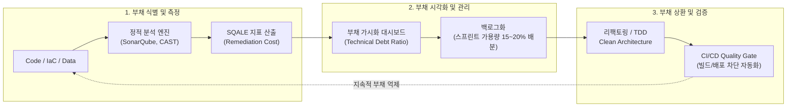

# 기술 부채 (Technical Debt)

---

## I. 출시 속도와 품질 간의 전략적 타협, 기술 부채(Technical Debt)의 개요

* **정의**: 단기적 출시 속도(Time-to-Market)를 위해 최적 설계 대신 차선책/임시방편(Quick-and-Dirty)을 선택함으로써 발생하며, 향후 리팩토링과 [[유지보수]] 비용으로 상환해야 하는 잠재적 추가 비용의 총체

---

## I. 단기적 개발 편익과 장기적 품질 비용의 트레이드오프, 기술 부채의 개요

* **정의**: 빠른 출시(Time-to-Market)를 위해 단기적·타협적 엔지니어링 방식을 택함으로써, 향후 시스템 유지보수, 리팩토링, 아키텍처 변경 시 추가적인 시간과 비용(이자)이 소요되는 소프트웨어 엔지니어링 상의 잠재적 부채 상태
* **등장배경 및 특징**:
* **등장배경**: 워드 커닝햄(Ward Cunningham)이 금융 부채에 비유하여 최초 제시, 애자일/CI·CD 가속화 환경에서 Time-to-Market 압박 및 조기 인도 우선주의 심화
* **금융 모델 비유**: 원금(Principal: 코드/아키텍처 개선 비용)과 이자(Interest: 결함 발생률 증가, 생산성 저하, 추가 개발 공수) 구조 형성
* **마틴 파울러의 사분면**: 신중함(Prudent) vs 무모함(Reckless), 의도적(Deliberate) vs 비의도적(Inadvertent) 4개 영역으로 분류

---

## II. 기술 부채의 생명주기 및 핵심 관리 요소

### 가. 기술 부채의 관리 메커니즘 및 수명주기

* 소스코드·인프라·데이터 단계에서 정적 분석 기반 부채 정량화(SQALE 모델) $\rightarrow$ 부채 백로그 등록 및 우선순위 선정 $\rightarrow$ 스프린트 단위 상환 및 Quality Gate 기반 재유입 차단 루프 수행

### 나. 기술 부채의 핵심 구성 및 관리 기술 요소

| 구분 | 핵심 기술 (키워드) | 세부 설명 |
| --- | --- | --- |
| **측정/평가 모델** | SQALE 지표 모델 | 품질 특성(유지보수성, [[신뢰성]] 등)별 Remediation Time(수정 시간) 기반 기술 부채 비율(TDR) 산출 |
| **측정/평가 모델** | TDR (Technical Debt Ratio) | 전체 개발 비용 대비 부채 상환 비용의 비율 수치화, 프로젝트 위험도 정량 관리 지표 |
| **정적 코드 분석** | Static Code Analysis | SonarQube, Checkmarx 기반 Code Smell, 중복 코드, 순환 복잡도(Cyclomatic Complexity) 자동 탐지 |
| **아키텍처 거버넌스** | ADR (Architecture Decision Record) | 설계 결정 사유, 포기한 대안, 기술적 타협점(의도적 부채)을 문서화하여 추적성 확보 |
| **아키텍처 거버넌스** | MoD (Modular Monolith) & [[MSA (Micro Service Architecture)|MSA]] 경계 진단 | 아키텍처 부채 방지를 위한 모듈 간 [[결합도]](Coupling) 완화 및 도메인 바운더리(Bounded Context) 검증 |
| **상환/리팩토링** | Refactoring & [[Design Pattern (23개 패턴)|Design Pattern]] | 동작 변경 없이 내부 구조를 개선(마틴 파울러 리팩토링 패턴 적용), 기술적 원금 상환 기법 |
| **상환/리팩토링** | Test Automation & [[TDD]] | 단위/통합 [[테스트 커버리지]] 확보를 통해 리팩토링 시 사이드 이펙트 억제 및 회귀 결함 방지 |
| **최신 인프라 부채** | IaC Drift Detection | Terraform/Ansible 기반 인프라 코드와 실제 런타임 리소스 간 불일치(Drift) 자동 감지 및 교정 |
| **AI/ML 부채 관리** | [[MLOps]] & Data Debt Monitoring | 모델 드리프트, 피처 결합도(Glue Code), 파이프라인 정글화를 억제하기 위한 Feature Store 및 지속적 재학습(CT) |

---

## III. 전통적 SW 기술 부채 vs AI/ML 시스템 기술 부채 비교

| 비교 항목 | 전통적 SW 기술 부채 | AI/ML 시스템 기술 부채 (Hidden Debt) |
| --- | --- | --- |
| **주요 유발 요인** | 스파게티 코드, 테스트 부재, 설계 결함 | 데이터 의존성(Data Debt), 모델 드리프트, 미흡한 검증 파이프라인 |
| **시스템 종속성** | 모듈 간 인터페이스 캡슐화로 격리 가능 | **CACE 원칙** (Changing Anything Changes Everything, 부분 수정이 전체 영향) |
| **코드 vs 시스템 비중** | 대부분의 부채가 소스코드 자체에 집중 | 코드 비중은 소규모(Glue Code), 데이터/인프라/파이프라인에 대다수 부채 은닉 |
| **측정 및 감지 난이도** | 정적 분석(SonarQube 등)으로 코드 레벨 명확히 측정 | 런타임 데이터 분포 변화 및 확률적 결과물로 인해 정량 측정 극히 곤란 |
| **주요 상환 전략** | 정기적 리팩토링, 코드 리뷰, Clean Code 원칙 준수 | MLOps 구축, 피처 스토어 일원화, Data Drift 모니터링, 자동화된 재학습(CT) |

* **향후 전망**: 생성형 AI 및 [[초거대 언어 모델|LLM]] 도입 확산에 따라 '[[프롬프트 엔지니어링]] 파편화', '비결정론적 출력 제어 실패' 등 새로운 AI 기술 부채 급증 추세.
* 기술 부채를 단순 결함이 아닌 '전략적 레버리지'로 인식하되, 스프린트 내 상환 버퍼(15~20%) 강제 할당 및 Quality Gate 통과를 조직 KPI로 내재화하는 체계적 거버넌스 수립 필수.

---

### 🔗 연관 토픽

- **소속 도메인**: [[00_경영전략_MOC|📈 경영전략]]
- **세부 분류**: `1. 경영 환경 분석 & 전략 수립 프레임워크`
- **핵심 연관 토픽**:
  - [[유지보수]]
  - [[Design Pattern (23개 패턴)]]
  - [[SWOT분석]]
  - [[결합도]]
  - [[테스트 커버리지|테스트 커버리지 (Test Coverage)]]
