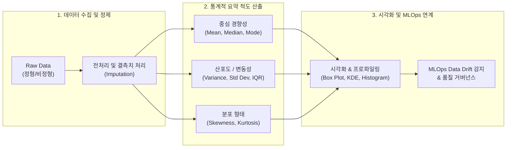

# 기술 통계 (Descriptive Statistics)

---

## I. 데이터의 특성 요약 및 패턴 식별, 기술 통계의 개요

* **정의**: 수집된 데이터의 특성을 정량화하여 중심 경향, 산포도, 분포 형태 등으로 요약·정리·시각화함으로써 원시 데이터(Raw Data)의 내재적 패턴을 직관적으로 파악하는 통계 기법
* **필요성 및 특징**:
* **[[EDA]](탐색적 데이터 분석)의 기반**: 머신러닝/[[딥러닝]] 모델링 전 데이터 분포 왜곡, [[결측치]] 및 [[이상치]](Outlier) 조기 식별
* **데이터 프로파일링(Profiling)**: 데이터 품질 진단 및 정합성 검증의 선행 단계로 데이터 리니지 및 거버넌스 체계 지원
* **직관적 가시성 제공**: 비즈니스 의사결정권자에게 복잡한 대규모 데이터셋을 단일 요약 지표와 시각화 차트로 압축 전달

---

## II. 기술 통계의 프레임워크 및 핵심 기술 요소

### 가. 기술 통계의 분석 체계 및 데이터 처리 흐름

* 원시 데이터 정제 후 중심 경향·산포·형태 척도를 병렬 산출하고, 시각화 도구와 연계하여 데이터 이상 징후 감지 및 [[MLOps]] 드리프트 모니터링에 활용하는 메커니즘

### 나. 기술 통계의 핵심 기술 및 구성 요소

| 구분 | 요소기술 (키워드) | 세부 설명 |
| --- | --- | --- |
| **중심 경향도** | 산술·기하·조화평균 (Mean) | 전체 데이터의 합을 개수로 나눈 대푯값, 이상치에 민감하게 왜곡되는 특성 보유 |
| **중심 경향도** | 중앙값 (Median) & 최빈값 (Mode) | 순서화된 데이터의 중앙 위치값(이상치에 로버스트) 및 빈도수가 가장 높은 범주형 데이터 대푯값 |
| **산포도** | 분산 (Variance) & 표준편차 (Std Dev) | 관측값이 평균으로부터 떨어진 거리의 제곱합 기반 산포 측정 지표, 데이터 [[변동성]] 정량화 |
| **산포도** | 사분위범위 (IQR, Interquartile Range) | 3사분위수($Q_3$)와 1사분위수($Q_1$)의 차이($Q_3 - Q_1$), 이상치 판별($1.5 \times \text{IQR}$) 및 박스플롯 기준선 활용 |
| **분포 형태** | 왜도 (Skewness) | 분포의 비대칭도 측정 (왜도 $> 0$: 우측 꼬리 분포, 왜도 $< 0$: 좌측 꼬리 분포) |
| **분포 형태** | 첨도 (Kurtosis) | 분포의 중심 집적도 및 꼬리의 두께 측정 ([[정규분포]] 기준 3, 첨도 $> 3$: 극단치 발생 확률 증가) |
| **상관 분석** | 공분산 & 피어슨/스피어만 상관계수 | 두 변수 간의 선형적·단조적 연관성 크기와 방향을 정규화($-1 \sim +1$)하여 [[다중공선성]] 진단 |
| **대규모/MLOps** | 스트리밍 스케치 (HyperLogLog, t-digest) | 대규모 분산/실시간 스트리밍 환경에서 고정 메모리로 카디널리티 및 분위수를 근사 산출하는 [[알고리즘]] |

---

## III. 기술 통계 vs 추론 통계 비교 및 최신 동향

### 가. 기술 통계(Descriptive) vs 추론 통계(Inferential) 비교

| 비교 항목 | 기술 통계 (Descriptive Statistics) | [[추론 통계]] (Inferential Statistics) |
| --- | --- | --- |
| **주요 목적** | 보유 데이터셋의 특성 요약, 정리, 패턴 시각화 | 표본(Sample)을 통해 모집단(Population)의 모수 추정 및 검정 |
| **분석 대상** | 관측 완료된 표본 또는 수집 데이터 전체 | 전체 모집단에서 확률적으로 추출된 표본 데이터 |
| **핵심 기법** | 중심경향치, 산포도, 빈도표, 히스토그램, 박스플롯 | 가설검정($p$-value, [[t-검정 (t-test)|t-test]], [[ANOVA(Analysis of variance)|ANOVA]]), 신뢰구간 추정, [[회귀분석]] |
| **결과의 불확실성** | 불확실성 없음 (주어진 데이터의 확정적 사실 기술) | 확률적 불확실성 수반 (표본 오차, 1종·2종 오류 존재) |
| **AI 파이프라인 역할** | [[데이터 프로파일링|Data Profiling]], Feature 분포 파악, 결측/이상치 탐지 | 모델 유의성 검정, A/B 테스트 성과 판별, 인과추론 |

### 나. 최신 기술 동향 및 실무 적용 방안

* **Data Observability 및 AutoEDA 통합**: Great Expectations, Monte Carlo, ydata-profiling 등의 도구를 통해 데이터 파이프라인 수집 단계에서 기술 통계 메트릭을 자동 추출하고 [[스키마]] 변형 및 결측 급증을 실시간 탐지
* **MLOps 기반 Feature Drift 감지**: 배포된 ML 모델의 서빙 데이터 기술 통계(평균, 사분위수, 왜도)를 학습 데이터 통계와 비교하여 인구통계학적 변화(Covariate Shift)를 사전에 인지하고 재학습(Continuous Training) 트리거로 활용

---

### 🔗 연관 토픽

- **소속 도메인**: [[00_인공지능_MOC|🤖 인공지능]]
- **세부 분류**: `1. 수학 · 통계학 & 데이터 전처리`
- **핵심 연관 토픽**:
  - [[추론 통계|추론 통계(Inferential Statistics)]]
  - [[이상치]]
  - [[t-검정 (t-test)]]
  - [[결측치]]
  - [[ANOVA(Analysis of variance)]]
