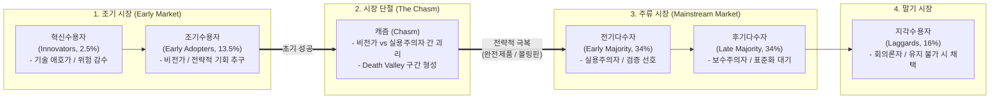

# 기술수용 주기 (Technology Adoption Life Cycle)

---

## I. 신기술의 시장 확산 및 수용자 행태 모델, 기술수용 주기의 개요

* **정의**: 혁신 기술이나 첨단 제품이 시장에 출시된 후 사회 구성원들에게 수용·확산되는 과정을 인구통계학적·심리학적 특성에 따라 [[정규분포]](Bell Curve) 및 누적 S자 곡선(S-Curve)으로 구조화한 생명주기 모델
* **배경 및 특징**:
* **에버렛 로저스(Everett Rogers)의 혁신 확산 이론**: 수용자의 혁신성향에 따라 5개 계층(혁신수용자, 조기수용자, 전기다수자, 후기다수자, 지각수용자)으로 정량적 분할
* **불연속적 기술의 시장 단절**: 제프리 무어(Geoffrey Moore)에 의해 조기 시장(Early Market)과 주류 시장(Mainstream Market) 사이의 구조적 단절인 '캐즘(Chasm)' 이론으로 진화
* **기술 마케팅 및 GTM(Go-to-Market) 지표**: R&D 상용화 성공률 제고, 타깃 세그먼트 선정, 시장 진입 장벽 돌파 전략 수립의 핵심 프레임워크로 활용

---

## II. 기술수용 주기의 모델 구조 및 핵심 구성요소

### 가. 기술수용 주기 구조 및 캐즘(Chasm) 전이 메커니즘

* 조기수용자(비전가)의 기술 중심 기대와 전기다수자(실용주의자)의 안정성·레퍼런스 중심 기대 간 불일치로 캐즘 발생
* 틈새시장 집중 공략(Beachhead Market) 및 완전제품(Whole Product) 완성을 통해 캐즘을 돌파하고 주류 시장으로 전이

### 나. 기술수용 주기의 핵심 구성 요소 및 전략 메커니즘

| 구분 | 요소기술 (키워드) | 세부 설명 |
| --- | --- | --- |
| **수용자 분류** | 혁신수용자 (Innovators) | 전체 시장의 2.5%, 신기술 자체에 열광하는 기술 마니아 계층, 미흡한 완성도 감수 |
| **수용자 분류** | 조기수용자 (Early Adopters) | 전체 시장의 13.5%, 기술의 잠재 가치를 발견하고 혁신을 주도하는 비전가(Visionary) |
| **수용자 분류** | 전기다수자 (Early Majority) | 전체 시장의 34%, 위험 회피형 실용주의자(Pragmatist), 입증된 레퍼런스와 안정성 중시 |
| **수용자 분류** | 후기다수자 (Late Majority) | 전체 시장의 34%, 기술 변화에 소극적인 보수주의자(Conservative), 산업 표준화 후 채택 |
| **수용자 분류** | 지각수용자 (Laggards) | 전체 시장의 16%, 기술 채택을 완강히 거부하는 회의론자(Skeptic), 경제적 강제 시 전환 |
| **시장 장애 요인** | 캐즘 (The Chasm) | 조기수용자와 전기다수자 사이의 수요 단절 현상, 스타트업 데스밸리(Death Valley)의 주원인 |
| **돌파 전략** | 교두보 시장 (Beachhead Market) | 캐즘 탈출을 위해 압도적 1위 달성이 가능한 단일 틈새시장(Niche Market)에 자원 집중 |
| **돌파 전략** | 완전제품 (Whole Product) | 핵심 기술(Generic) 외 부가 SW, 서비스, 교육, 보증 등 실용주의자가 즉시 쓸 솔루션 패키징 |
| **시장 확장** | 볼링핀 전략 (Bowling Pin) | 교두보 핀을 쓰러뜨린 후 인접 고객군 및 유사 산업 핀으로 시장 침투를 연쇄 확산 |
| **수요 폭발** | 토네이도 (The Tornado) | 주류 시장 진입 성공 시 사실상 표준(De facto standard) 확보와 함께 대량 수요가 폭증하는 단계 |

---

## III. 전통적 확산 모델(Rogers) vs 하이테크 캐즘 모델(Moore) 비교 및 최신 동향

### 가. Rogers 혁신확산 모델 vs Moore 캐즘 모델 비교

| 비교 항목 | 전통적 혁신확산 모델 (Rogers) | 하이테크 캐즘 모델 (Moore) |
| --- | --- | --- |
| **대상 기술 유형** | 연속적 혁신 (Continuous Innovation), 소비재/제조업 | 불연속적/파괴적 혁신 (Discontinuous Innovation), ICT/SW |
| **수용 전이 특성** | 수용자 집단 간 자연스럽고 부드러운 연속 전이 | 조기시장과 주류시장 사이에 필연적 단절(Chasm) 존재 |
| **구매 동기 축** | 유행 선도, 모방 효과, 점진적 효용 개선 | 비즈니스 혁신(비전가) vs 생산성·안정성 검증(실용주의자) |
| **마케팅 전략** | 광범위 프로모션, 가격 정책, 유통 채널 확대 | 교두보 시장 타깃팅, 볼링핀 전략, 완전제품 완성 |
| **위험 요인** | 시장 포화 및 성숙기 쇠퇴 위험 | 조기시장 의존에 따른 캐즘 탈락 및 유동성 고갈 |

### 나. 최신 기술 동향 및 실무 적용 방안

* **생성형 AI(Generative AI)의 엔터프라이즈 캐즘 국면**: 단순 텍스트 생성·PoC(조기 시장)를 거쳐, 데이터 보안, [[할루시네이션]](환각) 제어, 엔터프라이즈 RAG, [[AI TRiSM]](신뢰·리스크 거버넌스)이 결합된 '완전제품(Whole Product)' 구축을 통해 B2B 주류 시장 진입 가속화
* **가트너 하이프 사이클(Hype Cycle) 연계 진단**: 하이프 사이클의 '환멸의 계곡(Trough of Disillusionment)' 구간은 기술수용 주기의 '캐즘(Chasm)'과 일치하며, ROI 입증 및 온디바이스/경량화 모델([[sLLM (Smaller Large Language Model)|sLLM]]) 도입 기업 중심의 시장 재편 진행 중

---

### 🔗 연관 토픽

- **소속 도메인**: [[00_경영전략_MOC|📈 경영전략]]
- **세부 분류**: `3. 비즈니스 프로세스 혁신 & 디지털 전환 (DX)`
- **핵심 연관 토픽**:
  - [[sLLM (Smaller Large Language Model)]]
  - [[할루시네이션|할루시네이션(Hallucination)]]
  - [[정규분포|정규분포(Normal Distribution)]]
  - [[AI TRiSM|AI TRiSM(AI Trust Risk and Security Management)]]
  - [[BCP|BCP (Business Continuity Planning)]]
