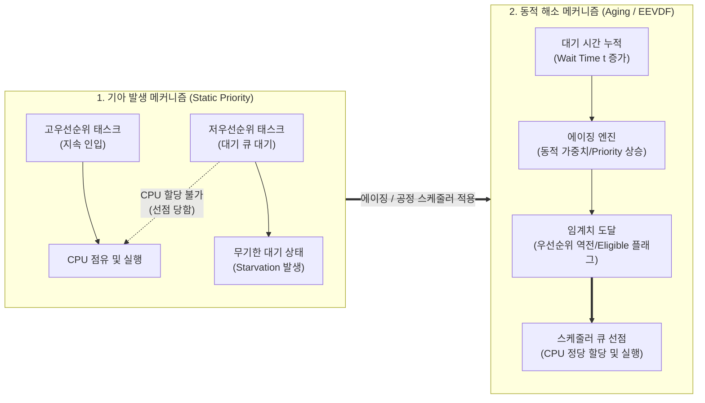

# 기아 (Starvation)

---

## I. 특정 프로세스의 무기한 자원 할당 배제 현상, 기아(Starvation)의 개요

* **정의**: 시스템 내 자원([[CPU]], 메모리, I/O, 뮤텍스 등)을 요청한 특정 프로세스나 스레드가 우선순위 [[편향]] 또는 [[스케줄링]] 정책의 한계로 인해 무기한 대기(Indefinite Blocking) 상태에 머무는 현상
* **등장배경 및 특징**:
* **정적 우선순위 스케줄링의 부작용**: 높은 우선순위 태스크가 지속 인입될 경우 저우선순위 태스크의 기아 유발
* **공정성(Fairness)과 응답성 간 트레이드오프**: [[처리량]] 극대화 기법(SJF, SRTF) 적용 시 실행 시간이 긴 프로세스의 실행 기회 박탈
* **진행성(Liveness) 결여**: 교착상태(Deadlock)와 달리 시스템 전체는 동작하나 특정 개체가 기아 상태에 고립되는 불공정성 초래

---

## II. 기아의 발생 메커니즘 및 핵심 해결 기술

### 가. 기아 발생 및 에이징(Aging) 해결 메커니즘

* 대기 큐에서 장기 체류 중인 저우선순위 프로세스에 대기 시간에 비례한 가중치를 부여(Aging)하여 강제 선점권 부여 및 기아 상태 탈출 유도

### 나. 기아 방지 및 제어를 위한 핵심 기술 요소

| 구분 | 요소기술 (키워드) | 세부 설명 |
| --- | --- | --- |
| **스케줄링 기법** | 에이징 (Aging) | 큐 대기 시간에 비례하여 동적으로 우선순위를 점진 상향 조정하는 기아 방지 표준 기법 |
| **스케줄링 기법** | 라운드로빈 (Round-Robin) | 고정 시간 할당량(Time Quantum) 기반 선점형 스케줄링으로 모든 준비 프로세스에 균등 기회 보장 |
| **스케줄링 기법** | EEVDF [[스케줄러]] | 가상 런타임 랙(Lag)과 기한(Virtual Deadline) 기반 스케줄링 (Linux 6.6+ [[커널]] 채택, 기아 및 레이턴시 억제) |
| **확률적 제어** | 복권 스케줄링 (Lottery Scheduling) | [[프로세스]] 중요도에 비례한 티켓 할당 및 무작위 추첨 방식으로 장기적 관점의 기아 확률 제거 |
| **확률적 제어** | 보폭 스케줄링 ([[STRIDE|Stride]] Scheduling) | 티켓 수의 역수인 보폭(Stride)만큼 패스(Pass) 값을 갱신하여 결정론적(Deterministic) 공정 자원 배분 |
| **동기화 락** | 티켓 락 (Ticket Lock) & MCS Lock | 임계구역 진입 시 [[FIFO]] 대기 번호표 방식을 적용하여 특정 스레드의 Spinlock 경합 탈락(Starvation) 원천 차단 |
| **우선순위 역전 해소** | 우선순위 상속 (Priority Inheritance) | 공유 자원을 선점한 저우선순위 스레드에 대기 중인 고우선순위 스레드의 우선순위를 일시 승격하여 기아/블로킹 방지 |
| **커널 확장 기술** | BPF 기반 sched_ext | eBPF를 활용하여 커널 수정 없이 워크로드 맞춤형 스케줄러를 동적 로드하고 태스크별 기아 방지 정책 유연화 |

---

## III. 기아(Starvation) vs 교착상태(Deadlock) 비교 및 최신 동향

### 가. 기아(Starvation) vs 교착상태(Deadlock) 비교

| 비교 항목 | 기아 (Starvation) | [[교착상태|교착상태 (Deadlock)]] |
| --- | --- | --- |
| **정의** | 특정 프로세스가 무기한 자원 할당을 받지 못하는 현상 | 두 개 이상의 프로세스가 상호 점유한 자원을 무한 대기하는 현상 |
| **시스템 상태** | 타 프로세스는 정상 실행 중 (전체 진행성 유지) | 연루된 프로세스 집합 전체가 완전히 중단됨 (진행 불가) |
| **발생 원인** | 불공정한 스케줄링, 우선순위 편향, 락 경합 불균형 | 4대 조건(상호배제, 점유대기, 비선점, 환형대기) 동시 충족 |
| **감지 난이도** | 간헐적 발생 및 시간 지연 특성으로 감지 어려움 | 자원할당그래프(RAG), 사이클 탐지 알고리즘으로 명확히 감지 |
| **해결 기법** | Aging, Fair Queuing, EEVDF, FIFO 락(MCS) | 예방(Prevention), 회피(Banker's), 탐지 및 복구(Rollback) |

### 나. 최신 커널 스케줄러 동향 및 발전 방향

* **리눅스 커널 CFS에서 EEVDF로의 전환**: 2007년 도입된 CFS(Completely Fair Scheduler)의 가상 런타임(vruntime) 모델 한계를 극복하기 위해 Linux 6.6부터 EEVDF(Earliest Eligible Virtual Deadline First) 공식 적용. 가상 런타임뿐 아니라 태스크의 기한(Deadline)을 함께 고려하여 지연에 민감한 태스크의 기아 현상을 수학적으로 통제
* **sched_ext 기반 맞춤형 스케줄러 확산**: Linux 커널에 병합된 sched_ext(eBPF extensible scheduler)를 통해 AI 워크로드([[GPU]] 통신 지연 방지)나 클라우드 멀티테넌트 환경에서 특정 컨테이너의 CPU/IO 기아를 커스텀 알고리즘으로 동적 차단하는 추세 확산 중

---

### 🔗 연관 토픽

- **소속 도메인**: [[00_운영체제_MOC|⚙️ 운영체제]]
- **세부 분류**: `1. 프로세스 & 스레드 관리`
- **핵심 연관 토픽**:
  - [[교착상태|교착상태 (Deadlock)]]
  - [[커널|커널(Kernel)]]
  - [[스케줄링]]
  - [[FIFO]]
  - [[스케줄러|스케줄러 (Scheduler)]]
