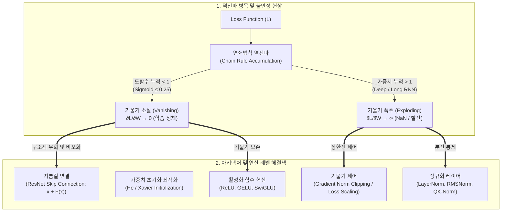

# 기울기 소실과 기울기 폭주 (Vanishing & Exploding Gradient)

---

## I. 역전파 연쇄법칙의 한계와 심층망 학습 불안정성, 기울기 소실과 폭주의 개요

### 가. 기울기 소실과 기울기 폭주의 정의

* **기울기 소실(Vanishing Gradient)**: [[딥러닝]] [[역전파|역전파(Backpropagation)]] 시 출력층에서 입력층 방향으로 오차 기울기가 전달되는 과정에서, 미분값이 지속적으로 곱해져 0에 수렴함으로써 하위 레이어의 가중치 갱신이 중단되는 현상
* **기울기 폭주(Exploding Gradient)**: 역전파 연쇄법칙 적용 시 1보다 큰 가중치 행렬과 도함수가 누적 곱해지며 기울기가 기하급수적으로 발산($NaN$, $\infty$)하여 모델 파라미터가 붕괴되는 현상

### 나. 발생 원인 및 수학적 메커니즘

* **연쇄법칙(Chain Rule) 종속성**:

$\frac{\partial L}{\partial w_1} = \frac{\partial L}{\partial a_L} \cdot \prod_{l=2}^{L} \left( \frac{\partial a_l}{\partial z_l} \cdot \mathbf{W}_l \right) \cdot \frac{\partial z_1}{\partial w_1}$

* **기울기 소실 요인**: 야코비안 행렬의 고윳값 및 활성화 함수 도함수 최댓값 한계(Sigmoid 도함수 최댓값 $0.25$, Tanh 도함수 최댓값 $1.0$)로 인해 층($L$)이 깊어질수록 지수함수적 감쇠($\to 0$)
* **기울기 폭주 요인**: 부적절하게 큰 가중치 초기화 및 [[RNN (Recurrent Neural Network)|RNN]] 계열의 긴 타임스텝($T$) 반복으로 인해 상태 전이 가중치 행렬 $\mathbf{W}$의 거듭제곱($\mathbf{W}^T$)이 임계치 초과 발산

---

## II. 기울기 소실/폭주의 메커니즘 및 핵심 해결 기술

### 가. 역전파 전파 오류 및 아키텍처 기반 해결 메커니즘

* 역전파 시 도함수 곱이 소실·폭주하는 문제를 완화하기 위해 **활성화 함수 교체**, 스킵 연결(Skip Connection)을 통한 기울기 고속도로 확보, **정규화 및 클리핑**을 통한 동적 안정화 구현

### 나. 기울기 소실 및 폭주 해결을 위한 핵심 기술 요소

| 구분 | 요소기술 (키워드) | 세부 설명 |
| --- | --- | --- |
| **활성화 함수** | Non-Saturating Activation | 양수 구간 도함수가 1인 **ReLU**, 비선형 곡률을 유지하는 **GELU**, 게이팅 기법을 결합한 **SwiGLU** 적용 |
| **가중치 초기화** | He / Xavier Initialization | 이전 층 노드 수($n_{in}$)에 맞춰 분산을 $2/n_{in}$로 정규화하는 He 초기화(ReLU용) 및 Xavier 초기화(Tanh용) |
| **네트워크 구조** | Residual Connection | $y = \mathcal{F}(x) + x$ 구조를 통해 $\frac{\partial y}{\partial x} = \frac{\partial \mathcal{F}}{\partial x} + 1$을 보장, 하위 층으로 최소 1의 기울기 무손실 전달 |
| **네트워크 구조** | Gated Cell ([[LSTM (Long Short-Term Memory)|LSTM]] / GRU) | Input/Forget/Output Gate 메커니즘을 통해 장기 의존성(Cell State) 경로의 기울기를 가산형으로 보존 |
| **기울기 제어** | Gradient Clipping | 기울기 노름($\Vert{}\mathbf{g}\Vert{}$)이 임계치($c$)를 초과할 경우 $\mathbf{g} \leftarrow c \cdot \frac{\mathbf{g}}{\Vert{}\mathbf{g}\Vert{}}$로 스케일링하여 폭주 억제 |
| **정규화 기법** | LayerNorm & RMSNorm | 레이어 내 피처 단위 평균·분산을 정규화하며, Transformer 계열에서는 연산량을 줄인 **RMSNorm** 표준 채택 |
| **정밀도 제어** | Mixed Precision & Loss Scaling | FP16/BF16 학습 시 언더플로우를 방지하기 위해 손실에 스케일 인자를 곱한 후 역전파하는 **Loss Scaling** |
| **최신 [[초거대 언어 모델|LLM]] 안정화** | QK-Norm & Soft-Capping | Attention Logit 폭주를 차단하기 위해 Q, K 벡터에 RMSNorm을 적용하거나 Tanh 기반 **Logit Soft-Capping** 적용 |

---

## III. 기울기 소실 vs 기울기 폭주 비교 및 최신 동향

### 가. 기울기 소실(Vanishing) vs 기울기 폭주(Exploding) 비교

| 비교 항목 | 기울기 소실 (Vanishing Gradient) | 기울기 폭주 (Exploding Gradient) |
| --- | --- | --- |
| **수학적 조건** | 유효 고윳값(Spectral Radius) $\rho(\mathbf{W}) < 1$ | 유효 고윳값(Spectral Radius) $\rho(\mathbf{W}) > 1$ |
| **가중치 갱신** | $\Delta \mathbf{W} \approx 0$ (초기 계층 학습 불능) | $\Delta \mathbf{W} \to \infty$ (가중치 진동 및 발산, $NaN$) |
| **주요 발생 모델** | Sigmoid/Tanh 기반 심층 MLP, 바닐라 RNN | 깊은 순환 신경망(RNN), 가중치 과대 초기화 모델 |
| **증상 확인** | Loss 정체, 초반 층 가중치 불변, 언더피팅 | Loss가 급격히 $NaN$ 또는 수치 오버플로우로 발산 |
| **1차 방어 기법** | ReLU 계열 채택, He 초기화, Skip-Connection | Gradient Norm Clipping, Weight Regularization($L_2$) |
| **대표 아키텍처** | ResNet, DenseNet, Highway Networks | LSTM/GRU, Pre-LayerNorm Transformer |

### 나. 최신 기술 동향 및 초거대 AI(LLM) 학습 안정화 방안

* **Transformer 아키텍처의 Pre-LN 및 RMSNorm 전환**: 과거 Post-LN의 학습 초기 Warm-up 의존성을 극복하기 위해 서브 레이어 입력단에 정규화를 배치하는 Pre-LN 구조가 정착되었으며, 최근 Llama, Gemma 등에서는 평균 계산을 생략한 **RMSNorm**으로 학습 안정성과 속도를 동시 확보
* **Attention Logit 수치 안정화 (QK-Norm & Logit Soft-Capping)**: 대규모 파라미터 스케일링 시 Self-Attention 점수($\mathbf{Q}\mathbf{K}^T/\sqrt{d_k}$)가 극단적으로 커져 Softmax 기울기가 소실되는 현상을 방지하기 위해, $\mathbf{Q}, \mathbf{K}$에 LayerNorm을 적용하는 **QK-Norm**과 $\text{Cap} \times \tanh(\text{Logit} / \text{Cap})$ 형태의 **Soft-Capping** 도입
* **저정밀도(FP8/FP4) 학습 가속과 마이크로스케일링**: FP8 혼합 정밀도 연산 확산에 따라 텐서 단위 블록 정규화를 수행하는 **MX(Microscaling) 포맷** 및 동적 스케일 팩터 추적 기술이 적용되어 수치적 언더/오버플로우를 원천 제어

---

### 🔗 연관 토픽

- **소속 도메인**: [[00_인공지능_MOC|🤖 인공지능]]
- **세부 분류**: `3. 딥러닝 핵심 아키텍처 & 신경망`
- **핵심 연관 토픽**:
  - [[초거대 언어 모델|초거대 언어 모델(Large Language Model)]]
  - [[딥러닝]]
  - [[LSTM (Long Short-Term Memory)]]
  - [[RNN (Recurrent Neural Network)]]
  - [[역전파|역전파(Backpropagation)]]
