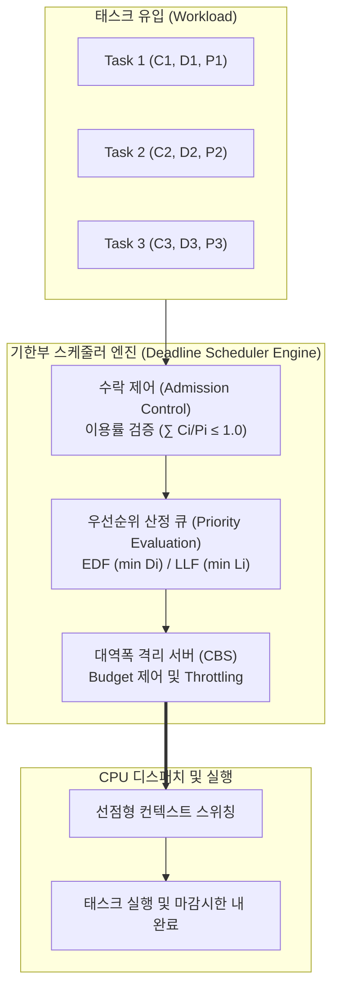

# 기한부 스케줄링 (Deadline Scheduling)

---

## I. 실시간 결정성 보장을 위한 기한부 스케줄링의 개요

* **정의**: 실시간 시스템(Real-Time System)에서 각 태스크의 마감시한(Deadline) 내 처리를 보장하기 위해 잔여 마감시한 및 여유시간(Laxity)을 기반으로 [[스케줄링]] 순위를 부여하는 시간 결정성(Determinism) 보장 기법
* **등장배경 및 필요성**:
* **시간적 정확성(Temporal Correctness)**: 논리적 결과뿐 아니라 마감시간 준수가 시스템 성패를 결정하는 Hard/Soft RTOS 환경 요구
* **자원 경합 및 큐 지연 해소**: 주기적/비주기적 태스크 혼재 환경에서 긴급도 기반의 공정한 [[CPU]] 자원 분배
* **범용 OS의 실시간성 확장**: 리눅스 [[커널]](`SCHED_DEADLINE`) 및 클라우드 [[컨테이너]] 환경의 실시간 워크로드([[SLA]]/SLO) 보장 필수화

* **특징**: 시간 결정성, 선점형(Preemption) 지원, 우선순위 역전(Priority Inversion) 방지 메커니즘 필요, 과부하 시 도미노 현상(Domino Effect) 제어 요구

---

## II. 기한부 스케줄링의 동작 메커니즘 및 핵심 기술 요소

### 가. 기한부 스케줄링의 아키텍처 및 동작 원리

* **동작 흐름**: 태스크 진입 시 수락 제어(Admission Control)로 스케줄 가능성 검증 $\rightarrow$ 잔여 기한 및 여유시간에 따라 동적 우선순위 산정 $\rightarrow$ 최단 시한 태스크에 선점형 CPU 할당 및 CBS 기반 대역폭 격리 수행

### 나. 기한부 스케줄링의 핵심 기술 요소

| 구분 | 핵심 기술/요소 | 세부 설명 |
| --- | --- | --- |
| **동적 [[알고리즘]]** | **EDF (Earliest Deadline First)** | 마감시한이 가장 임박한 태스크에 최고 우선순위를 동적 부여하는 최적(Optimal) 선점형 기법 ($U \le 1.0$) |
| **동적 알고리즘** | **LLF (Least Laxity First)** | 여유시간($Laxity = Deadline - Current Time - Remaining Execution$)이 최소인 태스크를 우선 처리 |
| **정적 비교 기법** | **RMS (Rate Monotonic Scheduling)** | 주기가 짧을수록 높은 정적 우선순위를 부여하는 주기 기반 선점형 기법 ($U \le n(2^{1/n}-1)$) |
| **대역폭 격리** | **CBS (Constant Bandwidth Server)** | 비주기적 태스크에 가상 마감시한을 설정하여 주기적 실시간 태스크의 간섭을 차단하는 자원 격리 메커니즘 |
| **타당성 검증** | **수락 제어 (Admission Control)** | 태스크 유입 시 총 이용률($U = \sum C_i / P_i$)을 사전 계산하여 데드라인 미충족 태스크의 진입 원천 차단 |
| **[[신뢰성]] 보장** | **우선순위 상속 (PIP/PCP)** | 공유 자원 락(Lock) 점유로 인한 마감시한 역전 방지를 위해 락 보유자의 우선순위를 승격하는 메커니즘 |
| **OS 구현체** | **Linux `SCHED_DEADLINE**` | Linux 3.14+ 공식 편입된 정책으로 EDF + CBS 기반 Runtime, Deadline, Period 파라미터 제어 |
| **예외 처리** | **도미노 현상 제어** | 일시적 과부하(Overload) 발생 시 가치 함수(Value Function) 기반 선별적 드롭을 통한 연쇄 실패 방지 |

---

## III. EDF vs RMS 비교 및 최신 기술 동향

### 가. 동적 기한(EDF) vs 정적 주기(RMS) 스케줄링 비교

| 비교 항목 | EDF (Earliest Deadline First) | RMS (Rate Monotonic Scheduling) |
| --- | --- | --- |
| **우선순위 결정** | **동적(Dynamic)** (잔여 마감시한 기준 변동) | **정적(Static)** (태스크 주기에 따라 고정) |
| **최대 CPU 이용률** | **최대 100% ($U \le 1.0$) 달성 가능** | **약 69.3% ($n \to \infty$)** 시 스케줄 보장 |
| **스케줄링 오버헤드** | 높음 (매 스케줄링 틱마다 마감시한 재계산) | 낮음 (고정 우선순위 큐 관리로 단순) |
| **과부하(Overload) 시** | **도미노 현상 취약** (다수 태스크 연쇄 지연) | **예측 가능** (주기가 긴 하위 태스크만 탈락) |
| **구현 복잡도** | 런타임 제어 및 큐 재정렬로 복잡함 | 단순 우선순위 선점형 커널로 구현 용이 |
| **주요 적용처** | Linux 실시간 정책, 클라우드 vCPU 스케줄링 | 전장용 RTOS (AUTOSAR Classic), 우주/항공 |

### 나. 최신 기술 동향 및 산업 적용 방향

* **멀티코어 실시간 확장 (Global EDF & Partitioning)**: 멀티코어 환경에서 코어 간 마이그레이션 오버헤드를 줄이기 위한 클러스터형 EDF 및 에너지 최적화(Energy-Aware Deadline Scheduling) 적용
* **SDV 및 [[Smart Car(자율주행)|자율주행]] (AUTOSAR Adaptive & ROS 2)**: LiDAR/카메라 센서 퓨전 데이터의 종단간([[End-to-End]]) 지연시간 상한(Bound) 보장을 위한 기한 기반 스레드 격리
* **[[클라우드 네이티브]] 실시간성 (Kube-deadline)**: Kubernetes 기반 지연 민감형(Micro-latency) 마이크로서비스 파드(Pod)에 대해 노드 커널의 `SCHED_DEADLINE`과 연계한 SLO 보장 스케줄링 기술 확산

---

### 🔗 연관 토픽

- **소속 도메인**: [[00_운영체제_MOC|⚙️ 운영체제]]
- **세부 분류**: `2. CPU 스케줄링 알고리즘`
- **핵심 연관 토픽**:
  - [[커널|커널(Kernel)]]
  - [[스케줄링]]
  - [[컨테이너|컨테이너 (Container)]]
  - [[비선점방식 유형]]
  - [[클라우드 네이티브]]
