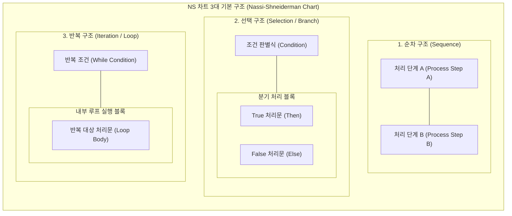

# 나씨-슈나이더만 차트 (Nassi-Shneiderman Chart)

---

## I. 구조적 프로그래밍 지원을 위한 도해식 설계 기법, NS 차트의 개요

* **정의**: 순서도(Flowchart)의 무분별한 화살표(GOTO) 사용에 따른 스파게티 코드를 방지하고, 구조적 프로그래밍을 지원하기 위해 순차, 선택, 반복 제어 흐름을 상자 형태의 중첩 블록으로 도해화한 2차원 [[알고리즘]] 설계 기법
* **등장배경 및 특징**:
* **GOTO 유해론 수용**: [[다익스트라 알고리즘|Dijkstra]]의 비구조적 제어 흐름 배제 사상을 시각화 도구에 적용
* **화살표 배제 (Arrowless Flow)**: 제어 이동 선을 사용하지 않고 블록의 공간적 배치로 실행 흐름 결정
* **단일 진입·단일 진출 (SESE)**: Single Entry, Single Exit 원칙을 준수하여 [[모듈화]] 및 [[신뢰성]] 극대화
* **시각적 복잡도 직관화**: 블록 중첩(Nesting) 깊이를 통해 알고리즘의 순환 복잡도(Cyclomatic Complexity)를 직관적으로 식별

---

## II. NS 차트의 아키텍처 및 핵심 기술 요소

### 가. NS 차트의 기본 제어 구조 및 개념도

* 화살표 없이 상하 인접(순차), 대각선 분할(선택), 외부 감싸기(반복) 형태로 표현되며, 블록 내부에 하위 블록이 계층적으로 중첩(Nesting)되어 제어 흐름을 단일 진입/단일 진출 구조로 완결

### 나. NS 차트의 핵심 기술 요소

| 구분 | 핵심 기술/요소 | 세부 설명 |
| --- | --- | --- |
| **기본 제어** | **순차 구조 (Sequence)** | 상하로 나열된 사각형 블록 내에서 위에서 아래로 명령이 순차 실행되는 구조 |
| **기본 제어** | **선택 구조 (Selection)** | 상단 대각선 분할 영역에 조건을 명시하고, 조건에 따라 참(T)/거짓(F) 블록으로 분기 |
| **기본 제어** | **반복 구조 (Iteration)** | While, Do-Until 등 조건을 상단/측면 외곽 프레임으로 배치하고 내부 본문을 감싸는 구조 |
| **확장 제어** | **다중 선택 (Case/Switch)** | 다중 조건 처리를 위해 상단 영역을 여러 개의 쐐기형으로 분할하여 다방향 분기 표현 |
| **구조화 원칙** | **화살표 배제 (No Arrows)** | 제어선의 임의 점프(GOTO)를 물리적으로 불가능하게 차단하여 제어 흐름 왜곡 원천 방지 |
| **구조화 원칙** | **단일 입출력 (SESE)** | 모든 블록이 하나의 시작점과 종료점을 갖도록 강제하여 프로그램 [[결합도]] 감소 및 독립성 보장 |
| **품질 분석** | **중첩도 분석 (Nesting Depth)** | 블록의 들여쓰기/중첩 레벨을 통해 McCabe 순환 복잡도 및 리팩토링 대상 코드 직관적 식별 |
| **도구/자동화** | **역공학 시각화 (Structorizer 등)** | 소스 코드(C, Java, Python 등) $\leftrightarrow$ NS 차트 간 상호 파싱 및 AST 기반 [[정적 분석 도구]] 지원 |

---

## III. NS 차트 vs 표준 순서도(Flowchart) 비교 및 최신 동향

### 가. NS 차트 vs 표준 순서도(Flowchart) 비교

| 비교 항목 | 나씨-슈나이더만 차트 (NS Chart) | 표준 순서도 (Flowchart) |
| --- | --- | --- |
| **제어 표현 방식** | **상자 기반 2차원 중첩 (Nesting)** | **기호 및 방향선/화살표 (Arrow)** |
| **GOTO문 표현** | **표현 불가 (원천 차단)** | 자유로운 분기 및 점프 가능 |
| **구조적 프로그래밍** | **완전 부합** (순차/선택/반복 강제) | 부합 취약 (스파게티 코드 유발 가능) |
| **복잡도 파악** | 중첩 깊이로 **순환 복잡도 파악 용이** | 선이 교차하여 전체 복잡도 식별 난해 |
| **예외/점프 처리** | Break, Continue, 예외 처리 표현 난해 | [[인터럽트]] 및 임의 탈출 표현 용이 |
| **수정 및 확장성** | 내부 블록 크기 재조정 필요 (수작업 시 난해) | 새로운 기호와 화살표 추가로 수정 용이 |

### 나. 최신 기술 동향 및 현대적 활용 방안

* **레거시 코드 현대화 (Legacy Modernization)**: COBOL, C 기반 금융·제조 레거시 시스템의 차세대 전환 시, 비구조적 스파게티 코드를 구조화된 NS 차트로 역공학(Reverse Engineering) 변환하여 업무 규칙(Business Rule) 추출
* **로우코드/노코드(LCNC) 및 블록 코딩의 기반 기술**: Scratch, Google Blockly 등 블록 결합형 비주얼 프로그래밍 언어의 '박스 중첩형 제어 구조' 아키텍처의 이론적 근간으로 지속 활용
* **[[초거대 언어 모델|LLM]] 기반 코드 검증 및 정적 분석**: LLM이 생성한 코드의 제어 흐름 무결성을 검증하기 위해 AST(Abstract Syntax Tree)를 NS 차트 구조로 정규화하여 순환 복잡도 상한(Threshold) 준수 여부 자동 판정

---

### 🔗 연관 토픽

- **소속 도메인**: [[00_소프트웨어공학_MOC|🏗️ 소프트웨어공학]]
- **세부 분류**: `3. 요구사항 공학 & UML 객체지향 분석/설계`
- **핵심 연관 토픽**:
  - [[신뢰성]]
  - [[정적 분석 도구]]
  - [[모듈화|모듈화 (Modularity)]]
  - [[변동성]]
  - [[소프트웨어 설계의 원리]]
