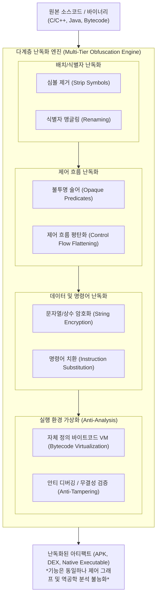

# 난독화 (Obfuscation)

---

## I. 지식재산권 보호와 역공학 방지를 위한 난독화의 개요

* **정의**: 프로그램의 본래 기능과 의미론적 동등성(Semantic Equivalence)을 유지하면서, 역공학(Reverse Engineering) 및 디컴파일 도구의 정적·동적 코드 분석을 난해하게 변환하는 소프트웨어 보안 기술
* **필요성 및 등장배경**:
* **지식재산(IP) 유출 방지**: 모바일 앱, 상용 소프트웨어, 펌웨어의 핵심 비즈니스 로직 및 고유 [[알고리즘]] 크랙 방지
* **역어셈블/디컴파일러 고도화**: IDA Pro, Ghidra 등 역공학 도구의 AST(Abstract Syntax Tree) 복원 기술 대응
* **위·변조(Tampering) 및 보안 위협 차단**: API 키, 금융 인증 로직, [[DRM(Digital Right Management)|DRM]] 보호 우회 방지 및 안티 바이올레이션 보장

* **핵심 특징**: 의미 보존성(Semantics Preserving), 분석 비용 극대화(Complexity Explosion), 성능 트레이드오프(실행 속도/크기 증가)

---

## II. 난독화의 메커니즘 및 핵심 기술 요소

### 가. 난독화 아키텍처 및 변환 프로세스

* 원본 코드의 식별자 제거 $\rightarrow$ switch-case 기반 평탄화 및 불투명 분기 삽입 $\rightarrow$ 데이터 인코딩 및 독자적 VM 바이트코드 변환을 통해 디컴파일러의 제어 흐름 그래프(CFG) 복원 차단

### 나. 난독화의 핵심 기술 요소

| 구분 | 요소기술(키워드) | 세부 설명 |
| --- | --- | --- |
| **배치 난독화** | **식별자 변경 (Renaming)** | [[클래스]], 함수, 변수명을 무의미한 단일 문자(`a`, `b`)나 비가시/유사 유니코드 문자로 치환 |
| **배치 난독화** | **심볼 스트리핑 (Stripping)** | 디버깅 정보(ELF Symbol, DWARF, D8 R8 메타데이터) 및 주석을 완전히 제거하여 가독성 배제 |
| **제어 난독화** | **제어 흐름 평탄화 (CFF)** | 기본 블록(Basic Block)을 단일 switch-loop 구문 내에 배치하여 선형적 흐름 그래프를 평탄화 |
| **제어 난독화** | **불투명 술어 (Opaque Predicate)** | 런타임 결과($P=True$)는 고정이나 정적 분석기는 참/거짓 판별이 불가능한 조건문과 더미 코드 삽입 |
| **데이터 난독화** | **문자열/상수 암호화** | 평문 스트링과 주요 상수를 [[AES]]/XOR 인코딩 후 런타임에만 동적으로 복호화하여 노출 방지 |
| **데이터 난독화** | **변수 분할 및 병합** | 단일 정수형 변수를 2개 이상의 수식 연산(예: $X = a \times 2 + b$)으로 쪼개거나 배열화하여 추적 교란 |
| **명령어 난독화** | **명령어 치환/확장** | 덧셈 연산($x + y$)을 비트 논리 수식($(x \oplus y) + 2(x \land y)$) 등 등가 복잡 연산으로 대체 |
| **[[가상화]] 난독화** | **VM 기반 난독화 (Virtualization)** | 네이티브 [[CPU]] 명령어를 독자 설계한 인터프리터 바이트코드로 변환하여 분석 도구(IDA) 무력화 |
| **동적 방어** | **안티 디버깅/안티 덤프** | `ptrace`, `IsDebuggerPresent`, 메모리 [[무결성]](Hash) 검증을 통해 동적 디버거 부착 시 [[프로세스]] 강제 종료 |

---

## III. 난독화 vs 암호화 비교 및 최신 보안 동향

### 가. 난독화(Obfuscation) vs 암호화(Encryption) 비교

| 비교 항목 | 난독화 (Obfuscation) | [[암호화|암호화 (Encryption)]] |
| --- | --- | --- |
| **주요 목적** | **이해 방지 (Comprehension Prevention)** | **[[기밀성]] 보장 (Confidentiality Protection)** |
| **실행 가능 여부** | **별도 복호화 키 없이 CPU/VM 직접 실행 가능** | 복호화 키(Key)를 통한 원본 복원 후 실행 가능 |
| **수학적 보장** | 휴리스틱 기반 복잡도 증가 (이론적 완벽 난독화 불가) | 수학적 복잡도(소인수분해, 이산대수 등) 기반 안전성 입증 |
| **주요 적용 대상** | 실행 파일, 라이브러리(SO/DLL), 프론트엔드 JS, 앱 | 저장 데이터(At-Rest), 전송 데이터(In-Transit), 토큰 |
| **취약점/한계** | 기호 실행(Symbolic Execution), SMT 솔버로 역난독화 | 키 탈취 시 원본 완전 노출, 메모리 덤프 취약 |

### 나. 최신 기술 동향 및 산업 적용 방향

* **AI/[[초거대 언어 모델|LLM]] 기반 디컴파일러 대응**: LLM을 결합한 지능형 디옵퍼스케이션(Ghidra+LLM)에 대항하기 위해 고차 다항식 기반 복합 불투명 술어 및 동적 JIT 코드 생성 기법 확대
* **기호 실행(Symbolic Execution) 무력화**: Angr, Triton 등 SMT 솔버 기반 경로 탐색 도구의 상태 폭발(State Explosion)을 유도하는 복합 순환 제어 주입
* **이론적 암호학 난독화 (iO; Indistinguishability Obfuscation)**: 2020년대 들어 다중선형사상 기반의 이론적 한계를 극복한 실용적 iO [[프로토콜]] 연구가 활성화되며, 영지식 증명([[영지식증명|ZKP]]) 및 안전한 아웃소싱 컴퓨팅 환경으로 확장 중

---

### 🔗 연관 토픽

- **소속 도메인**: [[00_소프트웨어공학_MOC|🏗️ 소프트웨어공학]]
- **세부 분류**: `6. 소프트웨어 테스팅 & 품질 보증 (QA/QC)`
- **핵심 연관 토픽**:
  - [[무결성]]
  - [[암호화|암호화 (Encryption)]]
  - [[가상화]]
  - [[기밀성]]
  - [[AES]]
