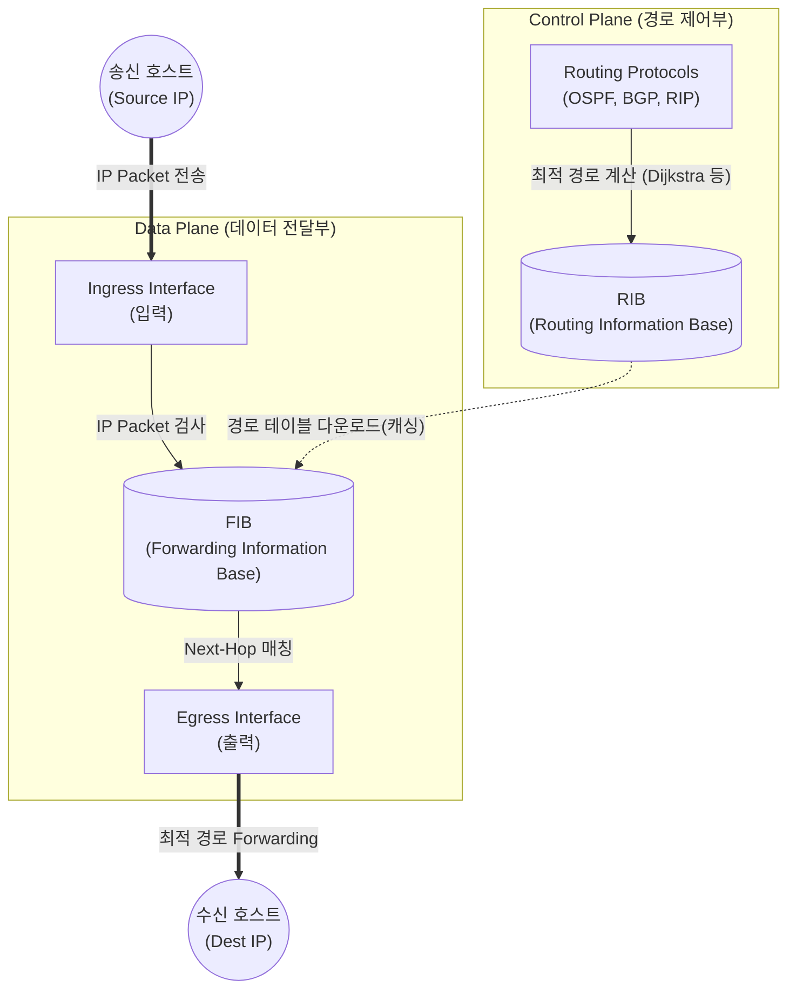

# 네트워크 계층 (Network Layer)

---

## I. 엔드투엔드(End-to-End) 패킷 전달과 최적 경로 탐색, 네트워크 계층의 개요

* **정의**: OSI 7계층 중 제3계층(Layer 3)으로, 송신 호스트에서 수신 호스트까지 논리적 주소(IP)를 기반으로 패킷의 최적 경로를 설정(Routing)하고 전달(Forwarding)하는 통신 계층
* **필요성**: 서로 다른 이기종 네트워크 간의 연결성 확보, 트래픽 혼잡 방지 및 데이터 전송 효율성 극대화
* **특징**: 비연결성(Connectionless), 최선 노력(Best-effort) 전송, 엔드투엔드 논리적 주소 지정(Logical Addressing)

---

## II. 네트워크 계층의 아키텍처 및 핵심 기술 요소

### 가. 네트워크 계층의 핵심 메커니즘 (라우팅 및 포워딩 구조)

* IP 주소 기반으로 라우팅 테이블(RIB)을 생성하여 최적 경로를 결정(Routing)하고, 이를 바탕으로 입력된 패킷을 하드웨어 기반 목적지 인터페이스로 빠르게 전달(Forwarding)함

### 나. 네트워크 계층의 핵심 기술 요소

| 분류(구분) | 요소기술(키워드) | 세부 설명 |
| --- | --- | --- |
| **논리적 주소** | [[IPv4]] / [[IPv6]] | 단말 간 식별 및 라우팅을 위한 32bit(v4) / 128bit(v6) 고유 [[논리 주소]] 체계 |
| **경로 설정** | Routing Algorithm | 목적지까지의 최적 경로 탐색 (Link-State, Distance-Vector [[알고리즘]] 적용) |
| **패킷 제어** | Fragmentation ([[단편화]]) | 하위 계층의 MTU(Maximum Transmission Unit) 크기에 맞춰 패킷을 분할 및 재조립 |
| **오류 제어** | [[ICMP]] (Internet Control Message Protocol) | 통신 장애, 패킷 전송 오류 발생 시 송신측에 원인 리포팅 및 네트워크 진단(Ping) |
| **주소 변환** | [[ARP]] / [[RARP]] | IP 주소(L3)와 [[MAC]] 주소(L2) 간의 상호 매핑 및 바인딩 테이블 관리 |
| **그룹 통신** | [[IGMP]] (Internet Group Management Protocol) | 멀티캐스트 환경에서 호스트와 [[라우터]] 간 그룹 멤버십 가입/탈퇴/유지 관리 |
| **품질 제어** | [[QoS|QoS (Quality of Service)]] | [[DiffServ (Differentiated Services)|DiffServ]], [[IntServ (Integrated Services)|IntServ]] 등을 통한 트래픽 우선순위 지정 및 패킷 큐잉/[[스케줄링]] 보장 |
| **[[가상화]]** | VRF (Virtual Routing and Forwarding) | 물리적 하나의 라우터 내에서 다수의 독립적인 가상 라우팅 [[인스턴스]] 운영 기술 |

---

## III. 네트워크 계층과 데이터링크 계층의 비교 및 최신 동향

### 가. 2계층(Data Link Layer)과 3계층(Network Layer) 비교

| 비교 항목 | Data Link Layer (2계층) | Network Layer (3계층) |
| --- | --- | --- |
| **전송 단위 (PDU)** | Frame (프레임) | Packet / Datagram (패킷) |
| **주소 체계** | MAC 주소 (물리적 주소, 48bit) | IP 주소 (논리적 주소, 32/128bit) |
| **통신 범위** | Node-to-Node (동일 네트워크/LAN 구간) | [[End-to-End]] (이기종 네트워크/WAN 구간) |
| **주요 장비** | L2 [[스위치 (Layer 3 Switch)|스위치]], 브릿지 | 라우터(Router), L3 스위치 |
| **핵심 [[프로토콜]]** | Ethernet, MAC, PPP, HDLC | IP(v4/v6), ICMP, OSPF, [[BGP]], ARP |

### 나. 네트워크 계층의 기술 발전 동향 및 전망

* **제어부 분리 ([[SDN(Software Defined Network)|SDN]])**: 네트워크 장비에서 Control Plane과 Data Plane을 물리적/논리적으로 분리하여, 중앙 집중식 컨트롤러 기반의 동적 네트워크 프로그래밍 지원 ([[OpenFlow]] 활용)
* **망 구조 단순화 (SRv6)**: IPv6 확장 헤더를 활용하여 패킷 자체에 경로 정보(Segment)를 삽입하는 Segment Routing over IPv6 도입으로 라우터 상태 유지 최소화 및 트래픽 엔지니어링 고도화
* **의도 기반 네트워킹 ([[IBN(Intent-Based Networking)|IBN]])**: AI/ML을 접목하여 관리자의 비즈니스 "의도(Intent)"를 정책으로 변환, 자동화된 라우팅 설정 및 자가 치유(Self-Healing) 네트워크 아키텍처로 진화 중

---

### 🔗 연관 토픽

- **소속 도메인**: [[00_네트워크_MOC|🌐 네트워크]]
- **세부 분류**: `1. OSI 7계층 & 데이터링크 계층 (L1/L2)`
- **핵심 연관 토픽**:
  - [[라우터]]
  - [[IPv6]]
  - [[BGP|BGP(Border Gateway Protocol)]]
  - [[IPv4]]
  - [[ICMP]]
