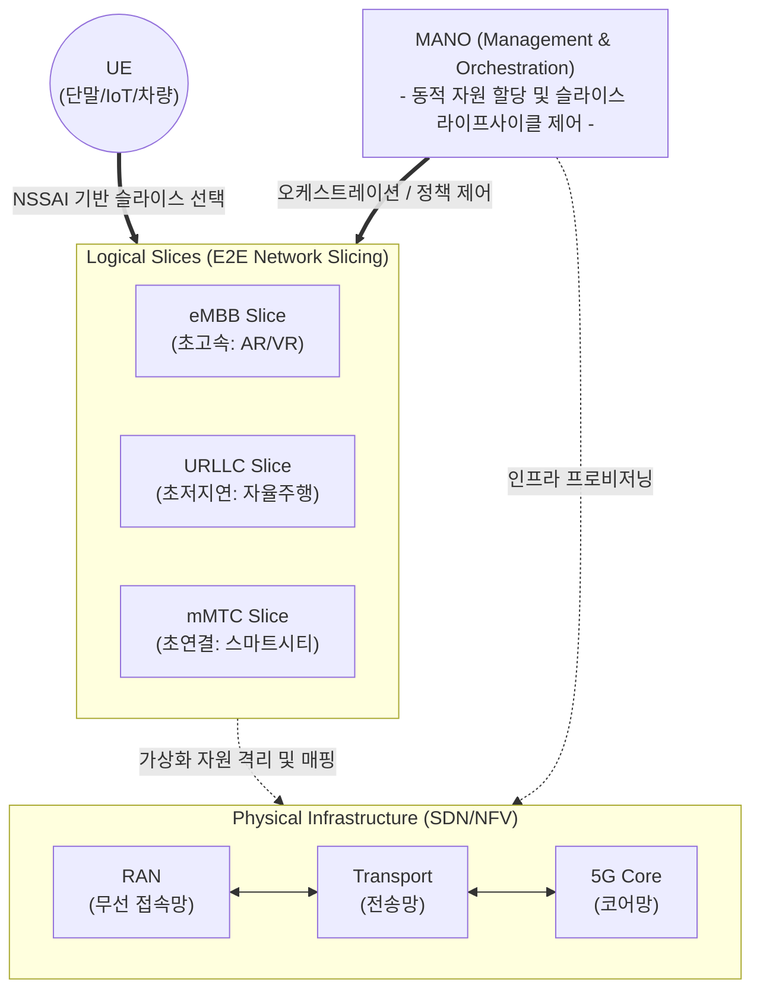

# 네트워크 슬라이싱 (Network Slicing)

---

## I. 5G/6G 맞춤형 서비스 제공을 위한 논리적 망 분할, 네트워크 슬라이싱의 개요

* **정의**: 단일 물리적 네트워크 인프라 위에 [[SDN(Software Defined Network)|SDN]]/[[NFV]] 기술을 활용하여, 각 서비스 요구사항([[QoS]])에 특화된 다수의 독립적인 논리적 가상 네트워크(Slice)를 생성하고 E2E([[End-to-End]])로 제공하는 기술
* **필요성**: 5G 3대 서비스(eMBB, URLLC, mMTC)의 이기종 QoS 동시 수용, 망 구축 비용(CAPEX) 및 운영 비용(OPEX) 절감
* **특징**: E2E 자원 격리(Isolation), 서비스 맞춤형 유연성, 오케스트레이터를 통한 동적 자원 할당(Lifecycle Management)

---

## II. 네트워크 슬라이싱의 개념도 및 핵심 기술 요소

### 가. 네트워크 슬라이싱의 개념도 및 동작 원리

* 단말은 NSSAI(Network Slice Selection Assistance Information)를 통해 적합한 슬라이스를 요청하며, MANO가 E2E 자원을 동적으로 프로비저닝하여 철저히 격리된 맞춤형 가상 망을 제공함

### 나. 네트워크 슬라이싱의 핵심 기술 요소

| 분류 | 요소기술(키워드) | 세부 설명 |
| --- | --- | --- |
| **[[가상화]] 기반** | SDN (Software Defined Networking) | 제어 평면(Control Plane)과 데이터 평면(Data Plane)을 분리하여 중앙 집중적 라우팅 제어 |
| **가상화 기반** | NFV (Network Functions Virtualization) | 하드웨어 종속성 탈피, [[방화벽]]/[[라우터]] 등 네트워크 기능을 SW(VNF) 형태로 가상화 |
| **망 오케스트레이션** | MANO (Management and Orchestration) | NFV 인프라 및 네트워크 슬라이스의 생성, 활성화, 폐기 등 전체 라이프사이클 통합 관리 |
| **코어망 제어** | 5GC SBA (Service Based Architecture) | 5G 코어망 기능을 마이크로서비스 단위로 분할하여 API 기반으로 슬라이스별 유연한 조합 지원 |
| **무선망 제어** | RAN Slicing | 무선 구간의 주파수 대역폭, [[스케줄링]] 자원을 서비스 요구사항에 맞춰 논리적으로 분할 |
| **전송망 제어** | FlexE (Flexible Ethernet) / SRv6 | 트래픽 격리 및 L2/L3 수준의 전송 경로 최적화를 통한 슬라이스 대역폭 보장 |
| **단말 연동** | NSSAI | 단말이 자신이 접속하고자 하는 네트워크 슬라이스 유형을 코어망에 식별시키기 위한 식별자 |
| **보안 및 품질** | E2E Isolation (망 격리) | 특정 슬라이스의 트래픽 폭증이나 장애가 다른 슬라이스에 영향을 주지 않도록 물리적/논리적 격리 |

---

## III. 5G 주요 슬라이스 유형 비교 및 향후 발전 동향

### 가. 5G 주요 네트워크 슬라이스 서비스 유형 비교

| 비교 항목 | eMBB (Enhanced Mobile Broadband) | URLLC (Ultra-Reliable Low-Latency) | mMTC (Massive Machine Type) |
| --- | --- | --- | --- |
| **주요 목적** | 초고속, 대용량 데이터 전송 | 초저지연, 초고신뢰 통신 보장 | 초연결, 대규모 단말 수용 |
| **QoS 요구사항** | 높은 대역폭 (최대 20Gbps) | 1ms 이하 지연, 99.999% [[신뢰성]] | 평방킬로미터 당 100만 기기 접속 |
| **활용 서비스** | UHD 스트리밍, AR/VR, 홀로그램 | [[Smart Car(자율주행)|자율주행]](V2X), 원격 수술, 스마트팩토리 | 스마트시티, 스마트팜, 원격 검침(IoT) |
| **슬라이싱 초점** | Data Plane 자원 할당 극대화 | [[EDGE|Edge]] Computing([[Mobile Edge Computing|MEC]]) 근접 배치 | 제어 평면(Control Plane) 최적화 |

### 나. 네트워크 슬라이싱의 향후 전망 및 동향

* **Zero-touch Network Management (ZSM)**: 수작업 개입 없이 AI/ML 기반으로 트래픽 패턴을 예측하여 슬라이스 자원을 자동 확장/축소(Auto-scaling)하는 지능형 운영 체계로 진화
* **의도 기반 네트워킹 ([[IBN(Intent-Based Networking)|IBN]]) 접목**: 사용자가 비즈니스 목적(Intent)만 입력하면, 시스템이 알아서 [[SLA]]를 분석하고 최적의 네트워크 슬라이스를 자동 생성 및 자가 치유(Self-Healing)하는 6G 핵심 기술로 발전 중

---

### 🔗 연관 토픽

- **소속 도메인**: [[00_네트워크_MOC|🌐 네트워크]]
- **세부 분류**: `1. OSI 7계층 & 데이터링크 계층 (L1/L2)`
- **핵심 연관 토픽**:
  - [[SDN(Software Defined Network)]]
  - [[Mobile Edge Computing|Mobile Edge Computing (MEC)]]
  - [[라우터]]
  - [[DiffServ (Differentiated Services)]]
  - [[IntServ (Integrated Services)]]
