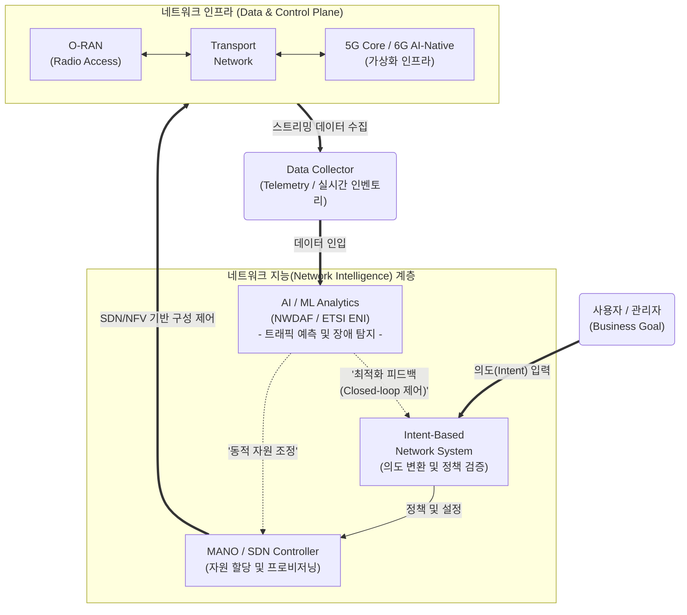

# 네트워크 지능 (Network Intelligence)

---

## I. 5G/6G 자율 제어를 위한 코어 기술, 네트워크 지능의 개요

* **정의**: 복잡한 네트워크 환경(5G/6G)에서 방대한 네트워크 트래픽 및 장비 데이터를 AI/ML 기반으로 수집·분석하여, 망의 상태 인지, 문제 예측, 자원 할당 및 자가 치유(Self-healing)를 자동화하는 지능형 네트워크 제어 기술
* **필요성**: 5G/6G 네트워크 슬라이싱에 따른 운용 복잡도 급증, 서비스 품질([[SLA]]) 보장을 위한 실시간 제어 요구 증가, 인적 개입 최소화를 통한 통신사 운용비용(OPEX) 절감
* **특징**: 무개입(Zero-touch) 기반 자동화, AI 연합 및 추론, 폐루프(Closed-loop) 제어를 통한 능동적·예측적 서비스 관리

---

## II. 네트워크 지능의 개념도 및 핵심 기술 요소

### 가. 네트워크 지능의 아키텍처 및 핵심 동작 원리 (Closed-loop Automation)

* 사용자의 비즈니스 의도(Intent)를 시스템 언어로 자동 변환하여 인프라를 설정하고, 인프라에서 수집(Telemetry)된 빅데이터를 AI/ML 알고리즘이 분석([[NWDAF(Network Data Analytics Function)|NWDAF]])하여 끊임없이 스스로 네트워크를 최적화하는 폐쇄형(Closed-loop) 구조를 가짐

### 나. 네트워크 지능의 핵심 기술 요소

| 분류 | 요소기술(키워드) | 세부 설명 |
| --- | --- | --- |
| **의도 기반 제어** | IBN ([[IBN(Intent-Based Networking)|Intent-Based Networking]]) | 관리자가 구체적인 설정값 대신 요구사항(Intent)을 입력하면 AI가 이를 정책으로 변환하고 유효성을 사전 검증하는 기술 |
| **코어망 지능화** | 3GPP NWDAF | 5G 코어망 내에 배치되어 각 NF(Network Function)의 데이터를 수집/분석하고 혼잡도 예측, 슬라이스 품질 데이터를 제공하는 표준 기능 |
| **자동화 [[프레임워크]]** | ETSI ZSM / ENI | 수동 개입 없는 [[End-to-End]] 관리(Zero-touch) 및 경험적 지능(ENI)을 통해 능동적 폐루프 관리를 수행하는 국제 표준 아키텍처 |
| **무선망 지능화** | [[O-RAN]] RIC | 개방형 무선접속망(Open RAN) 내에서 AI/ML 어플리케이션(xApp/rApp)을 구동하여 기지국 무선 자원을 지능적으로 제어(RAN Intelligent Controller) |
| **데이터 수집** | Streaming Telemetry | 기존 SNMP의 부하 한계를 극복하고, 네트워크 장비가 실시간 상태 데이터를 수집 서버로 능동적(Push)으로 전송하는 기술 |
| **예측 및 분석** | AI/ML / 연합학습 | [[딥러닝]]([[RNN (Recurrent Neural Network)|RNN]], [[LSTM (Long Short-Term Memory)|LSTM]]) 기반 트래픽 시계열 예측 및 데이터 프라이버시 보호를 위한 엣지 기반 분산형 연합학습(Federated Learning) 적용 |
| **망 인프라 유연성** | [[SDN(Software Defined Network)|SDN]] / [[NFV]] / Network Slicing | 소프트웨어 기반의 논리적 망 분리 기술을 바탕으로 AI 추론 결과에 따라 맞춤형 자원(Slice)을 동적이고 민첩하게 재할당 |
| **고품질 텔레콤 AI** | 통신 특화 Foundation Model | 네트워크 제어 및 시맨틱 통신 최적화를 위해 통신사 데이터를 사전 학습한 텔레콤 전용 초거대 AI([[초거대 언어 모델|LLM]]) 에이전트 도입 |

---

## III. TMF 자율 네트워크(Autonomous Networks) 성숙도 모델 및 전망

### 가. 네트워크 지능화 진화 단계 (TMF AN Level 중심)

| 진화 단계 | 특징 및 설명 (제어 권한의 변화) |
| --- | --- |
| **Level 0~1** (수동/보조 제어) | 사람이 모든 의사결정을 내리며, 시스템은 단순히 운영 현황 및 상태 리포트만 보조함 |
| **Level 2** (부분 자율 제어) | 특정 네트워크 도메인 내에서 사전 정의된 규칙(Rule-based)에 따라 시스템이 일부 정책을 실행함 |
| **Level 3** (조건부 자율 제어) | 제한된 환경 및 규칙 내에서 시스템이 상황을 인지하고 AI 기반 분석(예측)을 수행하나 최종 확인은 사람이 수행함 |
| **Level 4** (고도 자율 제어) | 의도(Intent) 기반으로 이기종 복합 도메인 간 폐쇄형(Closed-loop) 제어를 달성하여 시스템 주도로 자가 최적화 및 치유 수행 |
| **Level 5** (완전 자율 제어) | 인적 개입이 전혀 없는 Zero-touch 지능망으로 스스로 환경 변화에 적응하고 6G 시대의 AI-Native 네트워크 완성 |

### 나. 한계점 및 향후 발전 방향

* **설명 가능성 부재 극복 ([[XAI]])**: AI/DL 모델의 블랙박스 현상으로 인해 네트워크 장애 원인 파악이 어려운 한계를 극복하기 위해, 의사결정 과정을 시각화하는 설명 가능한 AI(XAI) 기술 도입 가속화
* **이기종 벤더 통합 최적화**: 멀티 벤더 장비 간의 비표준화된 데이터 포맷(Silo 현상) 해결을 위해 3GPP(코어)와 O-RAN(무선망) 및 ETSI 간의 교차 도메인 [[데이터 표준화]] 및 실시간 통합 인벤토리 확보 추진
* **6G 통신-AI 융합 시대로 진화**: 단순 분석과 제어를 넘어 기지국/코어망 자체가 하나의 거대한 AI 노드로 동작하는 'AI-Native Network' 및 정보의 의미를 해석해 전송하는 '시맨틱 통신(Semantic Communication)'으로 발전 중

---

### 🔗 연관 토픽

- **소속 도메인**: [[00_네트워크_MOC|🌐 네트워크]]
- **세부 분류**: `3. 전송 계층 & 트래픽 / 혼잡 제어 (L4)`
- **핵심 연관 토픽**:
  - [[초거대 언어 모델|초거대 언어 모델(Large Language Model)]]
  - [[딥러닝]]
  - [[SDN(Software Defined Network)]]
  - [[XAI]]
  - [[End-to-End]]
