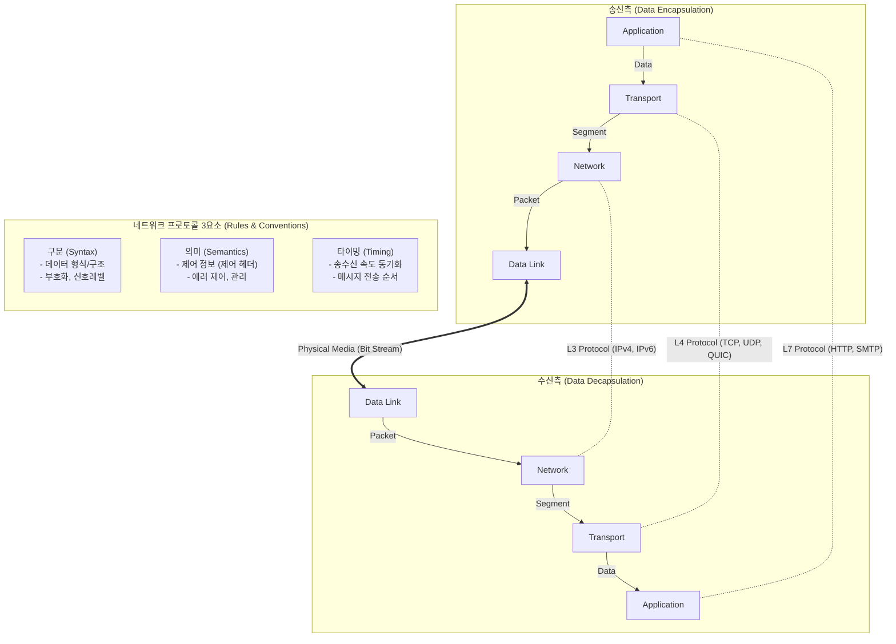

# 네트워크 프로토콜 (Network Protocol)

---

## I. 이기종 시스템 간 통신 규약, 네트워크 프로토콜의 개요

* **정의**: 컴퓨터 네트워크 상에서 이기종 시스템(단말, [[라우터]], 서버 등) 간에 데이터를 원활하고 [[신뢰성]] 있게 송수신하기 위해 사전에 약속된 논리적 통신 규약 및 절차
* **필요성**: 장비 및 벤더 독립적인 상호 운용성(Interoperability) 확보, 데이터 [[무결성]] 보장, 통신 중 발생 가능한 오류 탐지 및 복구
* **3대 핵심 요소**: 구문(Syntax, 데이터 형식), 의미(Semantics, 제어 정보), 타이밍(Timing, 속도 및 순서)

---

## II. 네트워크 프로토콜의 논리적 구조 및 핵심 구성 요소

### 가. 네트워크 프로토콜의 통신 아키텍처 및 3요소

* 각 계층(Layer)은 [[프로토콜]] 3요소(구문, 의미, 타이밍)를 준수하여 데이터를 [[캡슐화]](헤더 추가)하고, Peer-to-Peer 간 독립적인 논리적 통신을 수행함

### 나. 네트워크 프로토콜의 핵심 기능 및 구성 요소

| 구분 | 요소기술(키워드) | 세부 설명 |
| --- | --- | --- |
| **기본 3요소** | 구문 (Syntax) | 데이터 블록의 포맷, 부호화 방식, 데이터 크기 등 형식적 구조 정의 |
| **기본 3요소** | 의미 (Semantics) | 데이터 전송 제어, 오류 검출 및 복구를 위한 플래그 및 제어 정보 |
| **기본 3요소** | 타이밍 (Timing) | 송수신 장비 간 데이터 전송 속도 일치화 및 패킷의 전송 순서 제어 |
| **데이터 처리** | Encapsulation / Decapsulation | 송신 시 데이터에 프로토콜 헤더를 결합하고 수신 시 분리하는 과정 |
| **데이터 처리** | Fragmentation / Reassembly | 하위 계층의 전송 크기(MTU)에 맞게 PDU를 분할하고 수신지에서 재조립 |
| **전송 제어** | Connection Control | 데이터 전송 전 논리적 연결 설정([[TCP]] 3-Way Handshake) 및 연결 해제 기능 |
| **품질 제어** | Flow Control (흐름 제어) | 수신측 버퍼 오버플로우 방지를 위한 송신 속도 조절 (Sliding Window 등) |
| **품질 제어** | Error Control (오류 제어) | 패킷 손실, 훼손 시 재전송을 통한 데이터 신뢰성 보장 (ARQ, Checksum) |

---

## III. 계층별 프로토콜의 진화 비교 및 최신 발전 동향

### 가. 전통적 프로토콜과 최신 프로토콜의 진화 비교

| 계층 (TCP/IP) | 전통적 프로토콜 (Legacy) | 최신 프로토콜 진화 동향 (Modern/Next-Gen) | 주요 변경 특징 (개선점) |
| --- | --- | --- | --- |
| **Application** | HTTP/1.1, HTTP/2 | **[[HTTP 3|HTTP/3]]** | HOL(Head of Line) Blocking 완화, 병렬성 극대화 |
| **Transport** | TCP, UDP | **QUIC (Quick UDP Internet Connections)** | UDP 기반 [[다중화]], 0-RTT 연결 설정으로 초저지연 구현 |
| **Internet** | [[IPv4]], OSPF | **[[IPv6]], SRv6 (Segment Routing)** | 128bit 주소 확장, 트래픽 엔지니어링 및 망 구조 단순화 |
| **특수 환경(IoT)** | HTTP 기반 API 통신 | **[[MQTT (Message Queuing Telemetry Transport)|MQTT]], [[CoAP]] (Constrained Application)** | Publish/Subscribe 구조, 저전력/소형 기기 최적화 경량 통신 |

### 나. 네트워크 프로토콜의 최신 발전 트렌드 및 전망

* **저지연·고신뢰성 확보 (QUIC 도입 확산)**: 기존 TCP 기반 웹 통신의 Handshake 지연 및 HOL Blocking 한계를 극복하기 위해, 구글이 제안하고 IETF가 표준화한 UDP 기반의 QUIC 및 HTTP/3 채택 가속화
* **경량화 기반 IoT 초연결 (MQTT/CoAP)**: 스마트홈, 스마트팩토리 등 대규모 센서 네트워크 환경에서 오버헤드를 최소화하고 전력 소모를 줄이는 MQTT(메시지 큐 기반)의 산업 표준화 자리매김
* **보안 중심의 프로토콜 내재화 (TLS 1.3 / [[제로 트러스트 보안모델|Zero Trust]])**: 평문 전송의 취약점을 해결하기 위해 [[전송 계층]] 프로토콜 내에 보안 기능(TLS 1.3)을 기본 내장하고, 통신 전 과정에서 인증을 요구하는 제로 트러스트 아키텍처 연계 확산

---

### 🔗 연관 토픽

- **소속 도메인**: [[00_네트워크_MOC|🌐 네트워크]]
- **세부 분류**: `1. OSI 7계층 & 데이터링크 계층 (L1/L2)`
- **핵심 연관 토픽**:
  - [[프로토콜]]
  - [[IPv4]]
  - [[전송 계층|전송 계층 (Transport Layer)]]
  - [[MQTT (Message Queuing Telemetry Transport)]]
  - [[HTTP 3|HTTP/3]]
