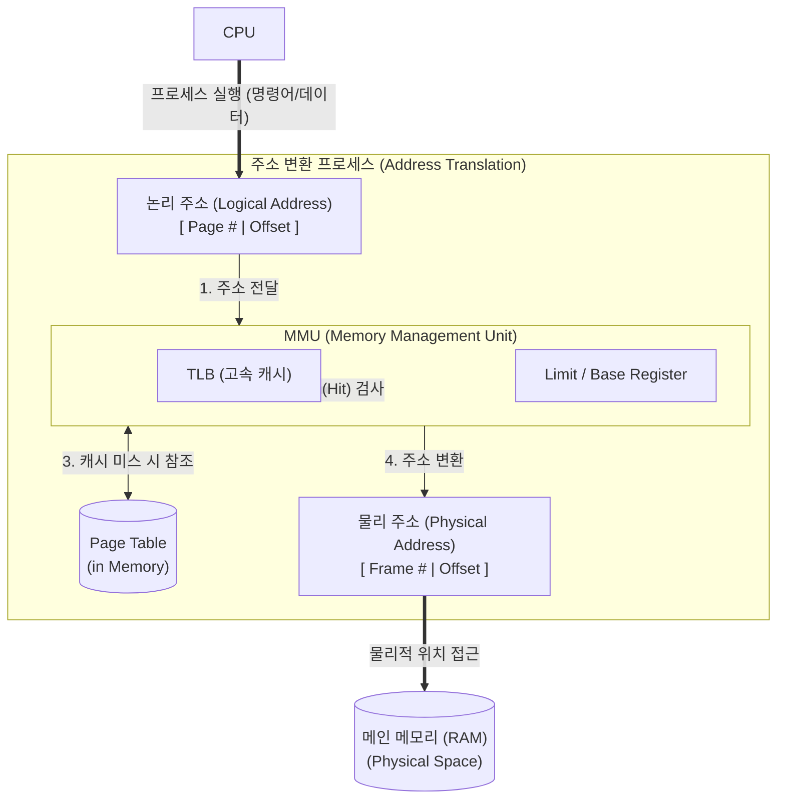

# 논리 주소 (Logical Address)

---

## I. 프로세스 관점의 독립적 메모리 공간, 논리 주소의 개요

* **정의**: [[CPU]]가 프로그램을 실행하면서 생성하는 주소로, 실제 물리적 메모리(RAM) 위치와 독립적으로 프로세스마다 0번지부터 부여되는 가상의 메모리 주소(Virtual Address)
* **필요성**: 다중 프로그래밍 환경에서 [[프로세스]] 간 메모리 영역 침범 방지(보호), 물리적 메모리 크기의 한계 극복([[가상 메모리]]), 메모리 할당 및 해제의 효율성 증대
* **특징**: 프로세스별 고유한 주소 공간 보유, 실행 시간 주소 바인딩(Execution-time Binding) 적용, 하드웨어(MMU)를 통한 동적 변환 필수

---

## II. 논리 주소의 변환 개념도 및 핵심 기술 요소

### 가. 논리 주소에서 물리 주소로의 변환(Mapping) 개념도

* CPU가 생성한 논리 주소는 MMU([[메모리 관리]] 장치)로 전달되며, TLB 캐시 또는 메모리 내의 페이지 테이블을 참조하여 실제 메모리 장치에 접근하기 위한 물리 주소로 런타임에 동적 변환됨

### 나. 논리 주소 관리 및 주소 변환 핵심 기술 요소

| 분류 | 요소기술(키워드) | 세부 설명 |
| --- | --- | --- |
| **메모리 공간** | Logical Address Space | 단일 프로세스가 참조할 수 있는 전체 논리 주소의 집합 (CPU 아키텍처에 의해 크기 결정) |
| **변환 장치** | MMU ([[MMU(Memory Management Unit)|Memory Management Unit]]) | 논리 주소를 물리 주소로 런타임에 매핑하는 하드웨어 칩 (주소 변환 및 메모리 보호 수행) |
| **변환 구조** | Page Table (페이지 테이블) | 논리 주소의 페이지 번호를 물리 주소의 프레임 번호로 1:1 매핑하는 메모리 내 데이터 구조 |
| **고속 캐싱** | TLB (Translation Lookaside Buffer) | 주소 변환 속도 향상을 위해 MMU 내부에 위치한 연관 메모리(Associative Memory) 형태의 캐시 |
| **메모리 보호** | Base & Limit Register | 프로세스의 시작 [[물리 주소]](Base)와 크기(Limit)를 저장하여, 합법적인 논리 주소 범위인지 검증 |
| **할당 기법** | Paging (페이징) | 논리 주소 공간을 동일한 크기의 '페이지(Page)' 단위로 분할하여 물리적 프레임에 비연속 할당 |
| **할당 기법** | Segmentation (세그먼테이션) | 논리 주소 공간을 코드, 데이터, 스택 등 의미 있는 가변 크기의 '세그먼트(Segment)'로 분할 |
| **바인딩 시점** | Execution-time Binding | 프로그램이 실행되는 도중에 메모리 내의 위치가 변경될 수 있도록 런타임에 주소를 확정하는 기법 |

---

## III. 논리 주소와 물리 주소의 비교 및 향후 전망

### 가. 논리 주소 (Logical Address)와 물리 주소 (Physical Address) 비교

| 비교 항목 | 논리 주소 (Logical Address) | 물리 주소 (Physical Address) |
| --- | --- | --- |
| **정의** | CPU가 실행 중인 프로세스 관점에서 생성하는 주소 | 메모리 칩 자체에서 인식하는 실제 데이터의 물리적 위치 |
| **생성 주체** | CPU (소프트웨어 및 연산 장치) | Memory Controller (하드웨어 장치) |
| **주소 공간 특성** | 프로세스마다 0번지부터 시작하는 독립적 공간 | 시스템 전체가 공유하는 단일하고 유일한 공간 |
| **공간 크기 한계** | CPU 아키텍처(32bit, 64bit)에 의해 결정 | 메인보드에 실제 장착된 RAM의 용량에 의해 결정 |
| **접근 방식** | 애플리케이션 코드가 직접 참조 (User Space) | MMU 변환 후 메모리 버스를 통해 접근 (Hardware) |

### 나. 주소 변환 기술의 최신 동향 및 전망

* **대용량 메모리 지원 (Huge Page 지원)**: [[가상화]] 환경 및 대용량 DB 처리 시 TLB Miss에 의한 성능 저하를 방지하기 위해 표준 페이지 크기(4KB) 대신 2MB, 1GB 단위의 Huge Page 활용이 데이터센터를 중심으로 보편화됨
* **[[CXL]](Compute Express Link) 기반 메모리 확장**: 최근 AI/머신러닝 워크로드 증가로 물리적 메모리 한계 극복을 위해, CXL 프로토콜을 활용하여 여러 노드의 메모리 풀(Memory Pool)을 단일 논리 주소 공간으로 묶어 사용하는 기술로 진화 중

---

### 🔗 연관 토픽

- **소속 도메인**: [[00_운영체제_MOC|⚙️ 운영체제]]
- **세부 분류**: `1. 프로세스 & 스레드 관리`
- **핵심 연관 토픽**:
  - [[물리 주소]]
  - [[가상 메모리]]
  - [[메모리 관리]]
  - [[프로세스]]
  - [[MMU(Memory Management Unit)]]
