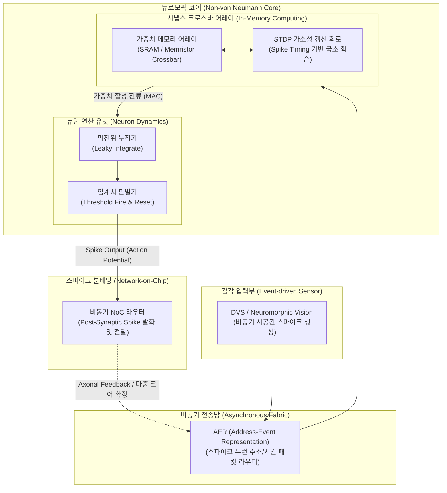

# 뉴로모픽 칩 (Neuromorphic Chip)

## I. 인간 뇌 신경망 모방형 초저전력 프로세서, 뉴로모픽 칩의 개요

- **정의**: 인간 뇌의 신경세포(Neuron)와 시냅스(Synapse) 구조를 하드웨어로 모방하여, 스파이크 펄스 기반의 비동기식 이벤트 구동(Event-driven) 방식으로 병렬 연산과 학습을 수행하는 비 폰노이만(Non-von Neumann) 반도체
- **등장배경 및 특징**:
    - **폰노이만 병목현상(Von-Neumann Bottleneck) 극복**: 연산부([[CPU]]/[[GPU]])와 메모리 분리로 인한 데이터 전송 지연, 대역폭 한계 및 발열 문제를 연산·기억 일체형 구조로 해결
    - **초저전력 스파이킹(Spike) 연산**: 신호가 발생할 때만 동작하는 희소성(Sparsity) 기반 이벤트 구동으로 수 밀리와트(mW) ~ 마이크로와트(\mu W) 수준의 에너지 효율 달성
    - **자율 국소 학습(On-chip Learning)**: 시냅스 가소성(STDP) 메커니즘을 칩 내부에서 직접 구현하여 실시간 적응형 비지도/반지도 학습 지원

## II. 뉴로모픽 칩의 아키텍처 및 핵심 구성요소

### 가. 뉴로모픽 칩의 아키텍처 및 동작 원리

- 이벤트 발생 시 스파이크 부호화(AER) \rightarrow 시냅스 크로스바에서 인메모리 가중치 누적(Integrate) \rightarrow 임계치 초과 시 스파이크 발화(Fire) 및 비동기 NoC를 통한 초저지연 분배

### 나. 뉴로모픽 칩의 핵심 기술 요소

|구분|핵심 기술|세부 설명|
|---|---|---|
|**망 아키텍처**|**SNN (Spiking Neural Network)**|시간 축 상의 스파이크 발생 빈도 및 타이밍으로 정보를 표현하는 생체 모방 3세대 신경망 모델|
|**신경망 모델**|**LIF (Leaky Integrate-and-Fire)**|입력 스파이크 전류를 막전위로 누적하고, 시간에 따른 누설 감쇠 후 임계치 도달 시 발화·리셋하는 뉴런 수식 회로|
|**학습 메커니즘**|**STDP (Spike-Timing Plasticity)**|시냅스 전·후 뉴런의 스파이크 발화 시차(\Delta t)에 따라 시냅스 연결 강도(가중치)를 자체 갱신하는 비지도 국소 가소성 기법|
|**소자/소재**|**[[멤리스터]] (Memristor / ReRAM)**|전류 이동에 따라 저항 상태가 가변되는 비휘발성 소자로, 생체 시냅스의 아날로그 가중치 기억 기능을 초소형 구현|
|**연산 패러다임**|**IMC (In-Memory Computing)**|메모리 셀 배열 자체에서 아날로그 키르히호프 법칙을 이용해 $O(1)$의 시간 복잡도로 벡터-행렬 곱([[MAC]])을 직접 수행|
|**통신 규약**|**AER (Address-Event Representation)**|스파이크가 발생한 뉴런의 고유 주소(Address)와 시간 정보만을 비동기 패킷화하여 전송선 공유 및 대역폭 최소화|
|**온칩 인터커넥트**|**비동기 NoC (Asynchronous NoC)**|전역 클록(Global Clock) 없이 핸드셰이킹 프로토콜로 다중 코어 간 스파이크 패킷을 저전력·저지연 라우팅|
|**대규모 시스템**|**Intel Hala Point (Loihi 2)**|인텔 4 공정의 로이히 2 칩 1,152개를 통합하여 11.5억 개 뉴런 및 1,280억 개 시냅스를 구현한 세계 최대 규모 시스템|

## III. 뉴로모픽 칩 vs 기존 AI 가속기(GPU/NPU) 비교 및 발전 전망

### 가. GPU vs NPU vs 뉴로모픽 칩 비교

|비교 항목|GPU (General Purpose GPU)|[[NPU]] (Neural Processing Unit)|뉴로모픽 칩 (Neuromorphic Chip)|
|---|---|---|---|
|**설계 철학**|대규모 데이터의 초병렬 고속 처리|[[딥러닝]](DNN/[[CNN]]/Transformer) 가속|뇌 신경세포의 구조 및 동작 메커니즘 모사|
|**아키텍처 구조**|폰노이만 구조 (CPU-GPU-[[HBM]] 분리)|폰노이만 변형 ([[시스톨릭 어레이]]/MAC)|비 폰노이만 구조 (In-Memory Computing)|
|**동작 방식**|동기식(Clock) 연속 행렬 연산|동기식 정밀도 고정 행렬 연산|비동기식(Event-driven) 희소(Sparse) 스파이크|
|**데이터 표현**|다비트 부동소수점 (FP32, FP16, FP8)|양자화 정수/소수점 (INT8, FP16)|시간 영역 이진 펄스 열 (Spike Train)|
|**학습 방식**|오차역전파 (Backpropagation)|학습 완료 모델 추론 (양자화/컴파일)|국소적 시냅스 가소성 (STDP) 및 SNN 변환|
|**소비 전력**|높음 (250W \sim 700W+)|중간 (1W \sim 70W)|극저전력 (\mu W \sim mW 단위)|
|**주요 적용처**|[[초거대 언어 모델|LLM]] 및 대규모 초거대 모델 학습|[[온디바이스 AI]], 데이터센터 추론 가속|엣지 센싱, BCI, 뉴로모픽 로보틱스, 초저전력 IoT|

### 나. 기술적 한계점 및 향후 발전 전망

- **[[알고리즘]] 한계 극복 (Backprop 불가 문제)**: 스파이크 함수의 비연속성(계단 함수)으로 인한 [[역전파]] 미분 불가 문제를 '대리 기울기(Surrogate Gradient)' 기법 및 기존 사전학습 모델의 'ANN-to-SNN 변환' 컴파일러 생태계로 극복 중
- **소자 상용화 로드맵**: 현재 안정화된 디지털 CMOS 기반 SNN 프로세서(Loihi 2, NorthPole)에서, 차세대 ReRAM·MRAM·강유전체(FeFET) 기반의 아날로그 [[PIM]] 크로스바 소자로 공정 전환 가속화 진행
- **적용 분야 확대**: 이벤트 기반 비전 센서(DVS)와 결합한 상시 대기형(Always-on) [[드론]] 회피 시스템, 실시간 생체 신호(뇌파/ECG) 해석 기반 BCI(뇌-컴퓨터 인터페이스) 및 자율 에이전트 엣지 브레인으로 핵심 영역 선점 전망

---

### 🔗 연관 토픽

- **소속 도메인**: [[00_컴퓨터구조_MOC|💻 컴퓨터구조]]
- **세부 분류**: `1. CPU 프로세서 & 마이크로아키텍처`
- **핵심 연관 토픽**:
  - [[멤리스터]]
  - [[CPU]]
  - [[GPU]]
  - [[NPU|NPU(Neural Processing Unit)]]
  - [[시스톨릭 어레이]]
