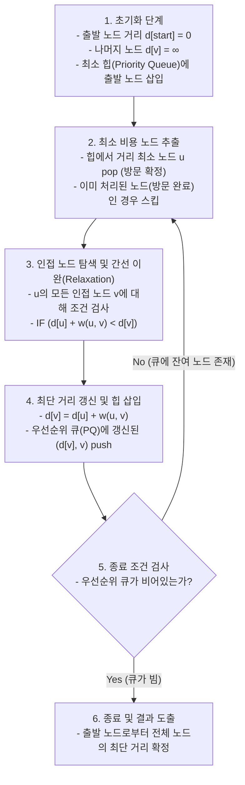

# 다익스트라 알고리즘 (Dijkstra's Algorithm)

## I. 단일 출발점 최단 경로 탐색, 다익스트라 알고리즘의 개요

- **정의**: 가중치 그래프에서 출발 노드로부터 다른 모든 노드까지의 최단 거리를 탐색하는 탐욕적(Greedy) 기법 기반의 단일 출발점 최단 경로(SSSP: Single-Source Shortest Path) [[알고리즘]]
- **등장배경 및 특징**:
    - **음의 가중치 부재 전제**: 간선의 가중치가 음수가 아닌(Non-negative) 실수 공간에서 최적 부분 구조(Optimal Substructure) 보장
    - **탐욕적 노드 확정**: 매 단계에서 미방문 노드 중 누적 최단 거리가 가장 짧은 노드를 선택하여 최단 경로를 영구 확정
    - **동적 거리 완화(Relaxation)**: 노드 방문 시 인접 노드의 거리를 d[v] = \min(d[v], d[u] + w(u, v)) 수식으로 지속 갱신

## II. 다익스트라 알고리즘의 동작 메커니즘 및 핵심 요소

### 가. 다익스트라 알고리즘의 동작 절차 및 개념도

- 미확정 노드 중 최소 비용 노드를 추출한 후, 해당 노드를 경유지로 삼아 인접 노드의 거리를 갱신(Relaxation)하는 과정을 우선순위 큐가 빌 때까지 반복 수행

### 나. 다익스트라 알고리즘의 핵심 구성 요소

|구분|요소기술 / 핵심개념|세부 설명|
|---|---|---|
|**알고리즘 기법**|**[[그리디 알고리즘|탐욕 알고리즘]] (Greedy)**|매 순환마다 국소적으로 가장 짧은 거리를 가진 노드를 즉시 선택하여 전역 최적해를 도출하는 전략|
|**핵심 연산**|**거리 완화 (Relaxation)**|$d[v] > d[u] + w(u, v)$인 경우 더 짧은 경로로 $d[v]$를 완화 및 갱신하는 기본 업데이트 연산|
|**자료구조**|**우선순위 큐 (Priority [[Queue]])**|최소 힙(Min Heap)을 사용하여 미확정 정점 중 최단 거리를 가진 정점을 $O(\log V)$에 선택|
|**시간 복잡도**|**O((V + E) \log V)**|정점 수 V, 간선 수 E 기준 이진 힙 적용 시 시간 복잡도 (피보나치 힙 사용 시 O(E + V \log V))|
|**공간 복잡도**|**O(V + E)**|인접 리스트(Adjacency List) 및 최단 거리 저장 1차원 테이블 구축을 위한 선형 공간 복잡도|
|**최적화 기법**|**양방향 다익스트라**|출발지와 목적지 양방향에서 동시에 다익스트라 탐색을 진행하여 탐색 공간(Search Space)을 기하급수적으로 축소|
|**전처리 가속**|**수축 계층화 (Contraction Hierarchies)**|도로망 네트워크에서 중요도가 낮은 정점을 사전 제거 및 단축선(Shortcut) 추가로 대규모 실시간 쿼리 밀리초 단위 응답|
|**병렬 확장**|**델타 스테핑 (Delta-stepping)**|간선 가중치를 \Delta 단위 버킷으로 그룹화하여 동일 버킷 내 완화 연산을 병렬(Multi-core/[[GPU]])로 처리|

## III. 최단 경로 탐색 알고리즘 비교 및 응용 분야

### 가. 최단 경로 알고리즘 비교 (다익스트라 vs 벨만-포드 vs 플로이드-워셜)

|비교 항목|다익스트라 (Dijkstra)|벨만-포드 (Bellman-Ford)|플로이드-워셜 (Floyd-Warshall)|
|---|---|---|---|
|**탐색 범위**|단일 출발점 (Single Source)|단일 출발점 (Single Source)|모든 쌍 (All-Pairs)|
|**알고리즘 전략**|탐욕적 기법 (Greedy)|[[동적 계획법]] (DP)|동적 계획법 (DP)|
|**음수 가중치**|**사용 불가 (음수 사이클 오작동)**|**사용 가능 (음수 사이클 감지)**|**사용 가능 (음수 사이클 부재 시)**|
|**시간 복잡도**|O((V + E)\log V) (최소 힙 기준)|O(VE)|O(V^3)|
|**자료구조**|인접 리스트, 최소 힙|간선 리스트 ([[EDGE|Edge]] List)|2차원 거리 행렬 (Matrix)|
|**주요 활용**|OSPF 라우팅, 실시간 지도 내비게이션|음수 비용 금융 파생상품 차익거래|대중교통 환승망, 소규모 네트워크 전체 경로|

### 나. 주요 활용 사례 및 발전 동향

- **인터넷 라우팅 [[프로토콜]] (OSPF/IS-IS)**: 링크 상태(Link State) 데이터베이스를 기반으로 각 라우터가 자기를 루트로 하는 최단 경로 트리(SPT) 구축 시 SPF 엔진으로 채택
- **실시간 모빌리티 및 내비게이션 가속**: 대규모 지리정보시스템(GIS)에서 단순 다익스트라의 탐색 오버헤드를 줄이기 위해 휴리스틱을 결합한 A* 알고리즘 및 전처리 기반 CCH(Customizable Contraction Hierarchies)로 고도화되어 상용 적용 중

---

### 🔗 연관 토픽

- **소속 도메인**: [[00_컴퓨터구조_MOC|💻 컴퓨터구조]]
- **세부 분류**: `4. 기본 자료구조 (Data Structures)`
- **핵심 연관 토픽**:
  - [[알고리즘]]
  - [[그리디 알고리즘|그리디 (탐욕) 알고리즘]]
  - [[힙|힙 (Heap)]]
  - [[Queue]]
  - [[GPU]]
