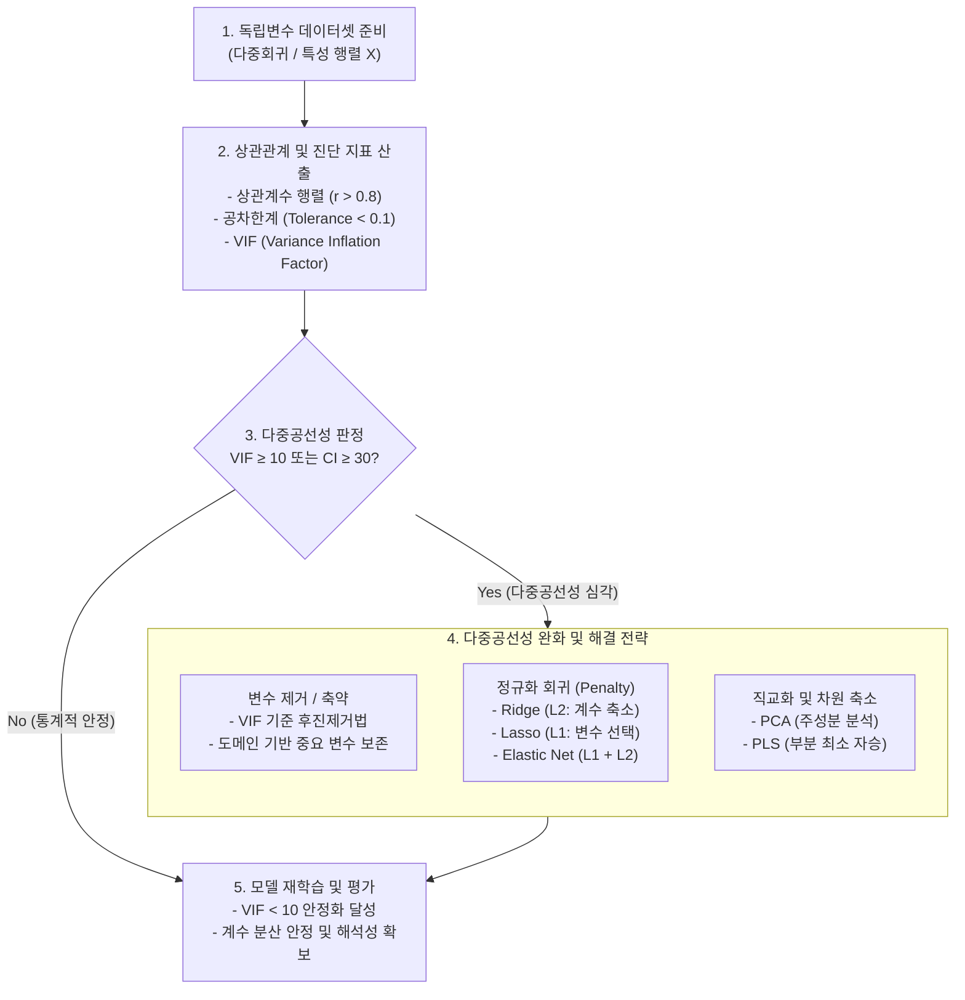

# 다중공선성 (Multicollinearity)

## I. 통계적 추정 왜곡 방지, 다중공선성의 개요

- **정의**: 다중회귀분석에서 둘 이상의 독립변수 간에 강한 선형 상관관계가 존재하여, 회귀계수의 분산이 비정상적으로 커지고 계수 추정의 신뢰도 및 해석력이 저하되는 현상
- **등장배경 및 문제점**:
    - **설계행렬 역행렬 계산 불안정**: 정규방정식 계산 시 $(X^T X)^{-1}$의 조건수 급증 및 행렬식 \approx 0 수렴으로 수치적 불안정성 초래
    - **[[통계적 가설검정]] 왜곡**: 결정계수(R^2)는 높아 모델 전체는 유의해 보이나, 개별 회귀계수의 표준오차 증가로 [[t-검정 (t-test)|t-검정]] 통과 실패([[유의확률|p-value]] 급증)
    - **해석 불가능성 및 부호 역전**: 독립변수의 실제 영향력과 반대되는 회귀계수 부호 산출 및 설명 가능한 AI([[XAI]])의 특성 기여도 왜곡 발생

## II. 다중공선성의 발생 메커니즘 및 핵심 요소

### 가. 다중공선성의 진단 및 해결 프로세스

- 변수 간 상관행렬 및 VIF 지표를 통해 공선성을 진단하고, 기준치(VIF \ge 10) 초과 시 변수 제거, L1/L2 정규화, [[PCA(Principal Component Analysis)|PCA]] 직교화를 통해 분산 팽창을 억제하는 순환 절차

### 나. 다중공선성의 핵심 기술 및 해결 요소

|구분|요소기술 (키워드)|세부 설명|
|---|---|---|
|**진단 지표**|**VIF (Variance Inflation Factor)**|VIF_i = 1 / (1 - R_i^2) 수식 기반 지표로, 통상 10 이상(엄격 기준 5 이상) 시 공선성 판정|
|**진단 지표**|**공차한계 (Tolerance)**|1 - R_i^2 (또는 1 / VIF)로 정의되며, 0.1 이하일 경우 다중공선성이 심각함을 의미|
|**진단 지표**|**상태지수 (Condition [[RDBMS 인덱스(index)|Index]])**|설계행렬 고유값 비율의 제곱근으로 계산되며, 30 이상 시 행렬 연산 불안정 판정|
|**진단 지표**|**상관계수 행렬 (r)**|변수 간 피어슨 상관계수를 산출하여 절대값 \vert{}r\vert{} \ge 0.8 이상인 변수 쌍 식별|
|**변수 처리**|**단계적 변수 선택법**|전진선택, 후진제거, 단계적(Stepwise) 방법으로 공선성을 유발하는 잉여 변수를 순차 제거|
|**정규화 기법**|**릿지 회귀 (Ridge / L2)**|손실함수에 L2 패널티(\lambda \sum \beta^2)를 부과하여 회귀계수 크기를 축소, (X^T X + \lambda I)^{-1} 역행렬 연산 안정화|
|**정규화 기법**|**라쏘 / 엘라스틱넷 (Lasso / Elastic Net)**|L1 패널티 기반 변수 자동 탈락(희소성 확보) 및 L1+L2 결합을 통한 상관 변수 동시 처리|
|**[[차원 축소]]**|**주성분 회귀 (PCR / PLS)**|상관관계가 높은 다차원 변수를 상호 직교(Orthogonal)하는 주성분으로 변환하여 공선성 원천 배제|
|**XAI 최적화**|**계층적 군집화 (Hierarchical Clustering)**|머신러닝/SHAP 분석 전 상관 변수를 트리형 군집으로 묶어 대표 피처 추출 및 중요도 왜곡 방지|

## III. 전통적 OLS vs 현대 머신러닝/XAI 환경 비교 및 대응 동향

### 가. 환경별 다중공선성 영향 및 대응 비교

|비교 항목|전통적 선형 통계 모델 (OLS)|현대 머신러닝 / XAI 환경 (Tree/DNN)|
|---|---|---|
|**주요 목적**|독립변수의 통계적 인과성 및 효과 추정|대규모 데이터 기반 최종 예측 정확도(Accuracy) 극대화|
|**모델 성능 영향**|회귀계수 분산 급증으로 모델 해석 불가|예측 성능 저하는 경미 (트리 모델은 분할 시 변수 대체)|
|**핵심 문제점**|p-value 왜곡, 계수 부호 역전 현상|**피처 중요도(MDI, Permutation) 분산 및 SHAP 기여도 왜곡**|
|**주요 진단 도구**|VIF, Tolerance, 상관계수 행렬|변수 간 상관 클러스터 맵, Collinear SHAP 분석|
|**주 해결 방안**|변수 수동 제거, Ridge/Lasso 적용|피처 클러스터링 후 대표값 사용, Clustered SHAP 적용|

### 나. 최신 동향 및 실무적 고려사항

- **[[MLOps]] 파이프라인의 자동화 진단**: 대규모 피처 스토어 구축 시 상관계수 및 VIF를 사전 측정하여 임계치 초과 피처를 자동으로 드롭(Drop)하거나 결합하는 [[데이터 전처리]] 파이프라인 표준화
- **설명 가능한 AI(XAI) [[신뢰성]] 확보**: [[Smart Car(자율주행)|자율주행]], 의료, 금융 등 고신뢰성 [[인공지능]] 분야에서 SHAP 분석 시 다중공선성으로 인한 특성 중요도 분산 착시를 방지하기 위해 계층적 클러스터링(Hierarchical Feature Clustering) 병행 필수화 추세

---

### 🔗 연관 토픽

- **소속 도메인**: [[00_인공지능_MOC|🤖 인공지능]]
- **세부 분류**: `1. 수학 · 통계학 & 데이터 전처리`
- **핵심 연관 토픽**:
  - [[PCA(Principal Component Analysis)]]
  - [[데이터 전처리]]
  - [[MLOps]]
  - [[차원 축소|차원 축소(Dimensionality Reduction)]]
  - [[t-검정 (t-test)]]
