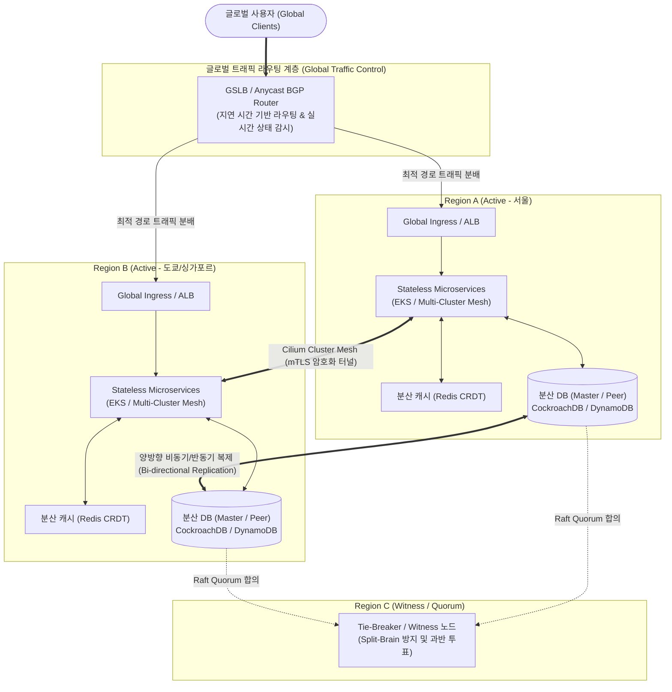

# 다중지역 A-A DRS (Multi-Region Active-Active Disaster Recovery System)

## I. RPO/RTO Zero 지향 초가용성 인프라, 다중지역 A-A DRS의 개요

- **정의**: 지리적으로 원격 분리된 2개 이상의 독립 리전(Region)에 동일 인프라와 애플리케이션을 상시 가동(Active)하여, 트래픽을 분산 처리하고 특정 리전 전면 장애 시 무중단(RPO=0, RTO \approx 0) 서비스를 보장하는 재해복구 시스템
- **등장배경 및 특징**:
    - **대규모 광역 재해 대응**: 단일 데이터센터 및 단일 클라우드 리전의 전력망 단절, 지진, 물리적 네트워크 단절 등 대규모 단절 위험 격리
    - **무중단 비즈니스 연속성([[BCP]])**: 상시 트래픽 처리로 유휴 자원 낭비를 방지하고, 장애 발생 시 전환 지연(Failover Latency)을 극소화하여 RTO Zero 달성
    - **지연 시간 단축 및 로컬 서빙**: 글로벌 사용자 인접 리전에서 직접 요청을 처리함으로써 사용자 체감 네트워크 왕복 시간(RTT) 단축

## II. 다중지역 A-A DRS의 개념도 및 핵심 기술 요소

### 가. 다중지역 A-A DRS의 개념도 및 동작 원리

- 평시에는 GSLB를 통해 양 리전으로 워크로드를 동시 분산 처리하며, 리전 간 전용망 터널링을 통해 [[데이터베이스]] 및 캐시를 실시간 동기화/합의 처리
- 단일 리전 붕괴 시 GSLB가 장애 리전을 즉시 격리(Traffic Cut-off)하고 잔여 리전으로 100% 트래픽을 자동 수용하며, 제3의 Witness 리전이 스플릿 브레인을 원천 차단

### 나. 다중지역 A-A DRS의 핵심 기술 요소

|구분|요소기술(키워드)|세부 설명|
|---|---|---|
|**트래픽 라우팅**|**GSLB / Anycast [[BGP]]**|지리적 위치(Geo-location), 네트워크 레이턴시 및 헬스체크 기반으로 사용자 요청을 최적 리전으로 자동 조향|
|**트래픽 라우팅**|**ARC (Application Recovery Controller)**|AWS Route 53 ARC 등 라우팅 제어 모듈을 통해 재해 발생 시 수초 이내 수동/자동으로 특정 리전 트래픽 차단|
|**데이터 동기화**|**CRDT (Conflict-free Replicated)**|중앙 동기화 락(Lock) 없이 다중 리전에서 동시 쓰기 후 수학적으로 충돌 없이 최종 상태를 병합하는 데이터 구조|
|**데이터 동기화**|**양방향 분산 복제 (Multi-Master)**|Aurora Global DB, DynamoDB Global Tables 등 다중 리전 간 쓰기 허용 및 LWW(Last-Write-Wins) 기반 충돌 해소|
|**분산 일관성**|**Raft / Paxos 분산 합의**|강한 일관성이 필요한 데이터 [[트랜잭션]] 처리를 위해 3개 이상 리전 간 쿼럼(Quorum, 과반수) 투표 기반 커밋|
|**고장 격리**|**스플릿 브레인 방지 (Witness)**|리전 간 통신 단절 시 상호 마스터 승격으로 인한 데이터 오염을 막기 위해 홀수 개의 쿼럼 또는 제3 리전 감시자 배치|
|**컴퓨팅/네트워크**|**멀티클러스터 서비스 메시**|Cilium Mesh, Istio Multi-primary를 활용하여 서로 다른 리전의 [[쿠버네티스]] 파드 간 mTLS 기반 서비스 직접 통신|
|**상태 관리**|**Stateless 아키텍처**|사용자 세션을 개별 서버에 종속시키지 않고 JWT 토큰 또는 글로벌 Redis 클러스터로 외부화하여 리전 간 자유로운 이동 보장|

## III. 전통적 재해복구(A-S) vs 다중지역 A-A DRS 비교 및 구축 전략

### 가. 전통적 Active-Standby vs 다중지역 Active-Active DRS 비교

| 비교 항목            | 전통적 Active-Standby [[DRS (Disaster Recovery System)|DRS]] (Cold/Warm) | 다중지역 Active-Active DRS             |
| ---------------- | ---------------------------------- | ---------------------------------- |
| **운영 상태**        | 주 센터 가동 / 재해복구 센터 대기(Standby)      | 분산된 2개 이상 리전 전면 가동(All Active)     |
| **복구 목표 (RTO)**  | 수십 분 ~ 수 시간 (기동 및 데이터 승격 필요)       | **RTO \approx 0 (수초 내 트래픽 재라우팅)**  |
| **데이터 손실 (RPO)** | 주기적 백업/비동기 복제로 RPO 발생              | **RPO \approx 0 (실시간 복제 및 쿼럼 합의)** |
| **자원 효율성**       | 대기 센터 자원 유휴화로 TCO 효율 저하            | 전 리전 상시 워크로드 처리로 인프라 가용률 극대화       |
| **데이터 일관성**      | 단일 쓰기 주체로 충돌 없음 (ACID 보장 용이)       | 동시 다중 쓰기로 인한 충돌 처리 메커니즘 필수         |
| **구축/운영 난이도**    | 표준적 솔루션 적용 가능 (낮음~보통)              | 복잡한 분산 아키텍처, 네트워크 레이턴시 제어 (매우 높음)  |

### 나. 구축 전략 및 운영 고려사항

- **도메인 격리(Cell-based Architecture)**: 사용자 계정 또는 지역 ID 단위로 데이터를 [[파티셔닝]](Sharding)하여 특정 사용자의 쓰기 트랜잭션을 특정 리전에 고정함으로써 리전 간 동시 쓰기 충돌 원천 방지
- **[[카오스 엔지니어링]](Chaos Engineering) 상시화**: Chaos Mesh, AWS FIS 등을 활용하여 주기적으로 실제 운영 리전의 전원 단절 및 네트워크 지연을 인위적으로 주입, 실시간 무중단 절체 무결성을 정기 검증하는 체계 구축 필수

---

### 🔗 연관 토픽

- **소속 도메인**: [[00_경영전략_MOC|📈 경영전략]]
- **세부 분류**: `5. IT 투자 성과 평가 & 비즈니스 연속성 계획 (BCP)`
- **핵심 연관 토픽**:
  - [[DRS (Disaster Recovery System)]]
  - [[데이터베이스]]
  - [[트랜잭션]]
  - [[파티셔닝|파티션]]
  - [[BCP|BCP (Business Continuity Planning)]]
