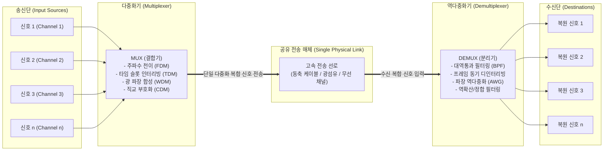

# 다중화 (Multiplexing)

## I. 전송 매체 효율 극대화 기술, 다중화의 개요

- **정의**: 단일 고속 물리 전송 선로의 가용 대역폭을 복수의 독립된 저속 논리 신호가 공유하여 동시 전송할 수 있도록 변환·집약하는 통신 전송 기술
- **등장배경 및 특징**:
    - **통신 인프라 TCO 절감**: 물리적 회선 포설 비용 및 [[유지보수]] 비용을 최소화하고 매체 활용률 극대화
    - **자원 분할 다변화**: 주파수, 시간, 파장, 부호, 공간, 전력 등 다양한 물리적 차원을 분할 축으로 활용
    - **투명성(Transparency)**: 상위 계층 트래픽 특성에 독립적인 투명한 물리 계층 논리 채널 제공

## II. 다중화의 개념도 및 핵심 기술 요소

### 가. 다중화의 개념도 및 동작 원리

- 송신단에서 다수 신호를 특정 도메인(시간·주파수·파장 등)으로 인터리빙/변조하여 결합(MUX) \rightarrow 고속 단일 링크 전송 \rightarrow 수신단 필터 및 역확산기를 통해 원래 개별 신호로 분리(DEMUX) 복원하는 구조

### 나. 다중화의 핵심 기술 요소

|구분|요소기술 (키워드)|세부 설명|
|---|---|---|
|**전통적 다중화**|**FDM (Frequency Division)**|전송 매체의 전체 대역폭을 비중첩 다중 주파수 대역으로 분할, 인접 채널 간 간섭 방지용 보호 대역(Guard Band) 필수|
|**전통적 다중화**|**TDM (Time Division)**|전체 대역폭을 고정 시간 슬롯(Time Slot)으로 시분할 할당; 동기식(고정 슬롯 할당)과 비동기식(통계적 다중화, 동적 할당) 구분|
|**광통신 다중화**|**WDM / DWDM (Wavelength)**|단일 광섬유에 다수의 레이저 광 파장을 중첩 전송; 50GHz/100GHz 초협대역 파장 간격 기반 고밀도 전송 기술(DWDM)|
|**무선 다중 접속**|**CDM / CDMA (Code Division)**|모든 사용자가 동일 주파수와 시간을 공유하며, 상호 직교성(Orthogonality)을 갖는 고유 확산 부호(Walsh Code)로 채널 분리|
|**디지털 고속화**|**[[OFDM (Orthogonal Frequency Division Multiplexing)|OFDM]] (Orthogonal FDM)**|부반송파 간 직교성을 유지하여 스펙트럼을 중첩 배치; 보호구간(CP) 삽입으로 다중 경로 심볼 간 간섭(ISI) 원천 억제|
|**공간 영역 확장**|**SDM (Space Division)**|다중 안테나(Massive [[MIMO]]) 공간 스트림 또는 다중 코어 광섬유(MCF)/소용돌이 모드 광섬유(FMF)를 이용한 물리 공간 분할|
|**비직교 고밀도**|**[[비직교 다중접속|NOMA]] (Non-Orthogonal)**|동일 시간·주파수 자원에 채널 이득 차이를 기반으로 전력 영역(Power Domain)을 차등 할당, 수신단 연속간섭제거(SIC)로 복원|
|**차세대 시공간**|**OTFS (Delay-Doppler)**|고속 이동(KTX, 도심항공교통, [[저궤도 위성]]) 환경의 도플러 확산 극복을 위해 시간-주파수가 아닌 지연-도플러 평면에서 신호 다중화|

## III. 다중화 방식별 비교 및 차세대 기술 전망

### 가. 주요 다중화 방식별 핵심 특성 비교

|비교 항목|FDM (주파수 분할)|TDM (시분할)|WDM (파장 분할)|CDM (부호 분할)|SDM (공간 분할)|
|---|---|---|---|---|---|
|**분할 차원**|주파수 영역 (Hz)|시간 영역 (sec)|광 파장 영역 (\lambda, nm)|부호 영역 (Code)|공간/경로 영역 (Space)|
|**동기화 요구**|반송파 주파수 동기|**엄격한 시간 동기 필수**|광학적 파장 안정성|칩(Chip) 단위 코드 동기|공간 채널 추정 동기|
|**간섭 완화 기법**|보호 대역 (Guard Band)|보호 시간 (Guard Time)|광학 채널 필터링|직교 부호화, 전력 제어|빔포밍 프리코딩 (Zero-Forcing)|
|**주요 전송 매체**|무선 라디오, 유선 동축|디지털 전송선, E1/T1|단일 모드 광섬유 (SMF)|무선 이동통신 (3G)|다중 코어 광섬유, 5G/6G MIMO|
|**장단점**|단순 구조 / 대역 낭비|전송 지연 발생 / 유연성|초고대역폭 / 고가 소자|보안성 우수 / 원근 문제|용량 극대화 / 누화(Crosstalk) 제어|

### 나. 기술적 한계 극복 및 향후 발전 전망

- **광 전송 비선형 한계 극복**: 단일 광섬유의 비선형 섀넌 한계(Shannon Limit)를 돌파하기 위해 다중 코어 광섬유(Multi-Core Fiber) 기반 SDM과 광전집적회로(CPO: Co-Packaged Optics) 패키징 다중화 기술로 진화
- **6G 극한 이동성 및 대용량 대응**: 6G 무선 백홀망에서 서브 테라헤르츠(sub-THz) 대역 OAM(궤도 각운동량) 기반 공간 다중화와 저궤도 위성(LEO) 통신용 OTFS 변조 다중화 기술의 표준화 및 상용화 가속 전망

---

### 🔗 연관 토픽

- **소속 도메인**: [[00_네트워크_MOC|🌐 네트워크]]
- **세부 분류**: `1. OSI 7계층 & 데이터링크 계층 (L1/L2)`
- **핵심 연관 토픽**:
  - [[MIMO]]
  - [[OFDM (Orthogonal Frequency Division Multiplexing)]]
  - [[프로토콜]]
  - [[전송 계층|전송 계층 (Transport Layer)]]
  - [[네트워크 프로토콜|네트워크 프로토콜 (Network Protocol)]]
