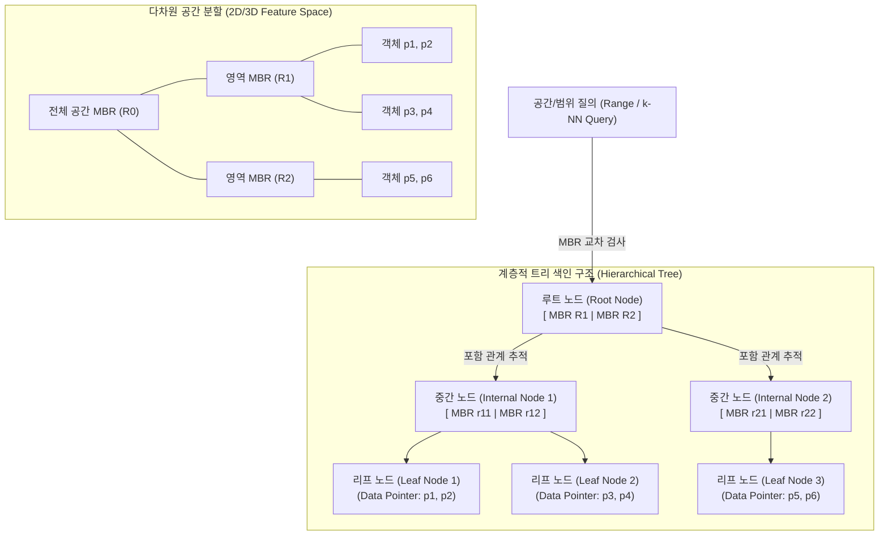

# 다차원 색인구조 (Multidimensional Index Structure)

## I. 다차원 공간·속성 데이터 초고속 탐색, 다차원 색인구조의 개요

- **정의**: 공간 좌표(GIS), 시계열, 멀티미디어 특징 벡터 등 2차원 이상의 다차원 속성을 갖는 데이터를 고속으로 검색·관리하기 위해 다차원 공간을 분할하고 계층화하는 비선형 색인 구조
- **등장배경 및 특징**:
    - **1차원 B-Tree 한계 극복**: B-Tree의 사전식 정렬(Lexicographical order)로 인한 다차원 범위 질의(Range Query) 시 비효율 및 인덱스 풀 스캔 한계 해소
    - **공간적 [[지역성]](Spatial Locality) 보존**: 인접한 다차원 데이터를 디스크 블록/메모리 페이지에 물리적으로 근접 저장하여 입출력(I/O) 최소화
    - **특수 질의 지원**: 점 질의(Point Query), 영역 질의(Range Query), 최근접 이웃 질의(k-NN Query), 공간 [[조인]](Spatial Join) 연산 가속

## II. 다차원 색인구조의 개념도 및 핵심 기술 요소

### 가. 다차원 색인구조(R-Tree 기반)의 개념도 및 동작 원리

- 공간 객체들을 최소 경계 사각형(MBR)으로 묶어 상위 계층으로 일반화하고, 질의 영역과 교차(Intersect)하지 않는 서브트리를 조기 프루닝(Pruning)하여 디스크 I/O를 O(\log_M N) 수준으로 절감

### 나. 다차원 색인구조의 핵심 기술 및 구성 요소

|구분|요소기술(키워드)|세부 설명|
|---|---|---|
|**공간 표현**|**MBR (Minimum Bounding Box)**|다차원 객체를 감싸는 최소 크기의 초직육면체/직사각형으로 색인 키의 기본 단위|
|**공간 객체 (SAM)**|**R-Tree**|B-Tree를 다차원으로 확장하여 MBR을 계층적으로 저장하는 높이 균형 트리 (중첩 허용)|
|**공간 객체 (SAM)**|**R*-Tree**|노드 분할 시 MBR 면적, 둘레, 중첩도(Overlap) 최소화 및 강제 재삽입(Forced Reinsert) 적용|
|**점 데이터 (PAM)**|**k-d Tree (k-dimensional Tree)**|k차원 공간을 각 축(Axis)에 수직인 초평면으로 번갈아 이분 분할하는 [[이진 탐색 트리]] 구조|
|**점 데이터 (PAM)**|**Grid File**|공간을 비균등 그리드로 분할하고, 격자 셀과 디스크 블록을 동적 디렉터리 어레이로 매핑|
|**공간 채움 곡선**|**Hilbert / Z-Order Curve**|다차원 좌표를 공간적 인접성을 보존하며 1차원 값(정수)으로 매핑하여 일반 B-Tree에서 색인 가능화|
|**고차원 근사 (ANN)**|**HNSW (Hierarchical NSW)**|고차원 임베딩 벡터 간 [[유사도]] 탐색을 위해 다층 스킵리스트 형태의 근접 그래프(Proximity Graph) 구축|
|**고차원 압축 (ANN)**|**IVF-PQ (Inverted File PQ)**|벡터 공간을 보로노이 셀로 군집화(IVF)하고 부분 벡터를 양자화(PQ)하여 메모리 극소화 및 초고속 검색|
|**차세대 학습 색인**|**Learned Multidimensional [[RDBMS 인덱스(index)|Index]]**|Flood, Tsunami 등 누적분포함수(CDF) 기반 머신러닝 회귀 모델로 다차원 [[파티셔닝]] 자동 최적화|

## III. 다차원 색인구조 간 비교 및 최신 발전 동향

### 가. 주요 색인구조 간 특성 비교

|비교 항목|1차원 B+Tree|공간 객체 색인 (R-Tree 계열)|공간 채움 곡선 (Hilbert/Z-order)|고차원 벡터 색인 (HNSW)|
|---|---|---|---|---|
|**대상 데이터**|1차원 단일 값 / 스칼라|2~3차원 다각형, 선, 영역 객체|2~4차원 다중 속성 점 데이터|수백~수천 차원 임베딩 벡터|
|**분할 방식**|값 크기 기준 1차원 범위 분할|MBR 기반 공간 계층적 집약|1차원 프랙탈 곡선 투영 후 분할|메트릭 공간 상의 k-NN 그래프 연결|
|**차원의 저주**|영향 없음|**차원 증가 시 MBR 중첩 급증 (d > 10)**|고차원 투영 시 거리 왜곡 심화|그래프 탐색으로 회피 (근사 탐색)|
|**검색 결과**|완전 일치 / 정확한 범위|정확한 공간 객체 추출 (Exact)|정확한 공간 객체 추출 (Exact)|**근사치 탐색 (Approximate, Recall 기반)**|
|**주요 활용**|RDBMS 프라이머리 키|GIS, LBS, [[Smart Car(자율주행)|자율주행]] 지도 데이터|PostGIS, MongoDB 공간 지오인덱스|[[초거대 언어 모델|LLM]] RAG, 이미지 검색, 추천 시스템|

### 나. 기술적 한계 극복 및 차세대 발전 동향

- **차원의 저주(Curse of Dimensionality) 극복**: 10차원 이상 고차원에서 MBR 중첩이 급증하여 전체 스캔으로 전락하는 문제를 해결하기 위해, 완전 탐색 대신 재현율(Recall 95~99%)을 허용하는 LSH, HNSW, ScaNN 등 ANN(근사 최근접 이웃) 색인 표준화
- **LLM/RAG 시대의 AI [[벡터 데이터베이스]] 통합**: 텍스트·멀티미디어 임베딩 벡터를 처리하기 위해 pgvector, Milvus, Pinecone 등 벡터 전용 DB에서 메타데이터 필터링(B-Tree)과 벡터 유사도 탐색(HNSW)을 결합한 하이브리드 인덱싱 기술 정착
- **AI 기반 학습 색인(Learned Index)으로의 진화**: 데이터 분포와 워크로드 패턴을 [[딥러닝]]/통계 모델로 학습하여 기존 트리 색인 대비 저장 공간을 80% 이상 절감하고 질의 처리 속도를 비약적으로 향상시키는 지능형 색인(Tsunami 등) 상용 엔진 통합 가속화

---

### 🔗 연관 토픽

- **소속 도메인**: [[00_데이터베이스_MOC|🗄️ 데이터베이스]]
- **세부 분류**: `2. 트랜잭션 & 동시성 제어 (Concurrency)`
- **핵심 연관 토픽**:
  - [[RDBMS 인덱스(index)]]
  - [[파티셔닝|파티션]]
  - [[벡터 데이터베이스|벡터 데이터베이스(Vector Database)]]
  - [[지역성|지역성(Locality)]]
  - [[데이터 레이크하우스|데이터 레이크하우스(Data Lakehouse)]]
