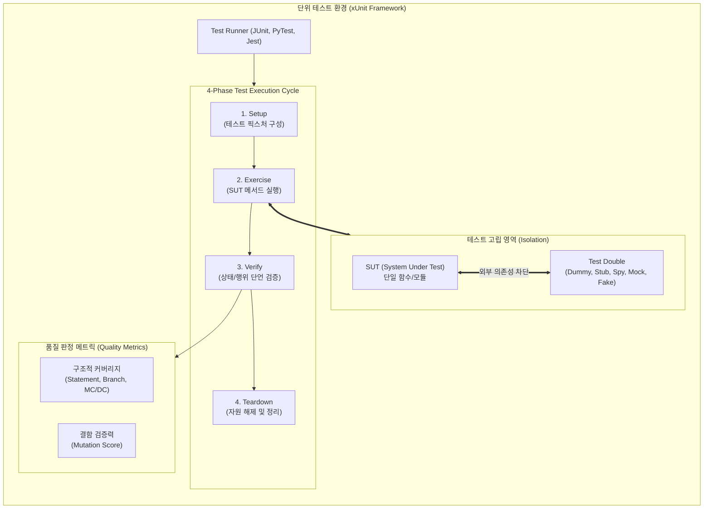

# 단위 테스트 (Unit Test)

## I. 모듈 단위 결함 조기 식별을 위한 단위 테스트(Unit Test)의 개요

- **정의**: 소프트웨어 개발 생명주기([[SDLC]])의 구현 단계에서 검증 가능한 최소 단위(함수, [[클래스]], 컴포넌트)를 외부 의존성과 격리하여 명세 충족성 및 내부 로직 결함을 검증하는 동적 화이트박스/[[블랙박스 테스트]] 기법
- **필요성 및 배경**:
    - **결함 조기 발견(Shift-Left)**: 배포 후 결함 수정 비용 대비 최대 1/100 수준으로 재작업 비용 절감(Boehm의 법칙)
    - **리팩토링 안정성 보장**: 회귀 결함(Regression Bug) 방지 및 CI/CD 파이프라인 내 조기 품질 게이트(Quality Gate) 확립
    - **핵심 특징**: 테스트 고립성(Isolation), 실행 자동화(Automation), 신속한 피드백 루프(Rapid Feedback)

## II. 단위 테스트의 개념도 및 핵심 기술 요소

### 가. 단위 테스트의 개념도 및 동작 원리

- **동작 흐름**: Test Double을 통해 DB, 네트워크 등 외부 I/O 종속성을 차단한 후, xUnit 4-Phase(Setup-Exercise-Verify-Teardown) 주기를 거쳐 SUT를 실행하고 단언문(Assertion) 및 코드/돌연변이 커버리지로 품질 검증

### 나. 단위 테스트의 핵심 기술 요소

|구분|핵심 기술 (키워드)|세부 설명|
|---|---|---|
|**실행 [[프레임워크]]**|**xUnit Architecture**|Setup, Exercise, Verify, Teardown의 표준 4단계 구조화 기반 자동화 프레임워크 (JUnit, PyTest, Vitest)|
|**의존성 격리**|**Test Double**|실제 객체를 대체하는 대역 객체 5종 (Dummy, Stub, Fake, Spy, Mock) 활용 고립 환경 보장|
|**설계 패러다임**|**[[TDD]] (Test-Driven)**|실패 테스트 작성(Red) -> 구현(Green) -> 코드 개선(Refactor) 사이클을 통한 [[모듈화]] 유도|
|**명세 기반 검증**|**Black-box Test Design**|동치 분할(Equivalence Partitioning), 경계값 분석(BVA) 기법을 통한 입출력 도메인 에지 케이스 검증|
|**구조 기반 검증**|**White-box Coverage**|제어 흐름 기반 검증 지표; 구문(C0), 분기(C1), 조건/결정(C2), 수정 조건/결정(MC/DC, DO-178C 표준)|
|**무작위성 탐지**|**Property-based Testing**|사전 정의된 불변 조건(Property)에 대해 무작위 대량 입력값을 자동 생성하여 반례 탐색 (Hypothesis, jqwik)|
|**품질 유효성 평가**|**Mutation Testing**|소스코드에 의도적 결함(Mutant)을 주입한 뒤 단위 테스트가 이를 탐지(Kill)하는지 검증 (PITest, Stryker)|
|**인텔리전스 자동화**|**[[초거대 언어 모델|LLM]]/GenAI Test Synthesis**|생성형 AI 및 RAG 기반 테스트 케이스, Mock 데이터, 경계 조건 자동 합성 및 커버리지 홀(Hole) 탐색|

## III. 단위 테스트 vs 통합 테스트 비교 및 최신 동향

### 가. 단위 테스트 vs 통합 테스트 비교

|비교 항목|단위 테스트 (Unit Test)|[[통합 테스트]] (Integration Test)|
|---|---|---|
|**검증 대상**|단일 함수, 클래스, 모듈 (최소 단위 로직)|모듈 간 상호작용, DB 연동, API 인터페이스|
|**의존성 처리**|Test Double(Mock/Stub)을 통한 완전 격리|실제 컴포넌트 연결 또는 [[컨테이너]] 기반 인프라 연계|
|**결함 격리성**|**극대화** (실패 시 원인 라인 즉시 특정 가능)|**보통** (모듈 간 연계 흐름 상 결함 추적 복잡)|
|**실행 속도**|밀리초(ms) 단위, 초고속 병렬 실행 가능|수 초~수 분 소요, I/O 및 네트워크 지연 수반|
|**테스트 피라미드**|하단부 위치 (전체 테스트의 70% 이상 비중 권장)|중간부 위치 (단위 테스트 상위 보완 계층)|
|**검증 도구**|JUnit5, PyTest, Mockito, Jest|SpringBootTest, Testcontainers, RestAssured|

### 나. 최신 기술 동향 및 실무 적용 방안

- **Testcontainers 기반 환경 구성**: DB, 메시지 브로커 등 격리가 어려운 영역에 경량 [[도커]] 컨테이너를 동적 바인딩하여 단위 테스트의 신뢰도와 통합 테스트의 현실성을 융합
- **Shift-Left CI/CD Pipeline 통합**: PR(Pull Request) 생성 시 단위 테스트 통과 및 커버리지 기준(예: Branch 80% 이상) 미충족 시 머지를 원천 차단하는 브랜치 보호 규칙(Branch Protection) 표준화 적용
- **LLM 기반 테스트 자동 증강**: AI 코딩 에이전트 연계를 통해 미검증 분기 경로에 대한 단위 테스트 스위트를 자동 생성하여 결함 누락 최소화

---

### 🔗 연관 토픽

- **소속 도메인**: [[00_소프트웨어공학_MOC|🏗️ 소프트웨어공학]]
- **세부 분류**: `1. 소프트웨어 개발 생명주기(SDLC) & 방법론`
- **핵심 연관 토픽**:
  - [[TDD|TDD (Test Driven Development)]]
  - [[통합 테스트]]
  - [[블랙박스 테스트]]
  - [[SDLC]]
  - [[CI, CD (Continuous Integration, Continuous Delivery)]]
