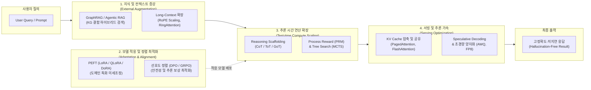

# 대규모 언어 모델(LLM) 성능 향상 기술

## I. 지능 한계 극복 및 신뢰성 확보를 위한 LLM 성능 향상 기술의 개요

### 가. 대규모 언어 모델(LLM) 성능 향상 기술의 정의

- 기저 모델(Foundation Model)의 사전 학습(Pre-training) 한계를 극복하고 환각(Hallucination) 감소, 추론 정확도 향상, 최신 지식 반영 및 서비스 응답 지연 단축을 위해 **데이터 증강, 파라미터 튜닝, 정렬, 추론 연산 확장, 서빙 최적화**를 적용하는 엔드투엔드 공학 기법

### 나. LLM 성능 향상 기술의 등장 배경 및 특징

- **스케일링 법칙(Scaling Law)의 한계**: 사전 학습 모델의 파라미터 확장만으로는 지수적 비용 증가 대비 복잡 추론(Math/Coding) 및 사실성(Factuality) 개선에 한계 봉착
- **지식 단절(Knowledge Cut-off) 및 환각**: 정적 파라미터 가중치 의존에 따른 최신성 결여 및 그럴듯한 오답 생성 위험 제거 필요
- **핵심 특징**: 다계층 최적화(학습·지식·추론·서빙 연계), 비용 효율성(Parameter-Efficient & Compute-Efficient), 추론 시간 연산 스케일링(Test-time Compute Scaling)으로 패러다임 전환

## II. LLM 성능 향상 기술의 프레임워크 및 핵심 기술 요소

### 가. LLM 성능 향상 기술의 다계층 프레임워크 및 동작 원리

- **동작 원리**: 질의 유입 시 **외부 지식(RAG)** 및 **확장 컨텍스트**를 주입하고, [[PEFT]]/정렬(DPO/GRPO)이 적용된 모델이 추론 시간 탐색(MCTS/PRM)을 통해 최적 추론 경로를 생성하며, 서빙 최적화(PagedAttention/추측 디코딩)를 거쳐 초저지연·고품질 응답을 도출함

### 나. LLM 성능 향상 핵심 기술 요소

|구분|요소기술 (키워드)|세부 설명|
|---|---|---|
|**추론 연산 확장**|**Test-time Compute Scaling**|사전 학습 의존 탈피; 추론 시점(Inference-time)에 토큰 생성 연산량을 동적 확장하여 복잡 문제 해결력 극대화 (o1 계열 아키텍처)|
|**추론 연산 확장**|**PRM (Process Reward Model)**|결과물만 평가하는 ORM과 달리, 사고 단계별(Step-by-step) 유효성을 점수화하여 MCTS 탐색 효율 극대화|
|**프롬프트 추론**|**사고 사슬 ([[COT|CoT]] / [[ToT]] / [[Graph of Thought (GoT)|GoT]])**|단계별 유도(Chain), 분기 및 역추적(Tree), 비순환 그래프(Graph) 기반 문제 분해 및 다각적 경로 탐색 기법|
|**외부 지식 접목**|**[[GraphRAG (Graph Retrieval-Augmented Generation)|GraphRAG]] & Agentic RAG**|단순 벡터 [[유사도]] 검색 한계를 넘어 지식 그래프(Knowledge Graph) 및 에이전트 자율 판단 루프(CRAG, Self-RAG) 결합|
|**파라미터 튜닝**|**PEFT ([[LoRA(Low-rank adaptation)|LoRA]] / QLoRA / DoRA)**|기저 모델 가중치 동결 후 저순위 분해 행렬(Rank)만 학습; 4-bit 양자화(QLoRA) 및 크기-방향 분해(DoRA)로 자원 절감|
|**인간 가치 정렬**|**DPO / GRPO**|PPO의 복잡한 보상 모델 훈련 없이 로그 확률로 직접 최적화하는 DPO와, 그룹 상대 보상 기반으로 추론 정렬을 가속하는 GRPO|
|**컨텍스트 확장**|**RoPE Scaling & RingAttention**|Rotary Position Embedding의 주파수 보간(YaRN) 및 [[GPU]] 링 통신 기반 시퀀스 분산 처리를 통한 수백만 토큰 문맥 수용|
|**서빙/가속화**|**PagedAttention & FlashAttention**|OS [[가상 메모리]] 기법을 차용하여 KV Cache 단편화를 방지하고(vLLM), SRAM-[[HBM]] 간 I/O 대역폭 병목을 최소화|
|**디코딩 가속**|**Speculative Decoding (추측 디코딩)**|경량 초안 모델(Draft Model)이 후보 토큰을 선행 생성하고, 타깃 [[초거대 언어 모델|LLM]]이 단일 포워드 패스로 병렬 검증하여 레이턴시 단축|

## III. 접근 방식별 비교 및 향후 전망

### 가. LLM 성능 향상 핵심 접근 방식 비교

|비교 항목|RAG (검색 증강)|파인튜닝 (PEFT/LoRA)|추론 연산 확장 (Test-time Compute)|
|---|---|---|---|
|**최적화 영역**|외부 지식 참조 및 최신성 확보|문체, 도메인 특화 태스크 포맷 습득|다단계 심층 논리/수학 추론 능력 확장|
|**지식 갱신 주기**|실시간 (DB/벡터 인덱스 업데이트)|주기적 (모델 재학습 파이프라인 수반)|질의 처리 시점 (Inference 단계 동적 탐색)|
|**환각 억제력**|**우수** (출처 근거 기반 답변 유도)|**보통** (학습 데이터 기반 기억 의존)|**매우 우수** (자기 비판 및 경로 검증 수행)|
|**비용 및 자원**|검색 인프라(Vector DB) 운영 비용|학습용 GPU 연산 자원 및 데이터 구축 비용|추론 시점의 토큰 생성량 증가에 따른 서빙 비용|
|**대표 결합 사례**|**RAFT (Retrieval-Augmented [[Fine-Tuning]])**: RAG 검색 문맥을 학습 데이터에 포함하여 노이즈 저항성을 강화하는 하이브리드 기법|||

### 나. 기술적 한계 및 향후 발전 전망

- **복합 하이브리드 아키텍처(Hybrid System 1 & 2)**: 단순 응답(System 1)은 소형 모델 및 RAG로 신속 처리하고, 난제(System 2)는 Test-time compute 모델로 분기하는 라우팅 메커니즘 확산
- **[[에이전틱 AI]](Agentic AI)와의 융합**: LLM 단독 성능 향상을 넘어 도구 사용(Tool-use), MCP([[MCP|Model Context Protocol]]) 기반 외부 API 연동 및 자율 피드백 루프를 통한 시스템 수준의 성능 최적화 가속

---

### 🔗 연관 토픽

- **소속 도메인**: [[00_인공지능_MOC|🤖 인공지능]]
- **세부 분류**: `4. 거대언어모델 (LLM) & 생성형 AI`
- **핵심 연관 토픽**:
  - [[Fine-Tuning]]
  - [[PEFT|PEFT(Parameter-Efficient Fine-Tuning)]]
  - [[COT|COT(Chain of Thought)]]
  - [[ToT|tot Tree of thought]]
  - [[Graph of Thought (GoT)|got Graph of thought]]
