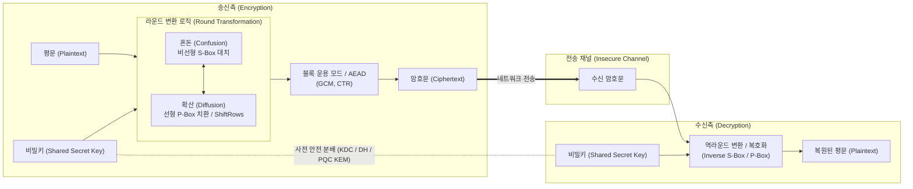

# 대칭키 암호화 (Symmetric-Key Cryptography)

## I. 고속 대용량 데이터 기밀성 보장을 위한 대칭키 암호화의 개요

### 가. 대칭키 암호화의 정의

- 송신자와 수신자가 동일한 비밀키(Secret Key)를 공유하여 데이터의 [[암호화]](Encryption)와 복호화(Decryption)를 수행하는 양방향 암호화 기법

### 나. 대칭키 암호화의 필요성 및 특징

- **고속 대용량 처리**: 비대칭키 대비 100~1,000배 빠른 연산 속도로 대용량 파일 암호화 및 실시간 네트워크 트래픽(TLS/[[IP Sec|IPsec]]) 처리 필수
- **키 관리 및 분배의 한계**: 통신 참여자 수 n명 증가 시 관리 키 개수가 $\frac{n(n-1)}{2}$로 급증하며, 사전 키 공유 채널(Key Distribution) 취약점 내재
- **핵심 특징**: 동일 키 사용, Shannon의 혼돈(Confusion) 및 확산(Diffusion) 원리 기반, 하드웨어 가속(AES-NI) 최적화

## II. 대칭키 암호화의 개념도 및 핵심 기술 요소

### 가. 대칭키 암호화의 개념도 및 동작 원리

- 송수신자는 사전에 공유된 동일 비밀키를 적용하며, 암호화 과정에서 S-Box(혼돈)와 P-Box(확산)의 반복 라운드 및 블록 운용 모드(GCM 등)를 통해 암호문 생성 후 역변환을 거쳐 복호화 수행

### 나. 대칭키 암호화의 핵심 기술 요소

|구분|요소기술 (키워드)|세부 설명|
|---|---|---|
|**설계 원리**|**혼돈과 확산 (Confusion & Diffusion)**|Shannon의 암호 원리; S-Box를 통한 평문-암호문 간 비선형 통계 관계 은닉 및 P-Box를 통한 1비트 변화의 전체 파급 효과|
|**구조적 분류**|**Feistel 네트워크**|평문을 좌우 분할하여 라운드 함수를 교차 적용; 암복호화 구조가 동일하여 역함수 구현 불필요 ([[DES]], 3DES, SEED)|
|**구조적 분류**|**SPN 구조 (Substitution-Permutation)**|평문 블록 전체에 비선형 치환(S-Box)과 선형 치환(P-Box)을 동시 병렬 적용; 높은 암호학적 강도 및 병렬 처리성 (AES, ARIA)|
|**구조적 분류**|**ARX 구조 (Addition-Rotation-XOR)**|모듈러 덧셈, 비트 회전, 배타적 논리합 연산만으로 구성; S-Box 메모리 룩업 테이블을 배제하여 [[부채널 공격]] 방어 및 초경량화 (LEA, ChaCha20)|
|**블록 암호**|**AES ([[AES|Advanced Encryption Standard]])**|128비트 고정 블록; 128/192/256비트 가변 키 지원; SubBytes, ShiftRows, MixColumns, AddRoundKey의 4단계 라운드 표준 [[알고리즘]]|
|**스트림 암호**|**ChaCha20-Poly1305**|소프트웨어 연산 최적화 스트림 암호; ARX 기반 의사난수 키스트림 생성 및 Poly1305 [[MAC]]을 결합한 모바일/저전력 표준 AEAD|
|**운용 모드**|**GCM (Galois/Counter Mode)**|카운터 모드(CTR)의 고속 병렬 암호화와 갈루아 필드(GF(2^{128})) 곱셈 기반 GMAC [[무결성]] 인증을 단일 패스로 결합한 현대 표준 모드|
|**경량화 표준**|**Ascon & LEA**|NIST 차세대 경량 암호 표준(Ascon) 및 IoT 센서/임베디드 디바이스 자원 제약 환경에 최적화된 국내 표준 경량 블록 암호(LEA)|

## III. 대칭키 vs 비대칭키 비교 및 최신 보안 동향

### 가. 대칭키 암호화 vs 비대칭키(공개키) 암호화 비교

|비교 항목|대칭키 암호화 (Symmetric)|[[비대칭키 암호화]] (Asymmetric)|
|---|---|---|
|**암·복호화 키**|**동일 키** (비밀키 1개 공유)|**키 쌍(Pair)** 구조 (공개키 + 개인키)|
|**연산 속도**|**초고속** (수 Gbps 처리, 저부하)|**저속** (수학적 난제 연산으로 인한 [[CPU]] 부하)|
|**키 개수 / 복잡도**|\frac{n(n-1)}{2} 개 (대규모 사용자 시 키 폭증)|2n 개 (공개키 디렉터리 및 PKI 체계 활용)|
|**보안 서비스**|**[[기밀성]](Confidentiality)** 중심|**전자서명, 부인방지, 안전한 키 교환**|
|**양자 위협 수준**|**Grover 알고리즘** (키 탐색 시간 O(\sqrt{N}) 단축)|**Shor 알고리즘** (소인수분해/이산대수 기반 다항식 시간 내 해독 완파)|
|**주요 활용처**|DB 암호화, 스토리지/디스크 암호화, TLS [[세션]] 암호화|인증서(X.509), SSL/TLS 핸드셰이크, SSH 키 인증|

### 나. 최신 기술 동향 및 양자 내성 대응 전략

- **양자 컴퓨터 위협(Grover 알고리즘) 대응**: 양자 탐색 연산에 의해 기존 대칭키의 보안 강도가 절반(n \rightarrow n/2)으로 격하됨에 따라, 보안 마진 확보를 위해 기존 AES-128에서 **AES-256 체계로 전면 상향 표준화** (NIST 가이드라인 충족)
- **하이브리드 암호화 및 PQC 결합**: 키 교환 단계는 양자 내성 암호(ML-KEM/Kyber)를 적용하고, 실제 데이터 전송 구간은 고속 대칭키(AES-256-GCM)를 사용하는 **하이브리드 KEM 아키텍처**로 전환 진행 중

---

### 🔗 연관 토픽

- **소속 도메인**: [[00_보안_MOC|🛡️ 보안]]
- **세부 분류**: `1. 정보보안 원칙 & 거버넌스 · 인증`
- **핵심 연관 토픽**:
  - [[DES]]
  - [[비대칭키 암호화]]
  - [[암호화|암호화 (Encryption)]]
  - [[기밀성]]
  - [[IP Sec]]
