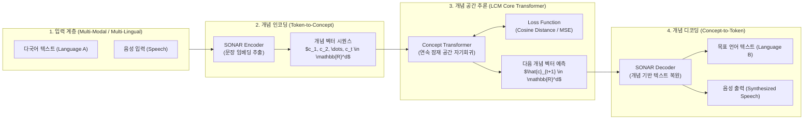

# 대형개념모델 (LCM, Large Concept Models)

## I. 토큰 의존 탈피 및 고수준 의미 공간 추론, 대형개념모델(LCM)의 개요

- **정의**: 텍스트를 개별 서브워드(Sub-word) 토큰으로 분할하여 다음 토큰을 예측하는 기존 [[초거대 언어 모델|LLM]]과 달리, 문장 및 아이디어 수준의 연속적 의미 공간(Continuous Concept Space)에서 다음 개념(Concept) 벡터를 직접 예측·생성하는 고차원 추론 모델
- **등장 배경**:
    - **Next-Token Prediction의 한계**: 표층적 통계 매칭으로 인한 논리적 장기 계획(Long-term Planning) 부재, 문맥 누적에 따른 환각(Hallucination), 2차 복잡도(O(N^2)) 시퀀스 연산 병목 심화
    - **비언어적/다국어 공통 지능 필요성**: 언어별 토크나이저 종속성을 탈피하여 인간의 뇌처럼 언어·모달리티와 무관한 순수 '개념(Idea)' 단위로 사고하는 아키텍처 요구
- **핵심 특징**: 시퀀스 길이 10~20배 압축, 연속 잠재 공간(Continuous Latent Space) 연산, 언어 독립적 제로샷 전이(Zero-shot Transfer)

## II. LCM의 개념도 및 핵심 기술 요소

### 가. LCM의 아키텍처 및 동작 원리

- **핵심 동작 흐름**: 입력을 문장 단위로 SONAR 인코더를 통해 연속 개념 벡터로 변환하고, LCM Core가 개념 공간에서 다음 개념 벡터를 자기회귀적으로 예측한 후, 디코더가 목표 언어 및 모달리티로 최종 복원하는 3계층 계층적 구조

### 나. LCM의 핵심 기술 요소

|구분|요소기술 (키워드)|세부 설명|
|---|---|---|
|**의미 표현 기반**|**SONAR 임베딩 공간**|200여 개 언어 및 음성을 고정 차원 연속 벡터 공간에 정렬하는 Meta의 다국어·다중모달 문장 임베딩 기술|
|**추론 엔진**|**Concept Transformer**|이산형 어휘 사전(Vocabulary) 없이 고정 차원 연속 벡터 시퀀스 간의 셀프 어텐션을 수행하는 개념 연산기|
|**시퀀스 압축**|**문장 단위 [[추상화]]**|토큰 단위 시퀀스를 문장·아이디어 단위로 축약하여 컨텍스트 길이를 대폭 압축하고 연산 복잡도 해소|
|**목적 함수**|**Vector-based Regression Loss**|Cross-Entropy 대신 코사인 [[유사도]](Cosine Distance), MSE, 대조 학습(Contrastive Loss)을 결합하여 잠재 벡터 방향성 최적화|
|**벡터 양자화**|**RVQ (Residual Vector Quantization)**|연속 벡터의 분산 소실 및 표현 붕괴(Representation Collapse)를 방지하기 위한 잔차 다단계 양자화 기법|
|**계층적 생성**|**Hierarchical Generation**|고수준 의미 기획(Concept Planning)과 저수준 표층 표현(Lexical Surface Realization)의 2단계 분리 생성|
|**모달리티 통합**|**Modality-Agnostic Processing**|텍스트, 음성 등 입력 형태와 무관하게 동일한 개념 공간에서 추론을 수행하여 모달리티 간 변환 손실 최소화|
|**지능 철학 연계**|**JEPA 아키텍처 구현**|픽셀·토큰 재생성을 지양하고 잠재 공간의 의미 표현을 직접 예측하는 Yann LeCun의 자기지도 학습 철학 적용|

## III. LCM vs LLM 비교 및 향후 전망

### 가. 대형개념모델(LCM) vs 대규모언어모델(LLM) 비교

|비교 항목|대형개념모델 (LCM)|대규모언어모델 (LLM)|
|---|---|---|
|**모델링 기본 단위**|**개념 벡터 (문장 단위 연속 공간)**|**서브워드 토큰 (이산 어휘 사전)**|
|**핵심 예측 메커니즘**|다음 개념 벡터 회귀 (Next-Vector Regression)|다음 토큰 다항 분류 (Next-Token Categorical)|
|**시퀀스 길이 / 복잡도**|**극소 (1/10 \sim 1/20 수준 단축)**|**장대함 (토큰 폭증으로 인한 어텐션 병목)**|
|**언어/모달리티 의존성**|**완전 독립적** (공유 개념 공간 기반 Zero-shot)|**언어 종속적** (토크나이저 및 어휘 사전에 종속)|
|**사고 및 추론 수준**|고수준 아이디어 기획 및 추상 논리 (System 2)|표층적 언어 패턴 매칭 및 문맥 완성 (System 1)|
|**환각(Hallucination)**|의미론적 맥락 일관성 우수, 세부 사실 왜곡 가능|어휘 유창성은 높으나 논리적/사실적 환각 빈번|
|**대표 모델**|Meta Large Concept Model (LCM)|GPT-4o, Llama 3, Claude 3.5|

### 나. 기술적 한계 및 향후 발전 전망

- **세부 사실성 정보 병목(Information Bottleneck)**: 문장을 단일 벡터로 압축하는 과정에서 고유명사, 정확한 수치, 미세 코드 구문 등이 소실되는 디코딩 복원 한계 존재
- **Hierarchical Hybrid AI(System 1 + System 2)로의 진화**: 전체 전략 및 논리 전개는 LCM(System 2 Planner)이 주도하고, 정밀한 사실 기술 및 표층 문장 생성은 LLM(System 1 Actor)이 수행하는 계층형 복합 모델 아키텍처로의 전환 가속화 전망

---

### 🔗 연관 토픽

- **소속 도메인**: [[00_인공지능_MOC|🤖 인공지능]]
- **세부 분류**: `1. 수학 · 통계학 & 데이터 전처리`
- **핵심 연관 토픽**:
  - [[유사도|유사도(Similarity)]]
  - [[초거대 언어 모델|초거대 언어 모델(Large Language Model)]]
  - [[추상화|추상화 (Abstraction)]]
  - [[벡터 데이터베이스|벡터 데이터베이스(Vector Database)]]
  - [[TF-IDF (Term Frequency - Inverse Document Frequency)]]
