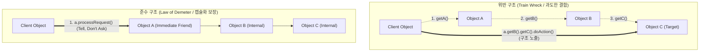

# 데메테르의 법칙 (Law of Demeter)

## I. 객체 간 결합도 최소화를 위한 데메테르의 법칙(Law of Demeter)의 개요

### 가. 데메테르의 법칙의 정의

- 객체 지향 설계에서 모듈 간의 결합도를 낮추기 위해 "오직 인접한 이웃하고만 통신해야 한다(Talk only to your immediate friends)"는 원칙을 정의한 최소 지식의 원칙(Principle of Least Knowledge)

### 나. 데메테르의 법칙의 필요성 및 특징

- **[[결합도]](Coupling) 완화 및 [[캡슐화]] 증대**: 다른 객체의 내부 구조에 대한 의존성을 차단하여 한 모듈의 변경이 연쇄적으로 파급되는 파급 효과(Ripple Effect) 차단
- **소프트웨어 유지보수성 향상**: [[클래스]] 내부 구현이 변경되어도 협력 객체의 코드 수정을 최소화하여 [[단위 테스트]] 및 리팩토링 용이성 확보
- **핵심 특징**: 최소 지식(Least Knowledge), 묻지 말고 시켜라(Tell, Don't Ask), 낯선 자와 말하지 마라(Don't talk to strangers)

## II. 데메테르의 법칙의 개념도 및 핵심 기술 요소

### 가. 데메테르의 법칙의 개념도 및 동작 원리

- **동작 흐름**: 호출자(Client)가 대상 객체의 내부 필드를 연쇄적으로 탐색(점 표기법 남발)하지 않고, 직접적인 이웃 객체(A)에 메시지를 위임하여 내부 탐색 경로와 구현 세부사항을 완전 격리

### 나. 데메테르의 법칙의 핵심 기술 및 구성 요소

|구분|요소기술 (키워드)|세부 설명|
|---|---|---|
|**호출 제약 규칙**|**4대 허용 호출 범위**|메서드 M 내에서 M의 인자, M 내부 생성 객체, 대상 객체의 [[인스턴스]] 변수, 대상 객체 자신(this)에만 메시지 전송 허용|
|**안티패턴 식별**|**기차 충돌 (Train Wreck)**|`a.getB().getC().doSomething()` 형태의 연속된 게터 체이닝으로, 내부 데이터 구조가 외부에 완전 노출되는 코드 스멜|
|**설계 패러다임**|**최소 지식의 원칙 (Least Knowledge)**|객체는 협력하는 다른 객체에 대해 알아야 할 지식을 최소화하여 시스템 전체의 정보 은닉(Information Hiding) 달성|
|**메시지 전송 원칙**|**Tell, Don't Ask**|객체의 상태를 조회하여 외부에서 판단·조작하지 않고, 원하는 행위를 수행하도록 메시지만 전송하여 자율적 책임 부여|
|**리팩토링 기법**|**위임 숨기기 (Hide Delegate)**|중간 계층 객체에 위임 메서드를 추가하여 클라이언트가 서버 객체의 세부 구성요소를 알지 못하도록 결합 차단|
|**도메인 모델링**|**애그리거트 루트 (Aggregate Root)**|[[DDD (Domain Driven Design)|DDD]](도메인 주도 설계)에서 경계 내 엔티티의 직접 접근을 금지하고 루트 객체만을 통해 트랜잭션과 비즈니스 로직을 수행하도록 강제|
|**인터페이스 설계**|**플루언트 인터페이스 예외**|빌더 패턴(Builder), Stream API 등 동일 인스턴스 또는 구조적 변환 파이프라인을 반환하는 메서드 체이닝은 구조 노출이 아니므로 허용|
|**트레이드오프**|**미들맨 (Middle Man) 스멜**|무분별한 법칙 준수는 단순 위임만을 수행하는 래퍼(Wrapper) 메서드를 양산하므로 시스템 복잡도와 설계 타협점 고려 필요|

## III. 데메테르의 법칙 위반 vs 준수 비교 및 현대 아키텍처 적용 동향

### 가. 데메테르의 법칙 위반(Train Wreck) vs 준수(Tell, Don't Ask) 비교

|비교 항목|위반 (Train Wreck / Getter Chain)|준수 (Tell, Don't Ask / LoD)|
|---|---|---|
|**코드 형태**|`order.getCustomer().getAddress().getCity()`|`order.getCustomerCity()` 또는 `order.deliverTo()`|
|**의존성 수준**|Order, Customer, Address 전 클래스에 직·간접 결합|오직 직접 협력체인 Order 클래스에만 단일 결합|
|**변경 전파력**|Address 내부 구조 변경 시 호출자 코드까지 전파|Address 내부가 변경되어도 호출자 코드는 불변|
|**객체의 성격**|데이터를 단순히 담는 수동적 자료구조 (Anemic Model)|상태와 행위를 함께 캡슐화한 자율적 객체 (Rich Model)|
|**단위 테스트**|다단계 객체 그래프 Mocking 필요로 테스트 복잡|직접 협력 객체 1개만 Mocking하여 검증 용이|

### 나. 현대 소프트웨어 아키텍처 적용 동향

- **[[MSA (Micro Service Architecture)|MSA]] 및 분산 아키텍처로의 확장**: 마이크로서비스 간에 타 서비스의 내부 DB 스키마나 서브 도메인을 직접 질의하지 않고, [[API Gateway]], Facade 패턴, 또는 이벤트 브로커([[EDA]])를 통해서만 통신하도록 경계를 격리하는 아키텍처 표준 원칙으로 기능
- **클린 아키텍처([[Clean Architecture]])와의 결합**: 외부 프레임워크나 DB 계층이 코어 도메인 엔티티의 내부 구현을 직접 참조하지 못하도록 인터페이스 어댑터(Use Case/Facade)를 경유시켜 의존성 역전(DIP)과 데메테르의 법칙을 동시 충족

---

### 🔗 연관 토픽

- **소속 도메인**: [[00_소프트웨어공학_MOC|🏗️ 소프트웨어공학]]
- **세부 분류**: `2. 애자일(Agile) & 지속적 통합/배포(CI/CD)`
- **핵심 연관 토픽**:
  - [[Clean Architecture]]
  - [[MSA (Micro Service Architecture)]]
  - [[클래스]]
  - [[결합도]]
  - [[DDD (Domain Driven Design)]]
