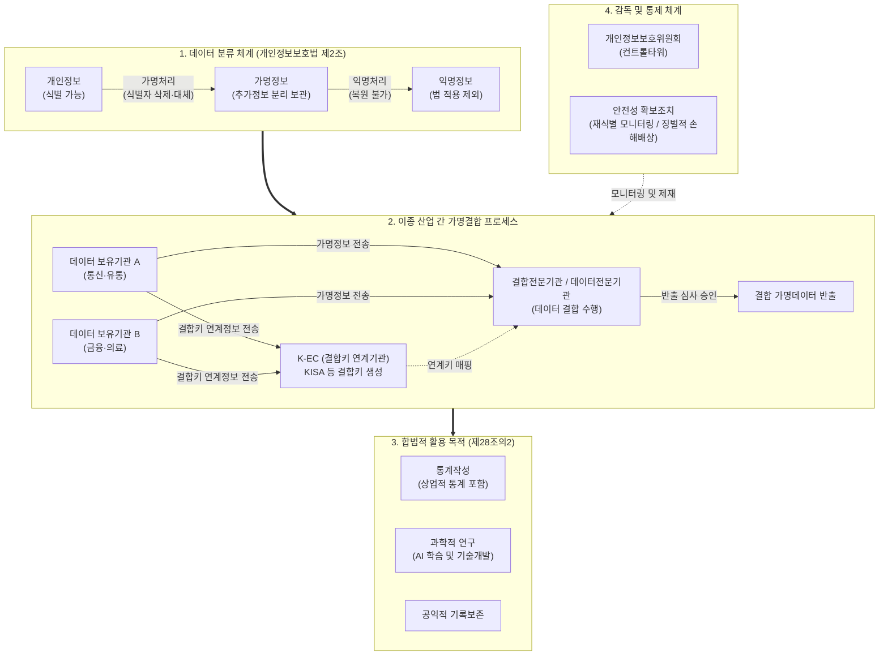

# 데이터 3법

## I. 데이터 경제 활성화와 프라이버시 보호의 조화, 데이터 3법의 개요

- **정의**: 4차 산업혁명 시대 데이터 활용 생태계 조성과 개인정보 자기결정권 강화를 위해 **개인정보 보호법, 정보통신망법, 신용정보법**을 개정하여 가명정보 도입, 규제 거버넌스 일원화, [[마이데이터]] 법적 근거를 확립한 3대 법률 체계
- **등장 배경 및 필요성**:
    - **데이터 경제(Data Economy) 도약**: 비식별 데이터 활용 경로 부재로 인한 AI·빅데이터 신산업 성장 지체 및 글로벌 경쟁력 약화 극복
    - **거버넌스 분절 해소**: 행정안전부, 방송통신위원회, 금융위원회로 다원화되었던 감독 체계를 개인정보보호위원회(국무총리 산하 중앙행정기관)로 일원화
    - **핵심 특징**: 가명정보 법적 지위 신설, 결합전문기관 제도화, 동의 만능주의 탈피, 전 분야 마이데이터(개인정보 전송요구권) 단계적 확장

## II. 데이터 3법의 거버넌스 체계 및 핵심 기술 요소

### 가. 데이터 3법의 데이터 활용 및 가명결합 아키텍처

- 개인정보를 가명처리하여 추가정보 분리 보관 후, 지정된 결합전문기관을 통해 이종 산업 간 데이터를 안전하게 결합하며 통계·연구 목적으로 동의 없이 활용하는 선순환 구조 확립

### 나. 데이터 3법의 핵심 법·제도 및 기술 요소

|구분|요소기술 (키워드)|세부 설명|
|---|---|---|
|**데이터 정의**|**가명정보 (Pseudonymized Data)**|추가 정보 없이는 특정 개인을 알아볼 수 없도록 처리한 정보; 통계작성, 과학적 연구, 공익적 기록보존 목적 시 동의 없이 처리 허용|
|**데이터 결합**|**결합전문기관 / 데이터전문기관**|대량 가명정보의 안전한 결합을 위해 지정된 기관(KISA, 금융보안원 등); 결합키 연계정보 매핑 및 반출승인심사 수행|
|**감독 기구**|**개인정보보호위원회 (PIPC)**|국무총리 소속 독립 중앙행정기관으로 위상 격상; 통합 조사권, 과징금 부과권, 정책 총괄 권한 보유|
|**정보 주체 권리**|**전 분야 마이데이터 (전송요구권)**|정보주체가 본인의 개인정보를 본인 또는 제3자(마이데이터 사업자)에게 표준 API로 안전하게 전송 요구할 수 있는 권리|
|**[[비식별화]] 기술**|**PET (Privacy-Preserving Tech)**|k-익명성, l-다양성, t-근접성 모델 및 노이즈 주입(Differential Privacy), 마스킹, 범주화 등 암호·통계학적 [[가명처리 기법]]|
|**위험 통제**|**재식별 위험도 평가 (Re-identification Risk)**|가명정보 결합 및 반출 전 환경적·기술적 재식별 가능성을 계량 분석(특이값 탐색, 결합 식별도 산출)하여 위험 차단|
|**[[알고리즘]] 대응**|**자동화된 결정 대응권**|2차 개정 반영 사항; AI·알고리즘 기반 완전 자동화 처리에 대한 거부권 및 설명요구권을 부여하여 [[신뢰성]] 확보|
|**처벌/책임 체계**|**전체 매출액 기준 과징금**|위반 행위 관련 매출액 산정 한계를 극복하고 EU GDPR 수준으로 상향; '전체 매출액의 3% 이하(위반 무관 매출 제외)' 부과 체계|

## III. 데이터 3법 개정 전·후 비교 및 최신 발전 동향

### 가. 데이터 3법 개정 전 vs 개정 후 비교

|비교 항목|개정 전 체계|개정 후 체계 (현행)|
|---|---|---|
|**데이터 개념 체계**|개인정보 vs 비식별 조치 정보 (법적 정의 불명확)|**개인정보 / 가명정보 / 익명정보 3단계 법제화**|
|**데이터 결합 방식**|기업 내부 결합 중심, 이종 산업 간 결합 불가|**국가 지정 전문기관을 통한 안전한 이종 결합 허용**|
|**정보주체 동의 요건**|사전 동의([[OPT|Opt]]-in) 만능주의, 유연성 부재|**과학적 연구·통계 목적 시 사후 활용(동의 면제)**|
|**규제 컨트롤타워**|행안부(보호법), 방통위(망법), 금융위(신정법) 분절|**개인정보보호위원회(PIPC) 단일 총괄 컨트롤타워**|
|**신산업 생태계**|빅데이터 분석 위축, 데이터 거래 인프라 부재|**금융·의료·통신 마이데이터 및 가명정보 거래소 활성화**|

### 나. 최신 기술 동향 및 향후 발전 방향

- **AI 신뢰성 및 비정형 데이터 프라이버시 확대**: 거대언어모델([[초거대 언어 모델|LLM]]) 학습을 위한 텍스트, 음성, 영상 등 비정형 데이터의 가명처리 가이드라인 고도화 및 합성데이터(Synthetic Data) 생성 기술 결합 가속
- **동형암호 및 연합학습(Federated Learning) 인프라화**: 원본 데이터를 이동·결합하지 않고 분산 환경에서 모델만 전송 학습하는 연합학습 및 완전동형암호(FHE) 기반 차세대 PET 기술과의 법제적 연계 추진

---

### 🔗 연관 토픽

- **소속 도메인**: [[00_보안_MOC|🛡️ 보안]]
- **세부 분류**: `1. 정보보안 원칙 & 거버넌스 · 인증`
- **핵심 연관 토픽**:
  - [[가명처리 기법|가명처리(Pseudonymization) 기법]]
  - [[비식별화]]
  - [[개인정보보호법]]
  - [[합성 데이터|합성 데이터(Synthetic Data)]]
  - [[데이터 안심구역|데이터 안심구역 (Data Safety Zone)]]
