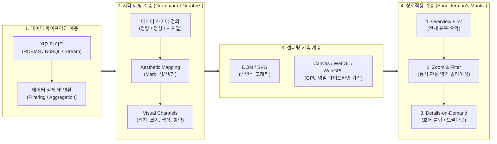

# 데이터 가시화 (Data Visualization)

## I. 인지 부하 감소 및 직관적 인사이트 도출, 데이터 가시화의 개요

### 가. 데이터 가시화(Data Visualization)의 정의

- 대규모·고차원의 복잡한 데이터를 인간의 시지각 채널(위치, 형태, 색상 등)과 그래픽 요소로 매핑하여 숨겨진 패턴, [[이상치]], 추세를 직관적으로 식별·탐색하도록 지원하는 **시각적 데이터 모델링 및 인지 공학 기법**

### 나. 데이터 가시화의 필요성 및 핵심 특징

- **인지 부하(Cognitive Load) 최소화**: 대규모 수치 연산 결과 및 테이블 데이터를 인간의 전주의적 속성(Pre-attentive Attributes)을 활용해 밀리초(ms) 단위로 신속 인지
- **데이터 주도 의사결정(DDDM) 가속**: 방대한 빅데이터에서 탐색적 데이터 분석([[EDA]])을 지원하여 현업-의사결정권자 간 데이터 문해력(Data Literacy) 격차 해소
- **핵심 특징**: 시각화 문법(Grammar of Graphics) 기반 구조화, 동적 상호작용성(Interactivity), 웹 기반 초고속 [[GPU]] 하드웨어 가속 렌더링

## II. 데이터 가시화의 개념도 및 핵심 기술 요소

### 가. 데이터 가시화의 파이프라인 아키텍처 및 동작 원리

- 원천 데이터를 추출·정제한 후 시각화 문법(Grammar of Graphics)을 통해 그래픽 채널(위치·크기·색채)에 매핑하며, **WebGPU/WebGL 가속 렌더링**을 거쳐 **슈나이더만의 정보 검색 만트라(Overview \rightarrow Zoom/Filter \rightarrow Details)** 기반 상호작용 수행

### 나. 데이터 가시화의 핵심 기술 요소

|구분|요소기술 (키워드)|세부 설명|
|---|---|---|
|**인지 공학**|**전주의적 속성 (Pre-attentive Attributes)**|의식적 사고 이전(200ms 이내)에 뇌가 즉각 감지하는 시각 단서; 형태(길이, 너비), 색상(색조, 채도), 공간 위치, 움직임 활용|
|**지각 이론**|**Cleveland-McGill 지각 순위**|시각 채널별 인간 인지 정확도 모델; 위치(Position) > 길이(Length) > 방향/각도 > 면적(Area) > 부피(Volume) > 채도 순으로 정보 왜곡 최소화|
|**설계 철학**|**그래픽 문법 (Grammar of Graphics)**|Leland Wilkinson 제안; 데이터를 데이터 변환, 기하 객체(Geom), 미적 매핑(Aesthetic), 좌표계(Coord), 패싯(Facet)으로 분해·조합하는 체계|
|**상호작용성**|**정보 검색 만트라 (Shneiderman's Mantra)**|"Overview first, zoom and filter, then details-on-demand"; 대시보드 내 다차원 브러싱 및 링킹(Brushing & Linking), 드릴다운 상호작용 표준|
|**가속 렌더링**|**WebGPU & WebGL 2.0**|브라우저 내에서 수백만 개 이상의 포인트 클라우드 및 노드-링크 네트워크를 지연 없이 렌더링하기 위한 GPU 셰이더 하드웨어 가속 API|
|**표현 라이브러리**|**선언적 시각화 스펙 (D3.js / Vega-Lite)**|웹 표준(SVG, Canvas) 기반 동적 바인딩 엔진(D3) 및 [[JSON]] [[스키마]] 기반 선언적 시각화 문법을 표준화한 고수준 [[추상화]] [[프레임워크]](Vega-Lite)|
|**지능형 분석**|**증강 분석 및 NLQ (Natural Language Query)**|[[초거대 언어 모델|LLM]] 및 RAG 기반 자연어 질의를 Vega-Lite 코드나 차트로 자동 합성·변환하는 Text-to-Visualization 기술 (예: LIDA 프레임워크)|
|**공간 시각화**|**몰입형 가시화 (Immersive Analytics)**|[[디지털 트윈]](Digital Twin) 환경에서 XR(VR/AR) 및 3D 타일셋(3D Tiles)을 결합하여 가상 공간 내 3차원 데이터 직관적 조작 지원|

## III. 데이터 가시화 vs 증강 데이터 가시화 비교 및 발전 전망

### 가. 전통적 데이터 가시화 vs 증강 데이터 가시화(Augmented Visualization) 비교

|비교 항목|전통적 데이터 가시화 (Traditional BI)|증강 데이터 가시화 (Augmented / GenAI)|
|---|---|---|
|**차트 생성 방식**|분석가가 수동으로 축, 범례, 차트 유형 설정|자연어 질의(NLQ) 기반 자동 추천 및 코드 합성|
|**상호작용 수준**|사전 정의된 필터, 슬라이서 중심의 정적 UI|양방향 대화형 에이전트 인터랙션 및 상황인지 뷰|
|**패턴 탐색 방식**|사용자의 육안 관찰 및 수작업 드릴다운 의존|자동 이상 탐지, 원인 분석(Root Cause) 자동 시각화|
|**설명 가능성**|시각 매핑 결과만 노출 (결과 해석은 사용자 몫)|[[XAI]](설명가능 [[인공지능]]) 및 텍스트 내러티브(NLG) 병기|
|**핵심 기술**|[[SQL(Structured Query Language)|SQL]], R/Python, Tableau, PowerBI, D3.js|LLM 에이전트, Auto-Vis [[알고리즘]], Semantic Layer|

### 나. 최신 기술 동향 및 향후 발전 전망

- **대규모 실시간 스트리밍 가시화**: IoT 센서 및 [[Smart Car(자율주행)|자율주행]] 로그 처리를 위해 **WebAssembly(Wasm)와 WebGPU**를 결합하여 수천만 행(Row)의 벡터 데이터를 브라우저 단에서 병목 없이 클러스터링·렌더링하는 엣지 비주얼라이제이션 본격화
- **설명가능한 AI(XAI) 통합 대시보드**: 블랙박스 형태의 AI 모델 의사결정 과정을 시각화하기 위해 SHAP/[[LIME]] 값의 다차원 분포 및 어텐션 맵(Attention Map)을 대시보드에 실시간 연동하는 [[신뢰성]] 가시화 체계 표준화 가속

---

### 🔗 연관 토픽

- **소속 도메인**: [[00_데이터베이스_MOC|🗄️ 데이터베이스]]
- **세부 분류**: `1. 데이터 모델링 & 관계형 DB 설계`
- **핵심 연관 토픽**:
  - [[스키마]]
  - [[ODBC]]
  - [[인공지능]]
  - [[SQL(Structured Query Language)]]
  - [[XAI]]
