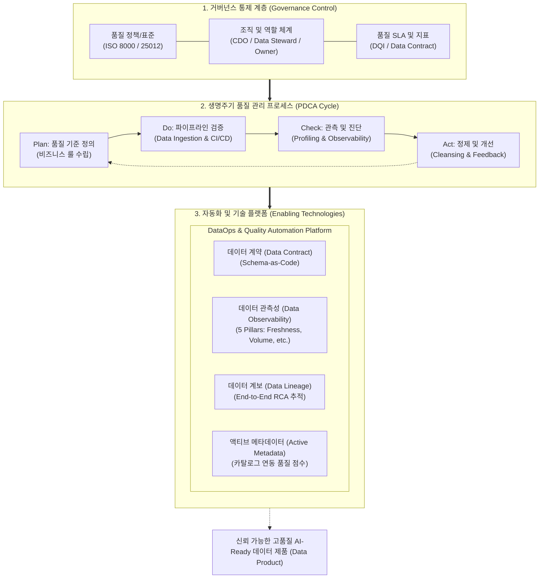

# 데이터 거버넌스 기반 데이터 품질 (Data Quality in Data Governance)

---

## I. 신뢰성 보장 및 AI-Ready 자산화의 핵심, 데이터 거버넌스 기반 데이터 품질의 개요

### 가. 데이터 거버넌스 기반 데이터 품질의 정의

* 전사 비즈니스 의사결정과 AI 모델의 신뢰성을 담보하기 위해, 거버넌스 원칙·조직·[[프로세스]] 통제 체계 하에서 데이터의 정확성, 완전성, 유효성, 최신성을 계획·측정·개선하는 지속적 관리 활동
* DAMA-DMBOK 기반 전사 데이터 관리 체계의 핵심 지식 영역이자, 데이터 값(Value), 데이터 구조(Structure), 관리 프로세스(Process)의 무결성을 입증하는 체계적 품질 보증(DQM) 체계

### 나. 데이터 품질 관리의 필요성 및 특징

* **AI/[[초거대 언어 모델|LLM]] [[신뢰성]] 및 GIGO 방지**: 저품질 데이터 주입으로 인한 [[할루시네이션|할루시네이션(Hallucination)]] 및 모델 드리프트(Drift) 선제 차단
* **데이터 침묵 오류(Data Downtime) 해소**: 파이프라인 결함, [[스키마]] 변형에 따른 다운스트림 분석 마비 및 비즈니스 손실 방지
* **특징(Shift-Left & Federated)**: 사후 수동 정제(Cleansing) 중심에서 파이프라인 생성 단계 검증(Shift-Left) 및 도메인 주도 연합형(Data Mesh) 책임 체계로 전환

---

## II. 데이터 품질 거버넌스의 프레임워크 및 핵심 기술 요소

### 가. 데이터 거버넌스 기반 데이터 품질 프레임워크 및 동작 프로세스

* 거버넌스 정책(표준/조직)에 따라 [[PDCA(Plan-Do-Check-Act, Deming Cycle)|PDCA]] 순환 사이클을 수행하며, Data Contract 및 Observability 자동화 플랫폼을 통해 소스 생성부터 소비까지 엔드투엔드 [[무결성]] 보장

### 나. 데이터 품질 거버넌스의 핵심 기술 및 구성 요소

| 구분 | 요소기술(키워드) | 세부 설명 |
| --- | --- | --- |
| **표준/원칙** | [[데이터 표준화]] (Standardization) | 표준 단어, 용어, 도메인, 코드 사전 정의를 통한 스키마 및 물리 모델 일관성 확보 |
| **품질 모델** | 품질 6대 차원 (ISO/IEC 25012) | 정확성, 완전성, 일관성, 유효성, 유일성, 적시성 기반 정량적 품질 지표(DQI) 산출 |
| **조직/역할** | Data Steward & Owner | 도메인 데이터 소유권 부여, 품질 규칙 제정, 프로파일링 오류 승인 및 조치 총괄 |
| **진단/분석** | [[데이터 프로파일링]] (Profiling) | 컬럼/테이블 단위 값의 분포, 빈도, [[결측치]], 패턴 왜곡 및 이상치를 자동 분석·측정 |
| **예방/통제** | 데이터 계약 (Data Contract) | 생산자-소비자 간 스키마, 의미론, 품질 [[SLA]]를 코드(Schema-as-Code)로 명시하여 파손 방지 |
| **실시간 추적** | 데이터 관측성 (Observability) | 데이터 신선도(Freshness), 볼륨, 스키마, 분포, 계보(Lineage) 5개 축 실시간 [[이상 감지]] |
| **추적/분석** | 엔드투엔드 데이터 계보 (Lineage) | 데이터 생성부터 대시보드/AI 모델까지의 변환 경로 추적 및 품질 결함 근본원인(RCA) 분석 |
| **지능화/정제** | AI 증강 데이터 정제 (AI Cleansing) | ML/LLM 기반 비정형 데이터 품질 검증, 결측치 대체, 이상값 격리(Quarantine) 자동화 |

---

## III. 전통적 데이터 품질 관리 vs 거버넌스 기반 현대적 데이터 품질 관리 비교

### 가. 전통적 DQM vs 거버넌스 기반 현대적 DQ 비교

| 비교 항목 | 전통적 데이터 품질 관리 (Legacy DQM) | 거버넌스 기반 현대적 DQ (Modern DQ with Governance) |
| --- | --- | --- |
| **관리 패러다임** | 사후 적발 및 수동 정제 (Reactive Cleansing) | 사전 결함 예방 및 파이프라인 검증 (Shift-Left DQ) |
| **통제 조직 체계** | 중앙 집중형 IT/DBA 팀의 일괄 검증 | 도메인별 Data Owner/Steward 주도 연합형 거버넌스 |
| **품질 검증 시점** | 저장소(DW/DB) 적재 후 주기적 배치 진단 | 소스 변경(CI/CD), 스트리밍 유입 단계 실시간 차단 |
| **인터페이스 통제** | 시스템 간 암묵적 연계, 스키마 변경 시 오류 발생 | Data Contract 기반 선언적 계약 및 자동 테스트 통과 필수 |
| **모니터링 체계** | 정적 규칙 기반 데이터 프로파일링 리포트 | 5대 기둥 기반 데이터 관측성(Data Observability) 엔진 |
| **대상 데이터 범위** | 관계형 [[데이터베이스]](RDBMS) 정형 데이터 | 멀티모달 비정형 텍스트/이미지, 벡터 임베딩, [[합성 데이터]] |
| **핵심 성공 지표** | 단순 오류율(DQI) 감소 | 데이터 가동시간(Data Uptime) 및 비즈니스 의사결정 신뢰도 |

### 나. 성공적 정착을 위한 향후 과제 및 전망

* **DataOps/[[MLOps]] 파이프라인 통합**: CI/CD 배포 파이프라인에 데이터 계약 및 유효성 검증(예: Great Expectations 등)을 통합하여 무결한 데이터만 AI 모델에 공급하는 환경 구축 필수
* **비정형 멀티모달 및 합성 데이터 품질 체계 수립**: LLM 파인튜닝용 합성 데이터(Synthetic Data)의 다양성, 편향성(Bias), 개인정보 비식별 조치 여부를 포괄하는 차세대 품질 평가 표준 정립 필요

---

### 🔗 연관 토픽

- **소속 도메인**: [[00_데이터베이스_MOC|🗄️ 데이터베이스]]
- **세부 분류**: `2. 트랜잭션 & 동시성 제어 (Concurrency)`
- **핵심 연관 토픽**:
  - [[무결성]]
  - [[데이터베이스]]
  - [[데이터 표준화]]
  - [[데이터 프로파일링|데이터 프로파일링 (Data Profiling)]]
  - [[스키마]]
