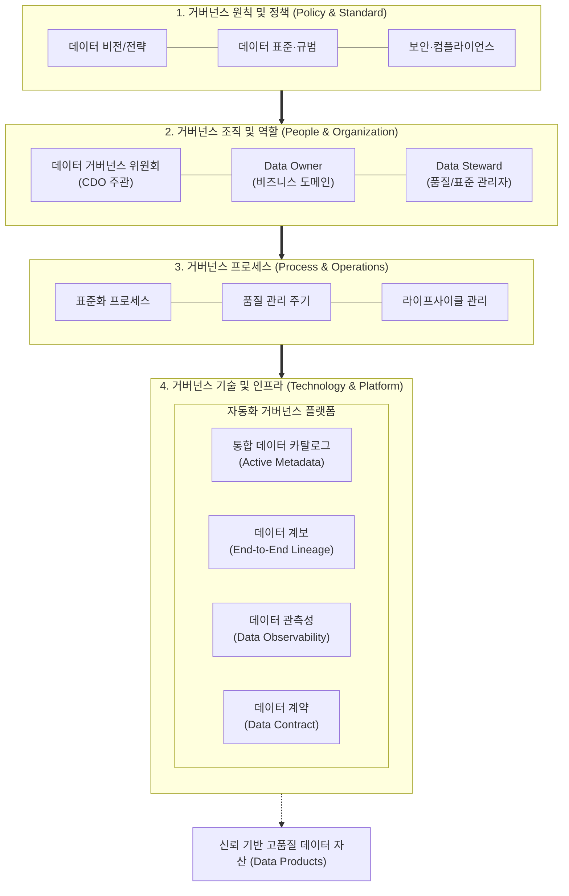

# 데이터 거버넌스

---

## I. 데이터 자산의 신뢰성 및 가치 극대화, 데이터 거버넌스의 개요

### 가. 데이터 거버넌스(Data Governance)의 정의

* 전사 데이터 자산의 [[신뢰성]], [[HA(High Availability)|가용성]], [[무결성]], 보안성을 확보하기 위해 데이터 관리 원칙, 정책, [[프로세스]], 조직 체계 및 기술 인프라를 계획·통제·운영하는 종합 관리 [[프레임워크]]
* DAMA-DMBOK(Data Management Body of Knowledge) 기준 데이터 관리의 11대 지식 영역을 지휘하고 통합하는 최상위 운영 통제 체계

### 나. 데이터 거버넌스의 필요성 및 특징

* **필요성**:
* **데이터 사일로(Silo) 해소**: 전사 표준 부재로 인한 중복 데이터 및 정합성 불일치 문제 해결
* **AI/[[초거대 언어 모델|LLM]] 신뢰성 담보**: Garbage In, Garbage Out(GIGO) 방지 및 양질의 학습·RAG 데이터 공급
* **컴플라이언스 준수**: [[개인정보보호법]](PIPA), GDPR, EU AI Act 등 데이터 규제 리스크 선제 대응

* **핵심 특징**:
* **3P1T 결합**: 사람(People/조직), 프로세스(Process), 정책(Policy), 기술(Technology)의 유기적 결합
* **책임성(Accountability) 명확화**: Data Owner와 Data Steward 중심의 오너십 체계 확립

---

## II. 데이터 거버넌스의 프레임워크 및 핵심 구성요소

### 가. 데이터 거버넌스의 프레임워크 및 아키텍처

* 최고 의사결정 기구(위원회)의 정책 수립 하에 도메인별 Owner/Steward가 표준 프로세스를 수행하며, 카탈로그·계보·관측성 등 자동화 플랫폼을 통해 데이터 무결성을 검증·통제하는 구조

### 나. 데이터 거버넌스의 핵심 기술 및 구성요소

| 구분 | 요소기술(키워드) | 세부 설명 |
| --- | --- | --- |
| **원칙/정책** | [[데이터 표준화]] (Data Standard) | 표준 단어, 용어, 도메인, 코드 사전 정의 및 물리/논리 모델링 일관성 보장 |
| **원칙/정책** | 데이터 아키텍처 (Data Architecture) | 전사 데이터 흐름, 저장 구조, 엔터프라이즈 데이터 모델([[EDM]]) 및 파이프라인 표준 설계 |
| **조직/체계** | 데이터 거버넌스 위원회 | CDO(최고데이터책임자) 주관 전사 데이터 정책 심의, 우선순위 및 충돌 조정 총괄 |
| **조직/체계** | Data Owner / Steward | 비즈니스 도메인 데이터에 대한 권한/책임 부여 및 실질적 품질 검증·수정 총괄 |
| **프로세스** | 데이터 품질 관리 (DQM) | 정합성·유효성·완전성 검증 지표 수립 및 프로파일링, 오류 데이터 정제 프로세스 |
| **프로세스** | 마스터 데이터 관리 (MDM) | 고객, 제품, 계정 등 핵심 기준 정보의 단일 뷰(Golden Record) 구축 및 일관성 동기화 |
| **기술/인프라** | 통합 데이터 카탈로그 | 액티브 메타데이터(Active Metadata) 기반 전사 데이터 탐색, 비즈니스 글로서리 제공 |
| **기술/인프라** | 엔드투엔드 데이터 계보 | 소스 시스템부터 대시보드·AI 모델까지의 데이터 파이프라인 변환 흐름 추적(Lineage) |
| **기술/인프라** | 데이터 계약 (Data Contract) | 생산자-소비자 간 [[스키마]], [[SLA]], 품질 요건을 코드로 명시(Schema-as-Code)하여 파손 방지 |
| **기술/인프라** | 데이터 관측성 (Observability) | 데이터 신선도(Freshness), 볼륨, 스키마 변화를 실시간 감지하여 이상 파이프라인 자동 격리 |

---

## III. 전통적 거버넌스 vs 현대적 거버넌스 비교 및 향후 전망

### 가. 전통적 거버넌스 vs 현대적(연합형/자율형) 거버넌스 비교

| 비교 항목 | 전통적 데이터 거버넌스 | 현대적 데이터 거버넌스 (Data Mesh / Fabric 기반) |
| --- | --- | --- |
| **관리 패러다임** | 중앙 집중형 통제 (Centralized) | 연합형 자율 거버넌스 (Federated Computational) |
| **데이터 관점** | IT 자산 및 저장 대상 (Asset) | 비즈니스 도메인 중심 '데이터 제품' (Data Product) |
| **역할 및 조직** | 중앙 데이터 팀의 일괄 승인/병목 | 도메인 팀의 책임 관리 + 공통 플랫폼 제공 |
| **메타데이터 관리** | 수동 등록 기반 정적 메타데이터(Static) | ML/[[지식그래프]] 기반 능동형 메타데이터(Active) |
| **정책 실행 방식** | 사후 감사 및 수작업 승인 (Gatekeeper) | 코드 기반 정책 자동화 (Policy-as-Code / CI/CD) |
| **지원 아키텍처** | 단일 DW / 데이터 레이크 중심 | 데이터 패브릭, 데이터 메시, 멀티/하이브리드 클라우드 |

### 나. 향후 발전 방향 및 고려사항

* **AI-Ready 거버넌스로의 확장**: 비정형 데이터(텍스트, 이미지, 임베딩 벡터) 품질 검증, AI 편향성 통제 및 [[파운데이션 모델]] 추적성을 포함하는 AI 거버넌스와의 융합 필수
* **자율형 거버넌스(Automated Governance) 구현**: 메타데이터 수집, 계보 추적, 품질 이상 탐지를 GenAI와 데이터 관측성 도구로 자동화하여 통제 비용 최소화 및 셀프서비스 데이터 분석 환경 조성

---

### 🔗 연관 토픽

- **소속 도메인**: [[00_경영전략_MOC|📈 경영전략]]
- **세부 분류**: `2. IT 거버넌스 & 엔터프라이즈 아키텍처 (EA/ISP)`
- **핵심 연관 토픽**:
  - [[데이터 표준화]]
  - [[무결성]]
  - [[데이터 분석 준비도와 성숙도]]
  - [[SLA|SLA (Service Level Agreement)]]
  - [[ISP (Information Strategy Plan)]]
