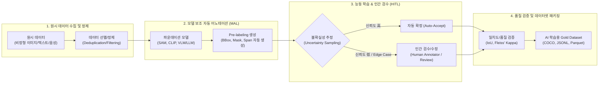

# 데이터 라벨링과 어노테이션

---

## I. 고품질 AI 모델 학습의 핵심 기초, 데이터 라벨링과 어노테이션의 개요

### 가. 데이터 라벨링과 어노테이션의 정의

* **데이터 라벨링(Data Labeling)**: 머신러닝 모델 학습을 위해 원시 데이터(Raw Data) 전체 또는 단일 샘플에 대해 사전 정의된 단일 범주나 [[클래스]] 태그(Ground Truth)를 부여하는 작업
* **데이터 어노테이션(Data [[Annotation]])**: 데이터 내부의 특정 객체, 위치, 문맥, 관계 등에 대해 바운딩 박스, 폴리곤, 의미적 속성 등 세밀하고 포괄적인 메타데이터(주석)를 부여하는 심층 가공 작업

### 나. 데이터 라벨링과 어노테이션의 필요성 및 특징

* **[[지도학습]](Supervised Learning)의 선결 조건**: 모델이 입력-출력 간 패턴과 특징을 학습하기 위한 정답셋(Ground Truth) 필수 구축
* **Data-Centric AI 패러다임 전환**: 모델 아키텍처 개선보다 학습 데이터의 품질·일관성·다양성이 모델 성능(mAP, F1-Score)을 결정하는 핵심 요인
* **GIGO(Garbage In, Garbage Out) 방지**: 불완전하거나 일관성 없는 주석 데이터로 인한 모델 [[편향]](Bias) 및 [[할루시네이션|할루시네이션(Hallucination)]] 선제 차단

---

## II. 데이터 라벨링·어노테이션의 프로세스 및 핵심 기술 요소

### 가. 데이터 라벨링·어노테이션 아키텍처 및 동작 프로세스

* [[파운데이션 모델]](SAM, [[초거대 언어 모델|LLM]] 등)로 1차 가공을 수행하고, 능동 학습([[Active Learning]])을 통해 불확실성이 높은 데이터만 인간 작업자(HITL)가 집중 검수·보정하여 비용 절감과 초고품질을 동시 달성하는 구조

### 나. 데이터 라벨링·어노테이션의 핵심 기술 및 구성 요소

| 구분 | 요소기술(키워드) | 세부 설명 |
| --- | --- | --- |
| **비전 어노테이션** | Bounding Box / Polygon | 2D/3D 사각형 및 다각형 정밀 윤곽선 추출을 통한 객체 위치 및 형태 지정 |
| **비전 어노테이션** | Semantic / Instance Segmentation | 픽셀(Pixel) 단위로 클래스를 분할하거나 개별 객체 단위의 마스크를 생성하는 기법 |
| **NLP 어노테이션** | NER(개체명 인식) & POS 태깅 | 문장 내 인명, 기관, 시간 등 고유 개체 식별 및 형태소/구문 구조 메타데이터 태깅 |
| **생성형 AI 정렬** | Instruction-Response / SFT | LLM 지시 이행 파인튜닝을 위한 고품질 멀티턴 프롬프트-응답 쌍 구축 |
| **생성형 AI 정렬** | Preference Ranking (RLHF/DPO) | 모델 응답 간 선호도/품질 비교 랭킹 부여 및 Red Teaming 기반 유해성 주석 |
| **자동화 파이프라인** | MAL (Model-Assisted Labeling) | SAM(Segment Anything), Grounding-DINO 등 파운데이션 모델 기반 사전 라벨 자동 생성 |
| **학습 최적화** | Active Learning (능동 학습) | 엔트로피, 불확실성(Uncertainty) 기반 샘플을 선별하여 작업자 개입을 최소화 |
| **프로그래밍 방식** | Weak Supervision (약지도 학습) | Snorkel 등 휴리스틱 규칙/함수를 코드로 정의하여 대규모 노이즈 라벨을 확률적 생성 |
| **품질 검증 체계** | 작업자 일치도 (IAA) 지표 | Cohen's / Fleiss' Kappa, IoU(Intersection over Union) 기반 어노테이터 간 신뢰도 정량 평가 |
| **[[합성 데이터]]** | Synthetic Data Annotation | 3D 시뮬레이터, Diffusion/LLM 엔진을 통해 Ground Truth가 내장된 대규모 합성 데이터 자동 생성 |

---

## III. 데이터 라벨링 vs 데이터 어노테이션 비교 및 향후 전망

### 가. 데이터 라벨링 vs 데이터 어노테이션 비교

| 비교 항목 | 데이터 라벨링 (Data Labeling) | 데이터 어노테이션 (Data Annotation) |
| --- | --- | --- |
| **개념적 범위** | 데이터 어노테이션의 하위 집합 (기초 태깅) | 라벨링을 포괄하는 상위 개념 (심층 주석) |
| **가공 수준** | 단순 범주 분류(Classification), 키워드 태그 | 공간/시간 좌표, 픽셀 마스크, 의미적 문맥, 텍스트 스팬 |
| **작업 복잡도** | 단순 규칙 기반, 크라우드소싱 용이 | 도메인 전문 지식(의료, 법률, [[Smart Car(자율주행)|자율주행]]) 및 고난도 도구 필요 |
| **시간 및 비용** | 건당 소요 시간 짧음, 비용 상대적 저렴 | 건당 소요 시간 김, 전문 인력 투입으로 고비용 수반 |
| **대표 사례** | 스팸 여부(Ham/Spam), 감성 분석(긍정/부정), 이미지 단일 클래스 태깅 | 자율주행 BBox/3D Point Cloud, 의료영상 [[세그멘테이션]], RLHF 선호도 평가 |
| **주요 적용 모델** | 단순 분류기(Classifier), 추천 시스템 | 객체 탐지(YOLO), 세그멘테이션 모델, 대규모 파운데이션/[[멀티모달 AI]] |

### 나. 향후 발전 방향 및 고려사항

* **RLAIF 및 LLM-as-a-Judge 대중화**: 인간의 주석 병목(Cost/Speed)을 해소하기 위해 고성능 LLM을 심사관으로 활용하여 자동으로 피드백과 라벨을 생성하는 RLAIF(AI 피드백 기반 [[강화학습]]) 급부상
* **데이터 프라이버시 및 라이선스 컴플라이언스**: 웹 스크래핑 데이터 어노테이션 시 개인정보 [[비식별화]](가명/익명 처리) 및 저작권 침해 방지를 위한 데이터 계보(Lineage) 관리 거버넌스 구축 필수
* **DataOps 파이프라인 연계**: 지속적 모델 재학습(Continuous Training) 환경에 맞춰 데이터 수집-자동 어노테이션-검수-배포가 단절 없이 연결되는 엔드투엔드 어노테이션 인프라 표준화 필요

---

### 🔗 연관 토픽

- **소속 도메인**: [[00_인공지능_MOC|🤖 인공지능]]
- **세부 분류**: `5. 컴퓨터 비전 · 음성 & 에이전트`
- **핵심 연관 토픽**:
  - [[멀티모달 AI|멀티모달(Multimodal) AI]]
  - [[강화학습]]
  - [[할루시네이션|할루시네이션(Hallucination)]]
  - [[지도학습]]
  - [[합성 데이터|합성 데이터(Synthetic Data)]]
